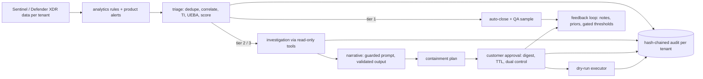

# Azure AI SOC: agentic triage, investigation and human-approved response for a multi-tenant MSSP

[](https://github.com/jagadishmazure-jpg/Jagadish-azure-ai-soc/actions/workflows/ci.yml)
[](https://github.com/jagadishmazure-jpg/Jagadish-azure-ai-soc/actions/workflows/infra.yml)
[](https://github.com/jagadishmazure-jpg/Jagadish-azure-ai-soc/actions/workflows/codeql.yml)

## At a glance (for recruiters)

- **An AI-assisted security operations centre as working code** for a fictional MSSP (Halyard Security
  Services) and three fictional customers: Brightwater Logistics, Orchid Valley Clinics and Pinecrest Credit
  Union. Synthetic Microsoft Sentinel and Defender XDR data, nine scripted attack stories and the benign
  look-alikes that make SOC work hard.
- **Microsoft Agent Framework agents** for triage, investigation, ATT&CK mapping, threat intel, behaviour
  analytics, predictive risk and response, in one workflow per incident with human checkpoints
  (`request_info`) for QA and approval.
- **Tier 1 / 2 / 3 routing with earned autonomy.** On the same 40 holdout incidents, the analyst feedback loop
  takes 3-class verdict accuracy from 77.5% to 100%, auto-closures from 25% to 70% and human reviews from 30
  to 15, with **zero attacks auto-closed** in any window or mode.
- **Detection and response:** 9 of 9 attack stories detected, MTTD median 33 minutes (alert time includes
  ingestion delay and rule schedule), all contained in dry run behind customer approval. ATT&CK priority
  coverage 11 of 21, gaps listed.
- **Containment is never autonomous:** plans from a fixed catalogue, approvals bound to the plan digest,
  dual control for privileged accounts and crown jewels, a dry-run executor, and a hash-chained audit log
  per tenant.
- **Read-only tools shaped like the Microsoft Sentinel MCP server,** served by a local MCP server. Agents run
  only allow-listed KQL templates with regex-checked parameters. These agents sit behind that interface and
  complement Security Copilot; they do not replace it.
- **Guardrails that are tested alone:** prompt-injection screening and quoting, PII redaction, per-tenant
  pseudonyms and an output validator. A deliberately gullible mock model proves which layer stops what.
- **Multi-tenant isolation as a gate check:** a canary planted in one tenant appears 0 times elsewhere, and 8
  of 8 cross-tenant attempts are refused.
- **Terraform + Bicep** for the Sentinel workspace, rules, least-privilege managed identities, a
  managed-identity Logic App playbook and private networking. Validated, tested with mocked providers and
  checkov-clean; deployment is gated off.
- **340 automated tests**, all offline, plus an eleven-check release gate and docs whose outputs and code
  excerpts are regenerated and drift-checked in CI.

**Skills demonstrated:** security operations (triage, investigation, containment, detection engineering),
Microsoft Sentinel, Defender XDR, KQL, MITRE ATT&CK and ATLAS, threat intelligence, UEBA, agentic AI with
Microsoft Agent Framework and MCP, LLM security (OWASP Top 10 for LLM Applications), Microsoft Foundry,
Entra ID managed identities, Azure Monitor, Terraform, Bicep, GitHub Actions (OIDC) and Python.

*Honesty note: all organisations, people and data are fictional and synthetic. The language model is a
deterministic mock (the Foundry path is written but has never been run), the guardrail screens are regex
stand-ins, the analysts in the evaluation are simulated from ground truth, MTTR is simulated, and nothing is
deployed to Azure.*

## Attribution

The set of use cases this repository covers was shaped by an AI-powered SOC guide published by Conifers
Technologies: [https://www.conifers.ai/blog/ai-powered-soc/](https://www.conifers.ai/blog/ai-powered-soc/).
The guide is **not** included or redistributed here, and nothing in this repository copies its text. The
scenario labels, design, code and wording are this repository's own; see
[docs/scenario-mapping.md](docs/scenario-mapping.md).

## Quick start

```bash
python -m venv .venv && source .venv/bin/activate
pip install -e ".[dev]"
pytest -q
aisoc gate
aisoc compare
aisoc investigate --tenant orchidvalley --incident INC-OR-032
aisoc injection
```

<!-- output: compare -->
```text
holdout window (days 14-20), same incidents:
metric                     baseline (no learning)  after feedback loop
-------------------------  ----------------------  -------------------
incidents                  40                      40
accuracy_3class_pct        77.5                    100.0
accuracy_binary_pct        92.5                    100.0
malicious_precision_pct    62.5                    100.0
malicious_recall_pct       100.0                   100.0
tier1                      10                      28
tier2                      28                      10
tier3                      2                       2
auto_closed_pct            25.0                    70.0
auto_closed_attacks        0                       0
escalation_noise_pct       83.3                    58.3
human_reviews              30                      15
override_rate_pct          30.0                    0.0
simulated_analyst_minutes  650                     380
```
<!-- /output -->

## How it fits together



## Attack stories

<!-- output: stories -->
```text
story                        window   starts     detected  MTTD min  incident    tier  AI verdict     contained  MTTR min (sim)  techniques
---------------------------  -------  ---------  --------  --------  ----------  ----  -------------  ---------  --------------  ----------
brightwater-spray-d9         train    D09 02:00  yes       20.0      INC-BR-015  2     true_positive  dry-run    100.0           2/2
brightwater-phish-d16        holdout  D16 09:00  yes       20.0      INC-BR-027  3     true_positive  dry-run    265.0           2/3
brightwater-insider-d19      holdout  D19 20:00  yes       60.0      INC-BR-036  2     true_positive  dry-run    115.0           2/2
orchidvalley-phish-d6        train    D06 10:00  yes       20.0      INC-OR-011  2     true_positive  dry-run    240.0           2/3
orchidvalley-ransomware-d18  holdout  D18 00:30  yes       33.0      INC-OR-032  3     true_positive  dry-run    152.0           5/5
pinecrest-ransomware-d5      train    D05 22:30  yes       33.0      INC-PI-011  3     true_positive  dry-run    152.0           5/5
pinecrest-insider-d11        train    D11 21:00  yes       60.0      INC-PI-022  2     true_positive  dry-run    115.0           2/2
pinecrest-spray-d17          holdout  D17 03:00  yes       20.0      INC-PI-032  2     true_positive  dry-run    100.0           2/2
pinecrest-travel-d20         holdout  D20 08:00  yes       60.0      INC-PI-036  2     true_positive  dry-run    80.0            1/3
```
<!-- /output -->

## Built vs planned

| Built and tested offline | Written, never run against Azure | Planned |
|---|---|---|
| Synthetic tenants, KQL engine, 12 rules, coverage | Terraform and Bicep stacks (validated, mocked tests) | Kusto emulator cross-check of the rules |
| Triage, routing, investigation, narrative on a mock model | Foundry chat client (`AISOC_LLM=foundry`) | Foundry evaluations and red teaming on a real model |
| Approvals, dry-run executor, audit chain | Prompt Shields adapter (request builder only) | Live Graph and Defender executor |
| Feedback loop, risk watch list, isolation checks | Gated deploy and teardown workflows | Shadow-mode switch, SLA reports, hosted Sentinel MCP connection |

The full list is in [docs/best-practices.md](docs/best-practices.md).

## Repository map

| Path | What it holds |
|---|---|
| `src/aisoc/` | Agents, workflow, gateway, MCP server, metrics, CLI |
| `detections/` | KQL rules, metadata and the generated `rules.json` |
| `config/` | Tenants, identities, templates, actions, thresholds, ATT&CK priorities |
| `runbooks/` | One runbook per attack family |
| `infra/` | Terraform and Bicep |
| `docs/` | Architecture, threat model, scenario mapping, metrics, components, infra, guides, ADRs |
| `tests/` | 340 tests |

## Where to start

- **Engineers:** [docs/architecture.md](docs/architecture.md), then the component docs in
  [docs/components/](docs/components/README.md) and [docs/threat-model.md](docs/threat-model.md).
- **Recruiters and reviewers:** this page, [docs/metrics.md](docs/metrics.md) and
  [docs/best-practices.md](docs/best-practices.md).
- **Adopters:** [docs/implementation-guide.md](docs/implementation-guide.md),
  [docs/mssp-operating-model.md](docs/mssp-operating-model.md) and [docs/deployment.md](docs/deployment.md).
- **Interview prep:** [docs/interview-guide.md](docs/interview-guide.md).

## Open gaps

- Rules use a simplified schema; they are created disabled and need the column mapping before real use.
- Ten priority ATT&CK techniques have no detection, including T1486 (encryption for impact).
- The live containment executor is deliberately not implemented; the IaC grants no containment permission.
- Holdout gains are easier than real life (look-alikes repeat on a schedule); risk precursors were planted.
- Nothing has been deployed, and the Foundry path has never been run.

## License

MIT for this repository's code and docs. The referenced guide is not covered by this license and is not
included.
