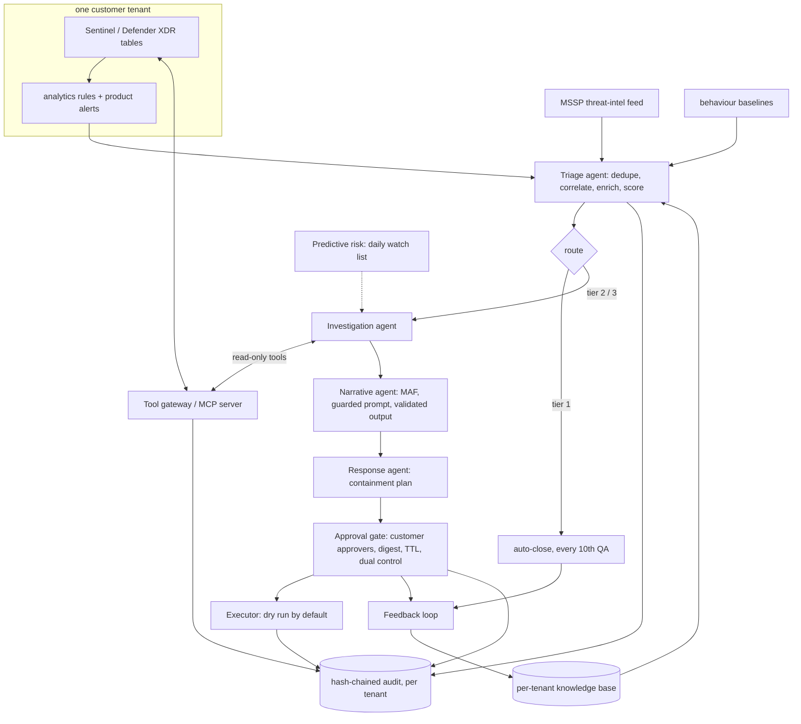

# Architecture

How the pieces fit: synthetic Sentinel and Defender XDR data per tenant, detections, an agent workflow per
incident built on Microsoft Agent Framework, a read-only tool gateway shaped like the Sentinel MCP server,
human checkpoints, a feedback loop, and the Azure footprint the IaC declares. Everything below runs offline;
the Azure side is declared and validated, never deployed.

## System view



## Trust boundaries

| Boundary | What crosses it | Control |
|---|---|---|
| Telemetry to model | Alert and evidence text (attacker-controlled) | Screen, redact, pseudonymise, quote; validator after |
| Agent to data | Queries | Gateway: identity entitlements, templates only, regex parameters, row cap, as-of time, audit |
| Agent to action | Containment | Plan only; human approval bound to digest; executor with one permission per action; dry run |
| Tenant to tenant | Nothing | Per-tenant store, knowledge base, pseudonyms, audit chain; canary and attempt tests |
| Repo to Azure | IaC and deployment | Gated workflow, OIDC, environment reviewers; never run |

## Components

| Component | Doc | Built or planned |
|---|---|---|
| Synthetic tenants and telemetry | [components/synthetic-data.md](components/synthetic-data.md) | Built |
| KQL engine | [components/kql-engine.md](components/kql-engine.md) | Built (subset); emulator cross-check planned |
| Detections and ATT&CK coverage | [components/detections.md](components/detections.md) | Built; 10 priority techniques uncovered |
| Triage and routing | [components/triage-routing.md](components/triage-routing.md) | Built |
| Tool gateway and MCP server | [components/tool-gateway-mcp.md](components/tool-gateway-mcp.md) | Built (local); hosted Sentinel MCP not connected |
| Investigation agent | [components/investigation-agent.md](components/investigation-agent.md) | Built |
| ATT&CK, TI, UEBA | [components/enrichment-attack-ti-ueba.md](components/enrichment-attack-ti-ueba.md) | Built |
| Narrative agent and guardrails | [components/narrative-guardrails.md](components/narrative-guardrails.md) | Built on a mock model; Foundry path written, not run |
| Containment and audit | [components/response-containment.md](components/response-containment.md) | Built (dry run); live executor not implemented |
| Workflow and human checkpoints | [components/workflow-hitl.md](components/workflow-hitl.md) | Built |
| Knowledge and feedback loop | [components/knowledge-capture.md](components/knowledge-capture.md) | Built |
| Predictive risk | [components/predictive-risk.md](components/predictive-risk.md) | Built (on planted precursors) |
| Tenant isolation | [components/tenant-isolation.md](components/tenant-isolation.md) | Built |
| Metrics and gate | [components/metrics-gate.md](components/metrics-gate.md) | Built |
| Azure footprint | [infra/README.md](infra/README.md) | Declared and validated; never deployed |

## Microsoft Agent Framework usage

* **Workflow:** `WorkflowBuilder` with executors per step and conditional edges on the tier
  ([components/workflow-hitl.md](components/workflow-hitl.md)).
* **Human in the loop:** `ctx.request_info(...)` pauses for QA and approval; `@response_handler` resumes.
* **Agent:** `Agent(client, instructions, name)` with `response_format=IncidentSummary`.
* **Client:** `MockSocChatClient` (a real `BaseChatClient` with the function-invocation layer) offline;
  `FoundryChatClient` with `AISOC_LLM=foundry`.

## Position next to Microsoft's products

This repository's agents sit behind the same tool interface as the Microsoft Sentinel MCP server and use
Sentinel and Defender XDR as the system of record. They are meant to work alongside Security Copilot, not
replace it: a team could point these agents at Microsoft's hosted MCP server, or point a Copilot or Foundry
agent at this local server for offline testing.

## Release gate

<!-- output: gate -->
```text
  PASS  every attack story detected (9/9)
  PASS  no attack auto-closed (all windows, both modes) (0 required)
  PASS  holdout malicious recall is 100% (100.0%)
  PASS  feedback loop does not reduce holdout binary accuracy (92.5% -> 100.0%)
  PASS  model never obeys injected instructions (guardrails on, gullible model) (obeyed 0)
  PASS  no narrative changed a verdict (fallbacks 0)
  PASS  no cross-tenant leakage ({"brightwater": 0, "orchidvalley": 0, "pinecrest": 139})
  PASS  every cross-tenant attempt denied (8 attempts)
  PASS  audit chains verify (264 records verified; 268 records verified; 281 records verified)
  PASS  no live containment (dry-run 27, live 0)
  PASS  detections/rules.json is current (aisoc rules-json --check)
gate: PASS (11/11)
```
<!-- /output -->
