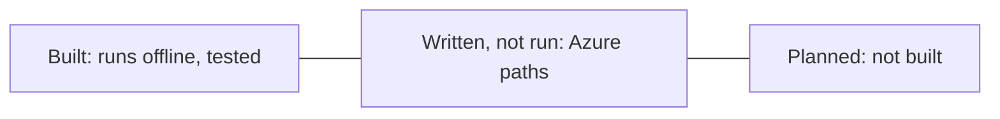

# Best practices and honest status

What this repository does to follow good practice for AI in security operations, and a plain list of what
is built, what is only written, and what is planned. "Built" means it runs offline and is tested.
"Written, not run" means the code or IaC exists but has never touched Azure. "Planned" means it does not
exist yet.

## Practices applied

| Practice | How |
|---|---|
| The model narrates; code decides | Verdicts, evidence and plans come from code; `validate_summary` rejects summaries that disagree |
| Treat telemetry as hostile input | Screen, redact, pseudonymise and quote before any prompt |
| Least privilege for agents | Read-only tools, templates only, Sentinel Reader on one workspace |
| Human approval for consequential actions | Approval bound to digest, TTL, dual control, agents cannot approve |
| Earned autonomy | Tier 1 per detector and tenant after reviews, behind a replay gate |
| No hindsight in evaluation | Investigations see data only up to one hour after the last alert; learning frozen for the holdout |
| Ground truth isolated | Agent code may not import labels (AST test) |
| Tamper evidence | Per-tenant hash-chained audit log |
| Numbers you can trust | Docs re-rendered from real runs and drift-checked in CI |
| Supply chain | SHA-pinned actions, Dependabot, CodeQL, gitleaks, SBOM, pinned Python dependencies |

## Built vs written vs planned

| Area | Built | Written, not run | Planned |
|---|---|---|---|
| Data | Synthetic tenants and stories | | Replay of real, anonymised incidents |
| Detection | 12 KQL rules, product alerts, coverage 11/21 | Sentinel rules in Terraform and Bicep (disabled) | Kusto emulator cross-check; rules for T1486 and nine other gaps; automated hunting |
| Triage and routing | Dedupe, correlation, scoring, tiers | | Learned weights |
| Investigation | Template pivots, timeline, scope | | Wider dynamic lookback |
| Tools | Local gateway and MCP server | | Connection to the hosted Sentinel MCP server |
| Model | MAF agent on a deterministic mock | Foundry client (`AISOC_LLM=foundry`) | Foundry evaluations and red teaming on a real model |
| Guardrails | Regex screen and redaction, pseudonyms, validator | Prompt Shields adapter (request builder) | Azure AI Language PII detection |
| Containment | Plans, approvals, dry-run executor, audit | | Live executor for Graph and Defender |
| Feedback | Notes, priors, gated thresholds | | Scheduled re-tuning; semantic note search |
| Risk | Watch list on planted precursors | | Calibration on real history |
| MSSP | Per-tenant isolation with tests | Lighthouse mapping (docs only) | SLA reports per customer |
| Infra | Terraform and Bicep validated, tested with mocks, checkov clean | Deploy and teardown workflows (gated off) | Data connectors, agent endpoint, Foundry project in IaC |
| Rollout | Baseline vs learning comparison | | Shadow-mode switch |

## What I would not claim

* That it has been deployed or used on a real tenant. It has not.
* That the holdout accuracy would hold on real data. Look-alikes here repeat on a schedule.
* That MTTR is measured. It is simulated with configured analyst minutes.
* That the risk model predicts attacks. Its precursors were planted.
