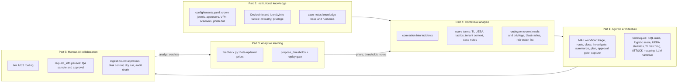
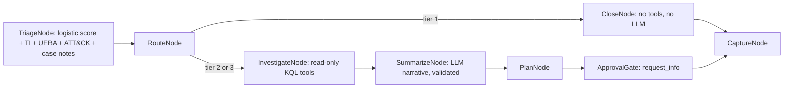
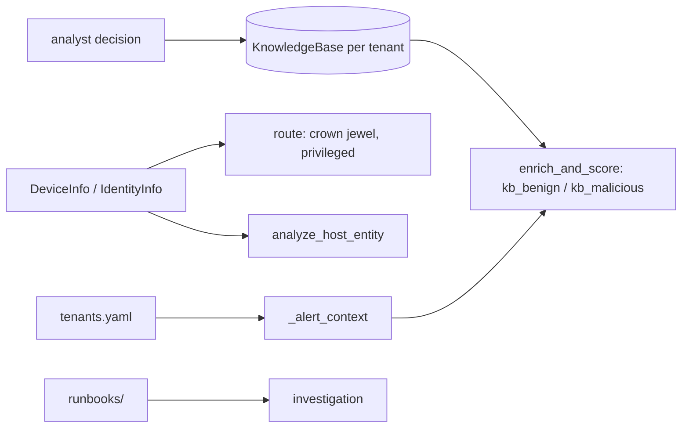
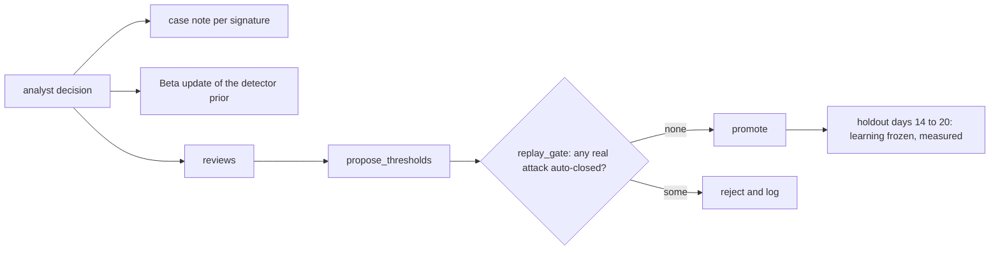
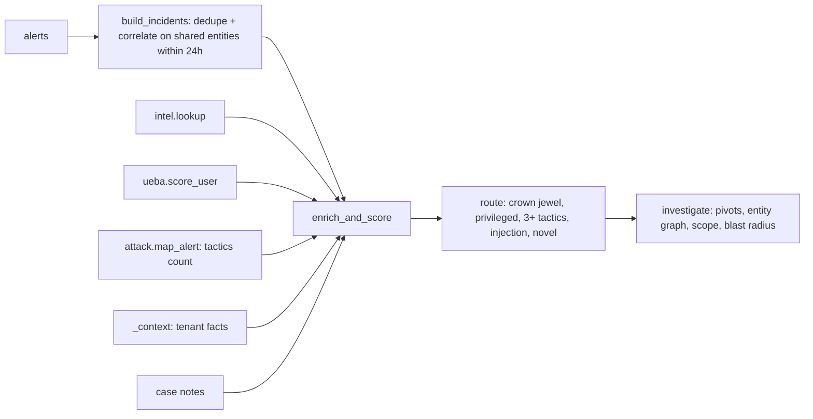
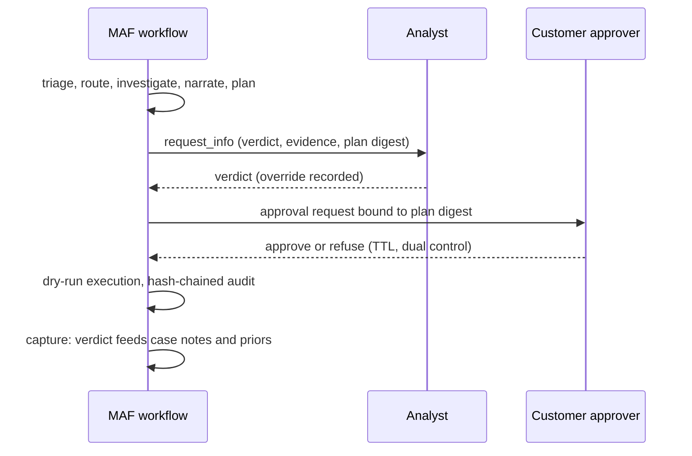

# The five parts of a cognitive SOC, and how this repository covers each one

Conifers Technologies' AI-powered SOC guide
([conifers.ai/blog/ai-powered-soc](https://www.conifers.ai/blog/ai-powered-soc/)) argues that a
"cognitive" SOC rests on five parts. Taken together, they are what separates a security team that has
bolted a chatbot onto its SIEM from one whose software works a case the way a seasoned analyst would.
This page explains each part in plain words, shows where this repository implements it (files,
functions, real excerpts and real command output) and gives an honest verdict on how far it goes.

The guide is not included, redistributed or quoted here. The five part names are short labels; every
explanation, example and judgement on this page is this repository's own. All companies, people and data
are fictional and synthetic, the language model is a deterministic mock, and nothing is deployed.

**Who this page is for**

| Reader | Read this for |
|---|---|
| Jagadish (interview prep) | A clear story per part, the honest gaps, and talking points |
| Recruiters and reviewers | What is really built, with evidence you can rerun |
| Adopters | Which pieces to keep, what production would add, and which Azure services back each part |

Contents: [The five parts at a glance](#the-five-parts-at-a-glance) ·
[1. Agentic architecture](#1-agentic-architecture) ·
[2. Institutional knowledge](#2-institutional-knowledge-integration) ·
[3. Adaptive learning](#3-adaptive-learning) ·
[4. Contextual analysis](#4-contextual-analysis) ·
[5. Human-AI collaboration](#5-human-ai-collaboration) ·
[Summary table](#summary-table) · [Where the guide is silent](#where-the-guide-is-silent) ·
[Glossary](#glossary)

## How to read the evidence on this page

Every `text` block under a `<!-- output: ... -->` marker is the real output of the `aisoc` command named
in the marker, and every code block under a `<!-- code: ... -->` marker is the current source of the
named function or class. `scripts/render_docs.py` regenerates both, and CI runs it with `--check`, so if
the code changes and this page is not re-rendered, the build fails. No number on this page was typed in
by hand.

```bash
pip install -e ".[dev]"
python scripts/render_docs.py --check   # proves the blocks below match a fresh run
```

The setting used in the examples: **Halyard Security Services**, a fictional managed security service
provider (MSSP), runs one SOC for three fictional customers (tenants).

<!-- output: tenants -->
```text
MSSP: Halyard Security Services (fictional); analysts: analyst.rivera tier 2, analyst.okafor tier 3
tenant        name                    industry            domain                workspace             users  hosts  crown jewels
------------  ----------------------  ------------------  --------------------  --------------------  -----  -----  --------------------
brightwater   Brightwater Logistics   logistics           brightwater.example   law-soc-brightwater   30     24     BWL-DC01, BWL-ERP01
orchidvalley  Orchid Valley Clinics   healthcare          orchidvalley.example  law-soc-orchidvalley  26     22     OVC-DC01, OVC-EHR01
pinecrest     Pinecrest Credit Union  financial services  pinecrest.example     law-soc-pinecrest     28     22     PCU-DC01, PCU-CORE01
```
<!-- /output -->

## The five parts at a glance



Read the arrows as one loop: tenant knowledge gives context, context drives the agents, the agents hand
judgement calls to people, and people's verdicts feed learning, which sharpens the next round of context.

| Part | In one sentence | Verdict |
|---|---|---|
| 1. Agentic architecture | Several specialised components, and the incident's tier decides which ones run | Partial |
| 2. Institutional knowledge | Tenant facts, asset and identity tables, runbooks and analyst case notes shape every verdict | Partial |
| 3. Adaptive learning | Analyst verdicts update priors, notes and gated thresholds, measured on unseen days | Strong |
| 4. Contextual analysis | An alert is judged with its related alerts, intel, behaviour, assets and privilege | Strong |
| 5. Human-AI collaboration | The AI closes only the safe, routine cases; people decide everything consequential | Strong |

Verdict scale: **Strong** means built, tested and measured offline, with gaps that are about production
data rather than design. **Partial** means the pattern is built, but a material piece is simplified or
missing. **Thin** means mostly described rather than built. No part is Thin, but part 1 comes closest,
for the reason explained below.

---

## 1. Agentic architecture

### What it means

A first-generation "AI SOC" pushes every alert through one model with one prompt. The agentic idea is
the opposite: break the job into specialised workers (detection, scoring, behaviour analytics, intel,
investigation, writing, response) and use the cheapest technique that can do each job. A large language
model is good at reading messy evidence and writing a summary; it is slow, costly and unnecessary for
adding up a score or checking an IP address against a feed. Statistics, rules and small models do those
jobs faster and more predictably. The system should also vary the mix per incident: a known-noisy alert
needs a quick score, while a ransomware chain needs the full investigation.

**Why it matters in a real SOC.** Cost and latency scale with alert volume. If the expensive model runs
on every one of thousands of daily alerts, the bill and the queue both grow. Using the right tool per job
also makes each step testable on its own.

**Example.** At Pinecrest Credit Union an "Atypical travel" alert for a user signing in from London turns
out to be the tenant's VPN exit in London. That case needs a score and a context lookup, nothing more. Later in
the run, a Word document at Orchid Valley Clinics starts PowerShell, dumps credentials and deletes
shadow copies; that case needs the tool-driven investigation, a written narrative and a containment plan.

### How this repository implements it

The specialists are nodes in one Microsoft Agent Framework (MAF) workflow per incident. Conditional
edges send tier 1 cases to `close` and everything else to `investigate`, so the investigation tools and the
language model never run on routine closures.



| Specialist | Technique | Where |
|---|---|---|
| Detection | Scheduled KQL analytics rules, plus Defender-style product alerts | `detections/*.kql`, `src/aisoc/detections.py` |
| Triage scoring | Transparent logistic model over named features | `src/aisoc/triage.py::enrich_and_score` |
| Behaviour analytics | Per-user baselines, z-scores, peer groups, drift | `src/aisoc/ueba.py::score_user` |
| Threat intel | Indicator matching with confidence decay | `src/aisoc/intel.py::lookup` |
| ATT&CK mapping | Rule and text-pattern mapping to techniques | `src/aisoc/attack.py::map_alert` |
| Investigation | Planned read-only tool calls through a Sentinel-MCP-shaped gateway | `src/aisoc/investigation.py::investigate`, `src/aisoc/tools.py` |
| Narrative | MAF `Agent` with structured output and a validator | `src/aisoc/llm.py::write_narrative` |
| Response | Containment planner from a fixed catalogue | `src/aisoc/response.py` |
| Forecasting | Nightly risk ranking from precursor signals | `src/aisoc/risk.py::rank` |

The workflow wiring, copied from the code:

<!-- code: src/aisoc/workflow.py::build -->
```python
def build(deps: Deps):
    triage, rte, close = TriageNode(deps), RouteNode(deps), CloseNode(deps)
    inv, summ, plan, gate, cap = InvestigateNode(deps), SummarizeNode(deps), PlanNode(deps), ApprovalGate(deps), CaptureNode(deps)
    return (
        WorkflowBuilder(start_executor=triage, name="aisoc-incident", max_iterations=20)
        .add_edge(triage, rte)
        .add_edge(rte, close, condition=lambda c: c.route.tier == 1)
        .add_edge(rte, inv, condition=lambda c: c.route.tier != 1)
        .add_edge(close, cap)
        .add_edge(inv, summ)
        .add_edge(summ, plan)
        .add_edge(plan, gate)
        .add_edge(gate, cap)
        .build()
    )
```
<!-- /code -->

To make the per-incident mix visible, `technique_mix` reports which techniques actually ran on, or
contributed to, each incident. It observes; it does not choose.

<!-- code: src/aisoc/metrics.py::technique_mix -->
```python
def technique_mix(case: Case) -> tuple[str, ...]:
    """The techniques that actually ran on, or contributed to, one incident, in pipeline order.

    This reports what happened; it does not choose anything. The mix differs per incident because the
    fixed tier routing (routing.py) decides whether investigation and the language model run at all, and
    because enrichment only counts when it finds something (an indicator hit, an anomaly, a case note)."""
    inc = case.incident
    used = {
        "kql-rule": any(not a.product for a in inc.alerts),
        "product-alert": any(a.product for a in inc.alerts),
        "logistic-score": True,
        "attack-map": bool(inc.techniques),
        "threat-intel": bool(inc.ti_hits),
        "ueba": any(x.score > 0 for x in inc.anomalies),
        "case-notes": bool(inc.features.get("kb_benign") or inc.features.get("kb_malicious")),
        "tenant-context": bool(inc.context),
        "tool-investigation": case.investigation is not None and case.investigation.tool_calls > 0,
        "llm-narrative": case.narrative is not None,
        "human": case.decision is not None,
    }
    return tuple(k for k in TECHNIQUES if used[k])
```
<!-- /code -->

Real output across all three tenants (`aisoc mix`):

<!-- output: mix -->
```text
mode learning: 110 incidents across 3 tenants; tier 1 73, tier 2 34, tier 3 3
technique           tier 1  tier 2  tier 3  total  what it is
------------------  ------  ------  ------  -----  -------------------------------------------------------------------
kql-rule            59      33      3       95     scheduled KQL analytics rule raised an alert (detections/)
product-alert       14      2       3       19     Defender-style product alert raised an alert
logistic-score      73      34      3       110    transparent logistic score over named features (triage.py)
attack-map          73      34      3       110    alert mapped to MITRE ATT&CK techniques (attack.py)
threat-intel        0       4       3       7      an active indicator matched and fed the score (intel.py)
ueba                20      9       1       30     behaviour anomaly above zero fed the score (ueba.py)
case-notes          50      16      0       66     earlier analyst case notes moved the score (knowledge.py)
tenant-context      25      4       0       29     tenant facts explained every alert away (scanner, VPN, phish drill)
tool-investigation  0       34      3       37     read-only tool calls built a timeline and scope (investigation.py)
llm-narrative       0       34      3       37     language-model agent wrote the summary (llm.py)
human               6       34      3       43     an analyst reviewed, or approvers decided, through request_info
16 distinct combinations; most common:
incidents  tiers  combination
---------  -----  ------------------------------------------------------------------------------------------------
37         1      kql-rule + logistic-score + attack-map + case-notes
15         2      kql-rule + logistic-score + attack-map + case-notes + tool-investigation + llm-narrative + human
14         1      product-alert + logistic-score + attack-map + ueba + tenant-context
8          1      kql-rule + logistic-score + attack-map + tenant-context
6          2      kql-rule + logistic-score + attack-map + tool-investigation + llm-narrative + human
6          1      kql-rule + logistic-score + attack-map + ueba + case-notes
5          1      kql-rule + logistic-score + attack-map + case-notes + human
5          2      kql-rule + logistic-score + attack-map + ueba + tool-investigation + llm-narrative + human
```
<!-- /output -->

What this shows: the language model wrote a narrative for only the tier 2 and 3 incidents, never for a
tier 1 closure, and the 110 incidents fell into many distinct combinations of techniques. A tier 1
closure looks like this; note there is no investigation and no model call:

<!-- output: investigate --tenant pinecrest --incident INC-PI-002 -->
```text
INC-PI-002 (pinecrest) tier 1: false_positive at confidence 0.97 >= 0.90
verdict false_positive p=0.029 confidence 0.971
score terms: prior 0.40 (Atypical travel); ueba 0.30 x +3.0; context_benign 1.00 x -4.0
techniques: T1078.004 Valid Accounts: Cloud Accounts
auto-closed at tier 1; no investigation
```
<!-- /output -->

### Coverage verdict: Partial

**Why not Strong.** The components are genuinely specialised, and the mix genuinely differs per incident,
but the choice is made by fixed routing rules (`routing.py`) and by which signals happen to exist, not by
a planner that weighs the incident and picks techniques. There is one language model role (the narrative
writer), and it is a deterministic mock offline. There is no small-model tier, no trained machine-learning
classifier (the scorer is a hand-weighted logistic model) and no cost-aware model routing.

**What production would add.**

* A routing step that picks a model per task: a small language model for classification and entity
  extraction, a larger model only for narratives and tier 3 reasoning, with a token budget per tenant.
* A trained classifier (for example gradient-boosted trees on historical closures) beside the logistic
  scorer, compared in shadow mode before it is trusted.
* A planner agent that chooses the investigation steps from the evidence so far, still restricted to the
  read-only tool allow-list.

**Azure services that would back it.** Microsoft Foundry (model deployments of different sizes, the model
router and Foundry Agent Service), Azure Machine Learning for the trained classifier, Microsoft Sentinel
analytics rules and UEBA, Defender XDR alerts, and Azure Container Apps for hosting the MAF workflow.

### Interview talking points

* "The model narrates; code decides. The LLM never sets a verdict, so swapping model sizes changes cost
  and prose, not outcomes." (ADR [0001](adr/0001-code-decides-model-narrates.md).)
* "Routing is the cost lever: in the offline run the narrative agent ran on 37 of 110 incidents; the rest
  were scored and closed by statistics plus tenant context."
* "I'd call the mesh honest but static: the tier decides the mix. The next step is a model router and a
  trained classifier evaluated in shadow mode."

### How to verify yourself

```bash
aisoc mix                                                     # technique usage by tier, distinct combinations
aisoc investigate --tenant orchidvalley --incident INC-OR-032 # a tier 3 case that runs every specialist
pytest -q tests/test_metrics_risk_isolation.py -k technique_mix
```

---

## 2. Institutional knowledge integration

### What it means

The same alert can be harmless in one company and an emergency in another. A sign-in from Frankfurt is
routine if Frankfurt is your VPN exit; a burst of failed logins is expected if it comes from your own
vulnerability scanner. Experienced analysts carry this knowledge in their heads: which servers matter,
who is allowed to approve what, which odd-looking job runs every afternoon. A cognitive SOC writes that
knowledge down in a form the software can use: asset inventory (a CMDB), identities and privilege,
past incidents and their outcomes, the organisation's appetite for risk, and the notes analysts leave
behind.

**Why it matters in a real SOC.** Without local knowledge, a model treats every tenant alike, so it
either drowns analysts in false positives or, worse, dismisses something that is only dangerous here.
When senior analysts leave, knowledge that was never written down leaves with them.

**Example.** On day 2, an encoded PowerShell command on Pinecrest's admin workstation `PCU-ADM01`
(started by the SCCM agent `ccmexec.exe`) scores 0.45 and goes to an analyst, who marks it benign. On day
6 the same job fires again. This time the analyst's earlier case note pulls the score down to 0.03.

### How this repository implements it

| Kind of knowledge | Where it lives | How it is used |
|---|---|---|
| Tenant facts: crown jewels, approvers, break-glass accounts, VPN egress, authorised scanners, phishing-drill sender | `config/tenants.yaml`, `src/aisoc/tenants.py` | Context that explains alerts away; routing; approval policy |
| Asset inventory (CMDB stand-in): role, criticality, internet exposure, open critical CVEs | `DeviceInfo` table built in `src/aisoc/synth.py` | `analyze_host_entity` tool; risk watch list |
| Identities: department, job title, privilege | `IdentityInfo` table | Routing (privileged accounts), UEBA peer groups, dual control |
| Past incidents, as analyst case notes per alert signature | `src/aisoc/knowledge.py::KnowledgeBase` | `kb_benign` / `kb_malicious` score terms |
| Runbooks per attack family | `runbooks/*.md`, `knowledge.py::runbook_for` | Attached to every investigation |
| MSSP threat intel feed | `data/ti/ioc-feed.json`, `src/aisoc/intel.py` | Score term and investigation pivots |
| Risk tolerance | `config/thresholds.yaml` plus per-tenant learned thresholds | Auto-close confidence, tier boundaries |



Tenant facts turned into code, copied from `triage.py`:

<!-- code: src/aisoc/triage.py::_alert_context -->
```python
def _alert_context(store: TenantStore, a: Alert) -> tuple[str, str] | None:
    """Tenant context that explains one alert away, as (reason, verdict), or None."""
    t = store.tenant
    for ip in a.entity_values("ip"):
        if ip in t.authorized_scanners:
            return (f"{ip} is an authorised vulnerability scanner", "benign_positive")
        if ip in t.vpn_ips and a.name == "Atypical travel":
            return (f"{ip} is the tenant's VPN egress", "false_positive")
    if a.fields.get("SenderFromAddress") == t.phish_sim_sender:
        return ("sender is the tenant's phishing-simulation vendor", "benign_positive")
    return None
```
<!-- /code -->

The knowledge base accepts notes only from analysts and only for its own tenant:

<!-- code: src/aisoc/knowledge.py::KnowledgeBase -->
```python
@dataclass
class KnowledgeBase:
    """Per-tenant case notes. One instance per tenant; lookups never cross tenants."""

    tenant: str
    notes: list[CaseNote] = field(default_factory=list)

    def add(self, note: CaseNote) -> None:
        if note.tenant != self.tenant:
            raise PermissionError(f"case note for {note.tenant} written to the {self.tenant} knowledge base")
        if not note.analyst.startswith("analyst."):
            raise PermissionError("only analyst decisions become case notes")
        self.notes.append(note)

    def prior(self, signature: str) -> Counter:
        return Counter(n.verdict for n in self.notes if n.signature == signature)

    def save(self, root: Path = OUT / "knowledge") -> Path:
        root.mkdir(parents=True, exist_ok=True)
        p = root / f"{self.tenant}.jsonl"
        p.write_text("".join(json.dumps(asdict(n)) + "\n" for n in self.notes))
        return p
```
<!-- /code -->

The asset inventory, as an analyst would query it (non-workstation assets at Pinecrest):

<!-- output: kql --tenant pinecrest --query "DeviceInfo | where Role != 'workstation' | project DeviceName, Role, Criticality, InternetFacing, OpenCriticalCves" --limit 10 -->
```text
6 row(s)
  {"DeviceName": "PCU-DC01", "Role": "domain-controller", "Criticality": 5, "InternetFacing": false, "OpenCriticalCves": 0}
  {"DeviceName": "PCU-CORE01", "Role": "line-of-business", "Criticality": 5, "InternetFacing": false, "OpenCriticalCves": 1}
  {"DeviceName": "PCU-FS01", "Role": "file-server", "Criticality": 4, "InternetFacing": false, "OpenCriticalCves": 1}
  {"DeviceName": "PCU-BKP01", "Role": "backup-server", "Criticality": 4, "InternetFacing": false, "OpenCriticalCves": 0}
  {"DeviceName": "PCU-WEB01", "Role": "web-server", "Criticality": 3, "InternetFacing": true, "OpenCriticalCves": 3}
  {"DeviceName": "PCU-ADM01", "Role": "admin-workstation", "Criticality": 4, "InternetFacing": false, "OpenCriticalCves": 0}
```
<!-- /output -->

The SCCM example, before any case note exists (day 2):

<!-- output: investigate --tenant pinecrest --incident INC-PI-004 --limit 1 -->
```text
INC-PI-004 (pinecrest) tier 2: privileged account
verdict false_positive p=0.450 confidence 0.550
score terms: prior 0.45 (encoded-powershell)
techniques: T1059.001 Command and Scripting Interpreter: PowerShell
runbook: ransomware-precursor.md
tool calls 9, evidence 1, routine rows counted 13
timeline:
  EV-001 D02 15:05 ccmexec.exe started powershell.exe on PCU-ADM01: powershell.exe -NoProfile -EncodedCommand RwBlAHQALQBTAGUAcgB2AGkAYwBlACAAfAAgAE8AdQB0AC0ARgBpAGwAZQAgAEMAOgBcAHQAZQBtAHAAXABzAHYAY...
scope: {"accounts": ["ari.blackwood@pinecrest.example"], "hosts": ["PCU-ADM01"], "external_ips": [], "destinations": []}
blast radius: {"privileged_accounts": ["ari.blackwood@pinecrest.example"], "crown_jewels": [], "external_destinations": [], "evidence_rows": 1, "routine_rows": 13}
containment plan (digest 6f93cdba99e06383):
approved: False; executions: []
narrative (fallback=False, injection obeyed=False, ~302 prompt tokens):
  PowerShell with an encoded command: no malicious activity found
  Code verdict false_positive at confidence 0.55. Mapped techniques: T1059.001. Scope: accounts USER-1; hosts HOST-1.
  evidence cited: EV-001; actions: none
analyst: analyst.rivera -> benign_positive
```
<!-- /output -->

And four days later, after the analyst's note (look for `kb_benign` in the score terms):

<!-- output: investigate --tenant pinecrest --incident INC-PI-012 --limit 1 -->
```text
INC-PI-012 (pinecrest) tier 2: privileged account
verdict benign_positive p=0.027 confidence 0.973
score terms: prior 0.36 (encoded-powershell); kb_benign 1.00 x -3.0
techniques: T1059.001 Command and Scripting Interpreter: PowerShell
runbook: ransomware-precursor.md
tool calls 9, evidence 1, routine rows counted 3
timeline:
  EV-001 D06 15:05 ccmexec.exe started powershell.exe on PCU-ADM01: powershell.exe -NoProfile -EncodedCommand RwBlAHQALQBTAGUAcgB2AGkAYwBlACAAfAAgAE8AdQB0AC0ARgBpAGwAZQAgAEMAOgBcAHQAZQBtAHAAXABzAHYAY...
scope: {"accounts": ["ari.blackwood@pinecrest.example"], "hosts": ["PCU-ADM01"], "external_ips": [], "destinations": []}
blast radius: {"privileged_accounts": ["ari.blackwood@pinecrest.example"], "crown_jewels": [], "external_destinations": [], "evidence_rows": 1, "routine_rows": 3}
containment plan (digest 20876f88e49be6d6):
approved: False; executions: []
narrative (fallback=False, injection obeyed=False, ~303 prompt tokens):
  PowerShell with an encoded command: no malicious activity found
  Code verdict benign_positive at confidence 0.97. Mapped techniques: T1059.001. Scope: accounts USER-1; hosts HOST-1.
  evidence cited: EV-001; actions: none
analyst: analyst.rivera -> benign_positive
```
<!-- /output -->

### Coverage verdict: Partial

**Why not Strong.** The plumbing is real and every source above changes outcomes, but the knowledge is
static and synthetic. There is no live CMDB sync and no active discovery (assets never appear or change
during a run). The crown-jewel list is hand-configured per tenant, and the `Criticality` column is not
used in the triage score at all, only in the host tool and the risk watch list. Risk tolerance is one
global set of thresholds plus learned per-detector values; a tenant cannot declare "we are a credit union,
be stricter". Case notes match on an exact alert signature (no semantic search), and the simulated
analyst writes a terse note, so free-text tribal knowledge is not really exercised.

**What production would add.**

* Scheduled sync from ServiceNow CMDB and Defender XDR device inventory, with Microsoft Security Exposure
  Management's critical-asset tags replacing the hand-kept crown-jewel list.
* Entra ID group membership, roles and PIM eligibility as the source of privilege.
* A per-tenant risk profile (auto-close ceiling, mandatory dual control classes) reviewed by the customer.
* Case notes in a searchable store with embeddings, so "inventory job on the admin box" matches a
  differently worded note.

**Azure services that would back it.** Microsoft Sentinel watchlists (crown jewels, VPN egress, scanners,
approvers), Defender XDR device inventory and Microsoft Security Exposure Management, Entra ID and
Privileged Identity Management, Logic Apps connectors for ServiceNow, Azure AI Search for case notes, and
Azure Cosmos DB for the per-tenant knowledge store.

### Interview talking points

* "Context is data, not prompt text: VPN exits, scanners and drill senders are tenant config, and an
  alert is only explained away if every alert in the incident is explained."
* "Only analysts write case notes, and notes cannot cross tenants. That blocks self-poisoning and leakage
  by construction, and both rules are tested."
* "The honest gap is freshness: real CMDB, Exposure Management and Entra sync would replace synthetic,
  static tables."

### How to verify yourself

```bash
aisoc tenants
aisoc investigate --tenant pinecrest --incident INC-PI-004 --limit 1
aisoc investigate --tenant pinecrest --incident INC-PI-012 --limit 1   # same job, now with kb_benign
pytest -q tests/test_triage_routing.py tests/test_workflow_feedback.py
```

---

## 3. Adaptive learning

### What it means

A static system makes the same mistake forever until someone rewrites a rule. An adaptive one treats
every closed case as a lesson: when an analyst overrules the AI, or confirms it, that outcome should make
the next similar case faster and more accurate. The hard part is doing this safely. A learning loop that
can be fooled, or that quietly starts closing real attacks, is worse than no loop at all.

**Why it matters in a real SOC.** Most alert volume is the same handful of noisy detectors. If the system
learns that a given detector at a given tenant is almost always benign, analysts stop reviewing the same
thing every day and spend the time on real threats.

**Example.** During the first two weeks at Brightwater Logistics, analysts review the encoded-PowerShell
alerts and keep marking them benign. At the end of the training window, the loop proposes that this
detector may be auto-closed at confidence 0.70 instead of 0.90. Before the change is promoted, the system
replays the whole training window with the new threshold to confirm that no real attack would have been
closed.

### How this repository implements it



Three things learn, all from analyst decisions and never from the AI's own verdicts
(`src/aisoc/feedback.py`):

1. **Case notes** per alert signature (see part 2).
2. **Detector priors**, by a Beta update in which the shipped prior counts as four reviews
   (`FeedbackLoop.capture`).
3. **Auto-close thresholds** per detector, proposed only after enough reviews, never below a floor, and
   promoted only if a replay of the training window auto-closes zero real attacks.

<!-- code: src/aisoc/feedback.py::propose_thresholds -->
```python
def propose_thresholds(reviews: list[Review]) -> dict[str, float]:
    th = thresholds()
    by_src: dict[str, list[Review]] = defaultdict(list)
    for r in reviews:
        if len(r.sources) == 1:
            by_src[r.sources[0]].append(r)
    out = {}
    for src, rs in by_src.items():
        if len(rs) < th["min_reviews_to_tune"]:
            continue
        if any(r.analyst_verdict == "true_positive" and r.ai_verdict != "true_positive" for r in rs):
            out[src] = 0.99  # the AI called a real attack benign on this detector: effectively never auto-close
            continue
        benign_right = [r.ai_confidence for r in rs if r.ai_verdict != "true_positive" and r.analyst_verdict != "true_positive"]
        if len(benign_right) >= th["min_reviews_to_tune"]:
            out[src] = round(max(th["threshold_floor"], min(benign_right) - th["threshold_margin"]), 2)
    return out
```
<!-- /code -->

<!-- code: src/aisoc/pipeline.py::replay_gate -->
```python
def replay_gate(store: TenantStore, incidents: list[Incident], kb: KnowledgeBase, learned: Learned) -> list[str]:
    """Re-triage the training window with candidate thresholds; any real attack that would be auto-closed blocks promotion."""
    misses = []
    for inc in incidents:
        if window_of(inc) != "train":
            continue
        probe = copy.copy(inc)
        enrich_and_score(store, probe, kb, learned)
        if route(store, probe, learned).tier == 1 and verdict_for_events(store.tenant.id, inc.event_ids) == "true_positive":
            misses.append(inc.id)
    return misses
```
<!-- /code -->

What the loop learned in each tenant (`aisoc feedback`):

<!-- output: feedback -->
```text
brightwater: 9 training-window reviews, 3 overrides, 10 case notes
  learned priors: {"encoded-powershell": 0.225, "mass-download": 0.2333, "phish-click": 0.4, "shadow-copy-delete": 0.4}
  gate: promoted 1 threshold change(s); replay auto-closed 0 real attacks
  auto-close thresholds now: {"encoded-powershell": 0.7}
orchidvalley: 9 training-window reviews, 3 overrides, 11 case notes
  learned priors: {"encoded-powershell": 0.225, "mass-download": 0.2333, "phish-click": 0.4, "shadow-copy-delete": 0.4}
  gate: promoted 1 threshold change(s); replay auto-closed 0 real attacks
  auto-close thresholds now: {"encoded-powershell": 0.7}
pinecrest: 10 training-window reviews, 3 overrides, 14 case notes
  learned priors: {"encoded-powershell": 0.225, "mass-download": 0.2333, "phish-click": 0.4, "shadow-copy-delete": 0.4}
  gate: promoted 1 threshold change(s); replay auto-closed 0 real attacks
  auto-close thresholds now: {"encoded-powershell": 0.7}
```
<!-- /output -->

The effect on the same 40 holdout incidents, which the loop never saw while learning (`aisoc compare`):

<!-- output: compare -->
```text
holdout window (days 14-20), same incidents:
metric                     baseline (no learning)  after feedback loop
-------------------------  ----------------------  -------------------
incidents                  40                      40
accuracy_3class_pct        77.5                    100.0
accuracy_binary_pct        92.5                    100.0
malicious_precision_pct    62.5                    100.0
malicious_recall_pct       100.0                   100.0
tier1                      10                      28
tier2                      28                      10
tier3                      2                       2
auto_closed_pct            25.0                    70.0
auto_closed_attacks        0                       0
escalation_noise_pct       83.3                    58.3
human_reviews              30                      15
override_rate_pct          30.0                    0.0
simulated_analyst_minutes  650                     380
```
<!-- /output -->

### Coverage verdict: Strong

**Why Strong.** The loop is complete (capture, update, propose, gate, promote, freeze), it is measured on
a holdout window it did not learn from, and the release gate (`aisoc gate`) fails the build if any attack
is ever auto-closed or if learning lowers holdout accuracy.

**The caveats that keep this honest.** The look-alike noise in the synthetic data repeats on a schedule,
so the jump to 100% is easier than real life; all three tenants learn identical priors for the same
reason. The analysts are simulated from ground truth, so they are never wrong. Learning happens once, at
the end of the training window, rather than continuously. Only analyst verdicts feed back; raw telemetry
outcomes (for example, an account later confirmed compromised) do not. Nothing is retrained: the loop
tunes priors and thresholds of a fixed, hand-weighted scorer.

**What production would add.**

* Continuous learning in small, gated steps, with a rolling replay window and automatic rollback.
* Sentinel incident closing classifications as labels, plus late-arriving outcomes.
* A retrained classifier, evaluated against the current one in shadow mode before promotion.
* Drift monitoring: alert on override rate rising per detector and per tenant.

**Azure services that would back it.** Microsoft Sentinel (incident classification and comments as
labels), Azure Machine Learning pipelines for retraining and model registry, Foundry evaluations for the
narrative agent, Azure Data Explorer or Microsoft Fabric for the outcomes store, and Azure Monitor alerts
on override-rate drift.

### Interview talking points

* "Learning is earned per detector and per tenant, and every promotion must survive a replay that proves
  no real attack would have been auto-closed." (ADR [0005](adr/0005-earned-autonomy-with-replay-gate.md).)
* "On the same 40 unseen incidents, overrides fell from 30% to 0% and human reviews halved, with zero
  attacks auto-closed. I'm upfront that synthetic repetition makes this easier than production."
* "The AI cannot teach itself: only analyst identities can write case notes."

### How to verify yourself

```bash
aisoc feedback
aisoc compare
aisoc gate        # includes "feedback loop does not reduce holdout binary accuracy"
```

---

## 4. Contextual analysis

### What it means

Basic alert scoring looks at one alert and asks "how bad is this kind of alert, usually?". Contextual
analysis asks a better question: "how bad is this alert, here, now, given everything around it?". That
means grouping alerts that belong to the same story, checking indicators against threat intel, comparing
a user's behaviour with their own history, asking whether the host is a crown jewel or the account is an
admin, and recognising which attacker techniques are in play and how far the activity has spread.

**Why it matters in a real SOC.** Attackers rarely trip one loud alert. A ransomware run is a chain of
quiet steps that look ordinary one at a time. Seeing the chain, and its reach, is what turns five medium
alerts into one urgent incident.

**Example.** At Orchid Valley Clinics, four alerts fire within an hour on workstation `OVC-WS008`: a Word
document starts PowerShell, PowerShell connects to a known command-and-control address, credentials are
dumped from LSASS, and shadow copies are deleted. Judged one at a time, each could be noise. Correlated,
they span four ATT&CK tactics and touch threat intel, so the incident goes straight to tier 3.

### How this repository implements it



| Context | Code |
|---|---|
| Related events | `triage.py::build_incidents` merges duplicates and correlates alert groups sharing an account, host, IP or URL |
| Threat-actor techniques | `attack.py::map_alert`; the number of distinct tactics is a score term and a tier 3 trigger |
| Threat intel | `intel.py::lookup` with confidence that decays as indicators age |
| Behaviour | `ueba.py::score_user`: downloads against the user's own baseline and department peers, new country, external uploads, drift |
| Business impact and asset criticality | `routing.py::route` escalates crown-jewel hosts and privileged accounts; `analyze_host_entity` returns role, criticality and exposure |
| Spread | `investigation.py::investigate` pivots on attacker addresses and domains to find other victims, then computes scope and blast radius |
| What tomorrow looks like | `risk.py::rank` builds a nightly watch list from precursor signals |

The score terms and their weights, copied from `triage.py`. Every verdict prints which of these fired:

<!-- code: src/aisoc/triage.py::WEIGHTS -->
```python
WEIGHTS = {
    "ti": 2.2,
    "ueba": 3.0,
    "two_tactics": 1.0,
    "three_tactics": 1.0,
    "injection": 1.5,
    "high_severity": 0.4,
    "context_benign": -4.0,
    "kb_benign": -3.0,
    "kb_malicious": 3.0,
}
```
<!-- /code -->

Routing uses the context to decide who handles the case:

<!-- code: src/aisoc/routing.py::route -->
```python
def route(store: TenantStore, inc: Incident, learned: Learned) -> Route:
    t = store.tenant
    users = store.users()
    crown = [h for h in inc.entities("host") if h in t.crown_jewels]
    privileged = [u for u in inc.entities("account") if users.get(u, {}).get("IsPrivileged")]
    threshold = min(learned.threshold(s) for s in inc.sources)
    if inc.verdict == "true_positive":
        why = []
        if crown:
            why.append(f"crown-jewel host {crown[0]}")
        if privileged:
            why.append("privileged account")
        if len(inc.tactics) >= 3:
            why.append(f"{len(inc.tactics)} ATT&CK tactics")
        if inc.injection:
            why.append("prompt-injection attempt in alert fields")
        if not inc.techniques:
            why.append("no mapped technique (novel)")
        if why:
            return Route(3, tuple(why))
        return Route(2, ("malicious verdict",))
    if inc.injection:
        return Route(2, ("prompt-injection attempt in alert fields",))
    if crown or privileged:
        return Route(2, ("crown-jewel host" if crown else "privileged account",))
    if inc.confidence >= threshold:
        return Route(1, (f"{inc.verdict} at confidence {inc.confidence:.2f} >= {threshold:.2f}",))
    return Route(2, (f"confidence {inc.confidence:.2f} below auto-close {threshold:.2f}",))
```
<!-- /code -->

The Orchid Valley ransomware chain, as the system sees it:

<!-- output: investigate --tenant orchidvalley --incident INC-OR-032 --limit 6 -->
```text
INC-OR-032 (orchidvalley) tier 3: 4 ATT&CK tactics
verdict true_positive p=0.995 confidence 0.995
score terms: prior 0.75 (Possible LSASS memory access, Suspicious PowerShell command line, shadow-copy-delete, ti-c2-connection); ti 0.78 x +2.2; two_tactics 1.00 x +1.0; three_tactics 1.00 x +1.0; high_severity 1.00 x +0.4
techniques: T1003.001 OS Credential Dumping: LSASS Memory, T1059.001 Command and Scripting Interpreter: PowerShell, T1071.001 Application Layer Protocol: Web Protocols, T1204.002 User Execution: Malicious File, T1490 Inhibit System Recovery
runbook: ransomware-precursor.md
tool calls 12, evidence 4, routine rows counted 17
timeline:
  EV-001 D18 01:00 winword.exe started powershell.exe on OVC-WS008: powershell.exe -nop -w hidden -enc SQBFAFgAIAAoAE4AZQB3AC0ATwBiAGoAZQBjAHQAIABOAGUAdAAuAFcAZQBiAEMAbABpAGUAbgB0ACkALgBEAG8AdwBuAGwA...
  EV-002 D18 01:05 OVC-WS008 (powershell.exe) connected to 203.0.113.140:443 [alert event]
  EV-003 D18 01:20 powershell.exe started rundll32.exe on OVC-WS008: rundll32.exe C:\Windows\System32\comsvcs.dll, MiniDump 624 C:\Users\Public\lsass.dmp full [alert event]
  EV-004 D18 01:45 powershell.exe started vssadmin.exe on OVC-WS008: vssadmin.exe delete shadows /all /quiet [alert event]
scope: {"accounts": ["emery.calloway@orchidvalley.example"], "hosts": ["OVC-WS008"], "external_ips": ["203.0.113.140"], "destinations": []}
blast radius: {"privileged_accounts": [], "crown_jewels": [], "external_destinations": [], "evidence_rows": 4, "routine_rows": 17}
containment plan (digest 115d2fd8318a215c):
  revoke_sessions emery.calloway@orchidvalley.example  approvals 1  permission User.RevokeSessions.All
  disable_user emery.calloway@orchidvalley.example  approvals 1  permission User.EnableDisableAccount.All
  isolate_host OVC-WS008  approvals 1  permission Machine.Isolate
  block_ip 203.0.113.140  approvals 1  permission Ti.ReadWrite.All
approved: True; executions: [('revoke_sessions', 'emery.calloway@orchidvalley.example', 'dry-run'), ('disable_user', 'emery.calloway@orchidvalley.example', 'dry-run'), ('isolate_host', 'OVC-WS008', 'dry-run'), ('block_ip', '203.0.113.140', 'dry-run')]
narrative (fallback=False, injection obeyed=False, ~589 prompt tokens):
  Connection to a threat-intel address; Possible LSASS memory access; Suspicious PowerShell command line; Volume shadow co: malicious activity confirmed by evidence
  Code verdict true_positive at confidence 0.99. Mapped techniques: T1003.001, T1059.001, T1071.001, T1204.002, T1490. Scope: accounts USER-1; external_ips 203.0.113.140; hosts HOST-1.
  evidence cited: EV-001, EV-002, EV-003, EV-004; actions: block_ip, disable_user, isolate_host, revoke_sessions
analyst: analyst.okafor -> true_positive
```
<!-- /output -->

### Coverage verdict: Strong

**Why Strong.** Each verdict is built from correlated alerts, intel, behaviour, ATT&CK tactics, tenant
context and analyst history, it is explainable term by term, and the investigation adds scope and blast
radius from real tool calls. All nine attack stories are detected and correctly escalated in the offline
run.

**What is simplified.** Business impact is coarse: a host is a crown jewel or it is not, and the
`Criticality` score is not a term in the verdict. There is no attack-path view ("this workstation can
reach the domain controller"). Correlation stays inside one tenant by design, so a campaign hitting two
customers at once is only connected through the shared intel feed, not by the SOC itself. Identity risk
comes from the synthetic sign-in data, not from a real identity-protection signal.

**What production would add.**

* Defender XDR incident correlation and Microsoft Security Exposure Management attack paths as inputs.
* Asset criticality and data sensitivity as weighted score terms, not only a routing switch.
* Entra ID Protection user and sign-in risk as a feature.
* An MSSP-level campaign view built from pseudonymised indicators, which never moves tenant data.

**Azure services that would back it.** Microsoft Sentinel (UEBA and threat intelligence), Defender XDR
incident correlation, Microsoft Defender Threat Intelligence, Microsoft Security Exposure
Management, and Entra ID Protection.

### Interview talking points

* "Correlation turns four medium alerts into one tier 3 incident with five techniques across four
  tactics. The score shows exactly which context terms fired."
* "Context can also clear an alert, but only if it explains every alert in the incident; one unexplained
  alert keeps the case open."
* "The gap I'd close first is business impact: criticality and data sensitivity as score terms, fed from
  Exposure Management."

### How to verify yourself

```bash
aisoc investigate --tenant orchidvalley --incident INC-OR-032
aisoc triage --tenant pinecrest    # every incident with p, verdict, tier and gold
aisoc risk                         # nightly watch list evaluation
```

---

## 5. Human-AI collaboration

### What it means

The goal is not an empty SOC. It is a SOC where each analyst covers far more ground, because the
software does the repetitive gathering and remembering, while people keep the decisions that need
judgement, accountability or a customer's consent. The AI should know when to hand over, the hand-over
should carry everything the analyst needs, and the analyst's answer should make the system better.

**Why it matters in a real SOC.** Fully autonomous response is a liability: one wrong account disabled at
a hospital is a clinical incident. Fully manual triage does not scale. The value sits in between: clear
lines for what the AI may do alone, and evidence that those lines hold.

**Example.** For the Orchid Valley ransomware case, the response agent proposes four containment steps.
Nothing happens until the clinic's CISO approves that exact plan. An approval from another customer's
staff, an approval for an older version of the plan, or an approval that has expired is refused. Because
the workstation is not a crown jewel, one approver is enough; a domain controller would need two.

### How this repository implements it

| Tier | Who decides | What the AI does |
|---|---|---|
| 1 | The AI closes; every tenth closure goes to an analyst for quality review | Score, context, close, audit |
| 2 | An analyst decides | Investigation, timeline, narrative, draft plan |
| 3 | A senior analyst leads | Same support, for crown jewels, privileged accounts, 3+ tactics, injection attempts or novel cases |



The approval gate pauses the workflow with `ctx.request_info`, then checks the answer against policy
before anything runs:

<!-- code: src/aisoc/workflow.py::ApprovalGate -->
```python
class ApprovalGate(Node):
    node = "approval_gate"

    @handler
    async def run(self, case: Case, ctx: WorkflowContext[Case, Case]) -> None:
        req = _request(case, "approval")
        self.deps.audit.append(
            "agent:response", "approval.requested", {"incident": req.incident_id, "digest": req.plan_digest, "tier": req.tier}, req.requested_at
        )
        await ctx.request_info(req, AnalystDecision)

    @response_handler
    async def decided(self, req: ReviewRequest, decision: AnalystDecision, ctx: WorkflowContext[Case, Case]) -> None:
        d = self.deps
        case = d.cases[req.incident_id]
        case.decision = decision
        ok, problems = response.validate_approvals(d.store, case.plan, decision.approvals, req.requested_at)
        case.approved, case.approval_problems = ok, problems
        for a in decision.approvals:
            d.audit.append(a.approver, "approval.decided", {"incident": req.incident_id, "digest": a.plan_digest, "approved": a.approved}, a.at)
        d.audit.append(
            decision.analyst,
            "case.reviewed",
            {"incident": req.incident_id, "verdict": decision.verdict, "ai_verdict": req.verdict, "override": decision.verdict != req.verdict},
            decision.decided_at,
        )
        case.executions = response.execute(d.store, case.plan, ok, d.audit, decision.decided_at)
        await ctx.send_message(case)
```
<!-- /code -->

Approval policy, tested on the real plan for the Orchid Valley case (`aisoc approvals`):

<!-- output: approvals -->
```text
plan 115d2fd8318a215c for INC-OR-032: [('revoke_sessions', 'emery.calloway@orchidvalley.example'), ('disable_user', 'emery.calloway@orchidvalley.example'), ('isolate_host', 'OVC-WS008'), ('block_ip', '203.0.113.140')]
  named approver, current digest: approved=True
  agent approves its own plan: approved=False ['agent:response: agents cannot approve containment', '0 valid approval(s); this plan needs 1']
  approver from another tenant: approved=False ['soc.lead@brightwater.example: not an approver for orchidvalley', '0 valid approval(s); this plan needs 1']
  approval for an older plan digest: approved=False ['ciso@orchidvalley.example: approval is for plan 0000000000000000, current plan is 115d2fd8318a215c', '0 valid approval(s); this plan needs 1']
  approval after it expired: approved=False ['ciso@orchidvalley.example: approval expired', '0 valid approval(s); this plan needs 1']
  crown-jewel plan with one approver: approved=False ['1 valid approval(s); this plan needs 2']
  crown-jewel plan with two approvers: approved=True
  disable break-glass account: refused (breakglass01@orchidvalley.example is a break-glass account and is never disabled)
```
<!-- /output -->

Every step, human or machine, lands in a hash-chained audit log per tenant (`aisoc audit`):

<!-- output: audit --tenant orchidvalley -->
```text
orchidvalley: 268 records verified (valid=True)
  approval.decided 2, approval.requested 12, case.auto_closed 24, case.qa_reviewed 2, case.reviewed 12, case.routed 36, containment.executed 7, containment.planned 12, containment.skipped 10, thresholds.tuned 1, tool.call 114, triage.scored 36
```
<!-- /output -->

In this offline repository, the "humans" are simulated so the loop can be measured. That code is kept
separate from the product, and it is shown here so nobody mistakes it for real analyst data:

<!-- code: src/aisoc/analyst.py::decide -->
```python
def decide(store: TenantStore, req: ReviewRequest) -> AnalystDecision:
    gold = labels.verdict_for_events(store.tenant.id, req.event_ids)
    analyst = "analyst.okafor" if req.tier == 3 else "analyst.rivera"
    at = req.requested_at + timedelta(minutes=minutes_for(req))
    approvals = []
    if req.kind == "approval" and req.actions and gold == labels.MALICIOUS:
        need = max(n for _, _, n in req.actions)
        approvals = [Approval(a, req.plan_digest, True, at) for a in store.tenant.approvers[:need]]
    note = f"{req.kind} review by {analyst}: {gold}"
    return AnalystDecision(analyst=analyst, verdict=gold, approvals=approvals, decided_at=at, note=note)
```
<!-- /code -->

### Coverage verdict: Strong

**Why Strong.** The hand-over points are real workflow pauses, not log lines; containment cannot run
without a valid, current, in-tenant human approval; agents cannot approve; dual control applies to
high-impact targets; tier 1 is sampled for quality; and every human verdict feeds the learning loop. The
force-multiplication effect is measured in the compare table above: on the holdout window human reviews
fall from 30 to 15 and simulated analyst minutes from 650 to 380, with no attack auto-closed.

**The caveats.** The analysts are simulated from ground truth and always right, and review times are
configured rather than measured, so MTTR and analyst minutes are models. There is no analyst user
interface, and the live containment executor is deliberately not implemented. Disagreement between two
analysts, fatigue and partial answers are not modelled.

**What production would add.**

* A real review surface: Sentinel incident comments, or a Teams adaptive card through a Logic App,
  posting the answer back to the paused workflow.
* Approvers resolved from Entra ID groups with PIM, not a static list.
* Shadow mode first (AI verdicts logged beside analyst verdicts, no autonomy), as the
  [implementation guide](implementation-guide.md) describes.
* Measured analyst time per case and override rate per analyst, shown on a workbook.

**Azure services that would back it.** Microsoft Sentinel incidents and automation rules, Logic Apps with
Teams approvals, Entra ID and Privileged Identity Management, Security Copilot alongside these agents,
Azure Monitor workbooks for override rate and analyst load, and Defender XDR or Microsoft Graph for the
eventual live containment calls.

### Interview talking points

* "An approval is bound to the plan's digest, so if the plan changes after approval, it is no longer
  approved." (ADR [0004](adr/0004-human-approval-bound-to-digest.md).)
* "Autonomy is earned and narrow: tier 1 closes only non-malicious verdicts above a learned threshold,
  never on crown jewels, privileged accounts or injection attempts, and a sample is still reviewed."
* "Halving human reviews on unseen data, with zero attacks auto-closed, is the force multiplier; I'm clear
  that analyst time here is simulated."

### How to verify yourself

```bash
aisoc approvals
aisoc audit --tenant orchidvalley --tamper   # editing one record breaks the chain
pytest -q tests/test_workflow_feedback.py tests/test_response_audit.py
```

---

## Summary table

| Part | Repository components | Verdict | Next step |
|---|---|---|---|
| 1. Agentic architecture | `workflow.py` (MAF nodes and conditional edges), `triage.py`, `ueba.py`, `intel.py`, `attack.py`, `investigation.py`, `llm.py`, `response.py`, `metrics.py::technique_mix` | Partial | Model router with a small-model tier; trained classifier in shadow mode; planner for investigation steps |
| 2. Institutional knowledge | `config/tenants.yaml`, `DeviceInfo` / `IdentityInfo`, `knowledge.py`, `runbooks/`, `data/ti/` | Partial | ServiceNow CMDB and Exposure Management sync; per-tenant risk profile; semantic search over case notes |
| 3. Adaptive learning | `feedback.py`, `pipeline.py::replay_gate`, `aisoc compare`, `aisoc gate` | Strong | Continuous gated learning with rollback; outcome labels from Sentinel; override-rate drift alerts |
| 4. Contextual analysis | `triage.py::build_incidents` and `enrich_and_score`, `routing.py`, `investigation.py`, `risk.py` | Strong | Criticality and data sensitivity as score terms; attack paths; Entra ID Protection risk |
| 5. Human-AI collaboration | `routing.py`, `workflow.py` (`request_info`), `response.py`, `audit.py`, `analyst.py` (simulation) | Strong | Teams or Sentinel review surface; PIM-backed approvers; shadow-mode rollout; measured analyst time |

## Where the guide is silent

The guide maps the problem well, but it leaves out several things a buyer or an engineer needs. This
repository answers some of them in part; the companion repository
[Jagadish-ai-soc-assurance](https://github.com/jagadishmazure-jpg/Jagadish-ai-soc-assurance) (in
progress) is a vendor-neutral kit built to answer them for any AI SOC, this one included.

| Topic the guide does not cover | What this repository has | What the assurance repository adds |
|---|---|---|
| Independent benchmarks | Self-measured numbers on labelled synthetic data, with caveats ([metrics.md](metrics.md)) | A rerunnable scoring harness on open attack datasets |
| Failure modes | STRIDE, OWASP Top 10 for LLM Applications and MITRE ATLAS in [threat-model.md](threat-model.md); injection tests with a gullible mock model | A failure-mode catalogue with tests that break things on purpose |
| Data residency | Tenant isolation tests and PII redaction; no region policy | Azure Policy and in-region model deployment |
| Model risk | Lives in the separate [Jagadish-agentic-ai-model-risk](https://github.com/jagadishmazure-jpg/Jagadish-agentic-ai-model-risk) repository | A model risk card for SOC agents |
| How agent decisions are audited | Hash-chained audit per tenant, digest-bound approvals, explainable score terms | Replay of any agent decision with its full reasoning trail |
| Comparison against other AI SOC products | None; this repository complements Security Copilot rather than competing | An evaluation scorecard for AI SOC products |

## Glossary

| Term | Meaning here |
|---|---|
| SOC | Security operations centre: the team and tools that watch for, investigate and respond to attacks |
| Cognitive SOC | The guide's term for a SOC whose software investigates with context and learns, rather than only scoring alerts |
| MSSP | Managed security service provider: one SOC serving several customer organisations |
| Tenant | One customer of the MSSP; the isolation boundary for data, knowledge, thresholds and audit |
| SIEM | Security information and event management; Microsoft Sentinel is the one modelled here |
| Defender XDR | Microsoft's extended detection and response suite; its product alerts are simulated here |
| KQL | Kusto Query Language, used by Sentinel; this repository has an offline KQL engine |
| MAF | Microsoft Agent Framework, which runs the per-incident workflow |
| `request_info` | The MAF call that pauses a workflow until a person answers |
| LLM / small language model | Large language model; a small language model is a cheaper model for narrow tasks such as classification |
| Logistic score | A transparent formula that turns named evidence terms into a probability of malicious |
| UEBA | User and entity behaviour analytics: comparing activity with a user's own history and peers |
| Threat intel (TI), IOC | Threat intelligence; an indicator of compromise is a known-bad IP, domain or file hash |
| MITRE ATT&CK | A public catalogue of attacker tactics (goals) and techniques (methods) |
| CMDB | Configuration management database: the inventory of assets, owners and importance |
| Crown jewel | An asset whose compromise would hurt the business most, such as a domain controller |
| Blast radius | What an incident has touched or could reach: accounts, hosts, privileged identities, destinations |
| Tier 1 / 2 / 3 | AI closes / AI investigates and an analyst decides / a senior analyst leads with AI support |
| Case note | An analyst's verdict on an alert signature, reused to score the next matching alert |
| Prior, Beta update | A detector's starting probability of being malicious, nudged by each reviewed outcome |
| Replay gate | Rerunning past incidents with proposed thresholds; promotion is blocked if a real attack would be auto-closed |
| Training and holdout windows | Days 0 to 13, where the loop learns, and days 14 to 20, where learning is frozen and results are measured |
| Override rate | The share of human reviews where the analyst disagreed with the AI's verdict |
| Plan digest | A hash of a containment plan; approvals are bound to it |
| Dual control | Two different approvers for high-impact targets |
| Dry run | The containment request is recorded, not sent |
| MTTD / MTTR | Mean time to detect / to respond (MTTR is simulated here) |
