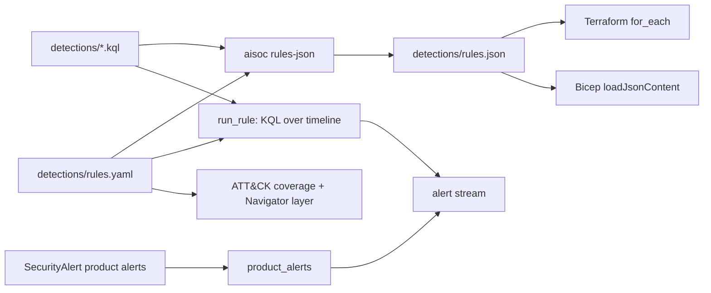

# Component: detections and ATT&CK coverage

Twelve analytics rules as KQL files with metadata, simulated as Sentinel scheduled rules over the
synthetic timeline, plus the Defender XDR product alerts already in `SecurityAlert`. The same metadata
is exported to `detections/rules.json`, which both IaC stacks read, and to an ATT&CK coverage report.

Sections: [1. Purpose](#1-purpose) · [2. Architecture](#2-architecture) · [3. How it works](#3-how-it-works) · [4. Key files](#4-key-files) · [5. Code excerpts](#5-code-excerpts) · [6. Configuration](#6-configuration) · [7. Commands](#7-commands) · [8. Real output](#8-real-output) · [9. Tests and gates](#9-tests-and-gates) · [10. Guardrails](#10-guardrails) · [11. Security and governance](#11-security-and-governance) · [12. Observability](#12-observability) · [13. Failure modes](#13-failure-modes) · [14. Mapping to Azure services](#14-mapping-to-azure-services) · [15. Limitations](#15-limitations) · [16. Interview talking points](#16-interview-talking-points)

## 1. Purpose

* Detection as code: each rule is a reviewed file with techniques, tactics, schedule and entity mapping.
* Realistic alert times: when the rule would actually have fired, not when the first event happened.
* An honest coverage picture against a priority technique list, gaps included.

## 2. Architecture



## 3. How it works

1. Each rule's KQL runs once over the tenant's full timeline. Every result row becomes an alert.
2. The alert time is when the contributing events crossed the rule's condition (first event, n-th event
   or n-th distinct value), plus a five-minute ingestion delay, rounded up to the rule's next run.
3. Product alerts from `SecurityAlert` join the stream unchanged, keyed by alert name.
4. `aisoc rules-json` writes `rules.json` with each query embedded; `--check` fails if it is stale, and
   both CI and the release gate run that check.
5. `aisoc attack` compares rule and product-alert techniques with `config/attack-techniques.yaml` and can
   write an ATT&CK Navigator layer.

## 4. Key files

| File | Role |
|---|---|
| `detections/rules.yaml` | Rule metadata: severity, tactics, techniques, schedule, prior, crossing, entities |
| `detections/*.kql` | One query per rule |
| `detections/rules.json` | Generated export read by Terraform and Bicep |
| `src/aisoc/detections.py` | Simulation, product alerts, `rules_json` |
| `src/aisoc/attack.py` | Technique catalogue, mapping, coverage, Navigator layer |
| `config/attack-techniques.yaml` | Priority techniques for this MSSP's customers |

## 5. Code excerpts

<!-- code: src/aisoc/detections.py::run_rule -->
```python
def run_rule(store: TenantStore, r: dict) -> list[Alert]:
    out = []
    for i, row in enumerate(kql.run(r["query"], store.tables, store.now)):
        ids = _row_ids(row)
        crossed = _crossing(store, r["crossing"], row, ids)
        when = _ceil(crossed + ingestion_delay(), iso_duration(r["frequency"]))
        ents = [{"type": t, "value": row[c]} for c, t in r["entities"].items() if row.get(c)]
        fields = {k: (v.isoformat() if isinstance(v, datetime) else v) for k, v in row.items() if k not in ("EventIds", "EventId")}
        out.append(
            Alert(
                id=f"{store.tenant.id[:2]}-{r['id']}-{i:03d}",
                tenant=store.tenant.id,
                source=r["id"],
                name=r["name"],
                severity=r["severity"],
                time=when,
                techniques=list(r["techniques"]),
                tactics=list(r["tactics"]),
                entities=ents,
                event_ids=ids,
                fields=fields,
            )
        )
    return out
```
<!-- /code -->

## 6. Configuration

`rules.yaml` fields: `frequency` and `period` (ISO 8601 durations, as in Sentinel), `prior` (starting
probability that an alert from this rule is malicious; the feedback loop learns per tenant), `crossing`
(how the alert time is derived) and `entities` (column to entity type). Ingestion delay is
`ingestion_delay_minutes` in `config/thresholds.yaml`.

## 7. Commands

```bash
aisoc detect
aisoc attack --layer out/navigator-layer.json
aisoc rules-json --check
```

## 8. Real output

<!-- output: detect -->
```text
brightwater: 44 alerts
orchidvalley: 46 alerts
pinecrest: 49 alerts
source (rule id or product alert)                               TP  BP  FP
--------------------------------------------------------------  --  --  --
Atypical travel                                                 1   0   15
Email messages containing malicious URL removed after delivery  2   0   0
Password spray                                                  2   0   0
Possible LSASS memory access                                    2   0   0
Suspicious PowerShell command line                              2   0   0
encoded-powershell                                              2   18  0
exfil-personal-cloud                                            2   0   0
inbox-forward-external                                          2   0   0
lsass-dump                                                      2   0   0
mass-download                                                   2   0   45
office-spawns-script                                            2   0   0
password-spray                                                  2   9   0
phish-click                                                     0   12  0
shadow-copy-delete                                              2   9   0
success-after-spray                                             2   0   0
ti-c2-connection                                                2   0   0
ti-url-click                                                    2   0   0
```
<!-- /output -->

The table counts alerts against ground truth: true positive (TP), benign positive (BP: real activity,
authorised) and false positive (FP). `mass-download` and `Atypical travel` are the noisy sources;
`encoded-powershell` and `password-spray` fire mostly on admin scripts and the authorised scanner.

<!-- output: attack -->
```text
priority techniques covered: 11/21 (52%)
  - T1566.001  Phishing: Spearphishing Attachment             no detection (gap)
  + T1566.002  Phishing: Spearphishing Link                   ti-url-click, phish-click
  - T1078      Valid Accounts                                 no detection (gap)
  + T1078.004  Valid Accounts: Cloud Accounts                 success-after-spray, product:Atypical travel
  + T1110.003  Brute Force: Password Spraying                 password-spray, success-after-spray, product:Password spray
  - T1110.001  Brute Force: Password Guessing                 no detection (gap)
  + T1003.001  OS Credential Dumping: LSASS Memory            lsass-dump
  + T1059.001  Command and Scripting Interpreter: PowerShell  encoded-powershell, office-spawns-script
  + T1204.002  User Execution: Malicious File                 office-spawns-script
  + T1071.001  Application Layer Protocol: Web Protocols      ti-c2-connection
  + T1490      Inhibit System Recovery                        shadow-copy-delete
  - T1486      Data Encrypted for Impact                      no detection (gap)
  + T1114.003  Email Collection: Email Forwarding Rule        inbox-forward-external
  + T1530      Data from Cloud Storage                        mass-download
  + T1567.002  Exfiltration Over Web Service: Exfiltration to Cloud Storage exfil-personal-cloud
  - T1021.001  Remote Services: Remote Desktop Protocol       no detection (gap)
  - T1053.005  Scheduled Task/Job: Scheduled Task             no detection (gap)
  - T1136.003  Create Account: Cloud Account                  no detection (gap)
  - T1098      Account Manipulation                           no detection (gap)
  - T1562.001  Impair Defenses: Disable or Modify Tools       no detection (gap)
  - T1070.001  Indicator Removal: Clear Windows Event Logs    no detection (gap)
```
<!-- /output -->

## 9. Tests and gates

* `tests/test_detections.py`: every rule fires somewhere, rule metadata is complete, no alert precedes its
  events plus the ingestion delay, every story raises at least one alert, alert entities are typed, and
  `rules.json` is current and carries the queries.
* `tests/test_iac.py`: `rules.json` ids and queries match the `.kql` files; both stacks load it.
* Release gate: every story detected, `rules.json` current.

## 10. Guardrails

* Rules are opt-in in the IaC (`deploy_analytics_rules = false`) and created disabled even when deployed.
* Prompt-injection text can appear in alert fields (subjects, command lines); downstream components treat
  every alert field as untrusted data.

## 11. Security and governance

Detection changes go through pull requests with CODEOWNERS review; the generated `rules.json` cannot
silently diverge because CI rebuilds and compares it.

## 12. Observability

`aisoc detect` reports TP / BP / FP per source, which is the per-rule false-positive rate a detection
engineer tunes against. In Sentinel the same view comes from incident classification on closure.

## 13. Failure modes

| Failure | Effect | Handling |
|---|---|---|
| A rule never fires on its story | Missed detection | Gate fails (every story detected) |
| `rules.json` edited by hand | IaC deploys different queries | `rules-json --check` in CI and the gate |
| Noisy rule floods triage | Analyst load | Triage priors and the feedback loop; rule tuning |

## 14. Mapping to Azure services

| Here | In Azure |
|---|---|
| Rule simulation | Microsoft Sentinel scheduled analytics rules |
| Product alerts | Defender XDR alerts synced to Sentinel incidents |
| Entity mapping | Sentinel entity mappings on the rule (account, host, IP, URL, mailbox) |
| Risky sign-in alerts | Entra ID Protection |
| Rule health | Azure Monitor and the Sentinel health table |
| Foundry | Not used by this component |

## 15. Limitations

* Each rule is simulated once over the whole timeline with `bin` windows, not as overlapping scheduled
  runs; lookback overlap and suppression are not modelled.
* Coverage is 11 of 21 priority techniques. T1486 (encryption for impact) is a known gap, alongside RDP,
  scheduled tasks, cloud account creation, account manipulation, defence impairment and log clearing.
* Queries use the simplified schema; see the column mapping before enabling them in a real workspace.

## 16. Interview talking points

* "Alert time is derived from when the condition was crossed plus ingestion delay and schedule, which is
  what MTTD should be measured against."
* "The coverage report lists gaps by name. Ten of the priority techniques have no detection."
* "One file per rule, one export for both IaC stacks, and a drift check so they cannot disagree."
