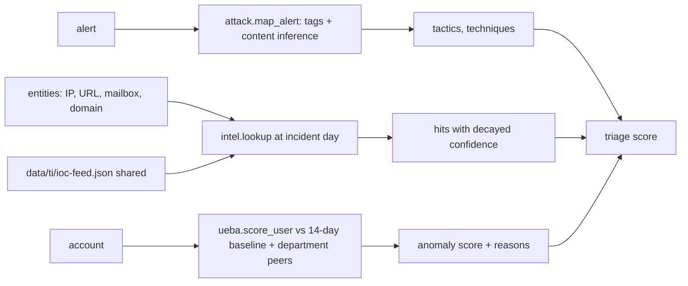

# Component: ATT&CK mapping, threat intel and UEBA

Three enrichment sources the triage and investigation agents use: MITRE ATT&CK technique mapping (from
rule tags and from content), a shared MSSP threat-intel feed with confidence decay, and per-user
behaviour baselines with peer groups.

Sections: [1. Purpose](#1-purpose) · [2. Architecture](#2-architecture) · [3. How it works](#3-how-it-works) · [4. Key files](#4-key-files) · [5. Code excerpts](#5-code-excerpts) · [6. Configuration](#6-configuration) · [7. Commands](#7-commands) · [8. Real output](#8-real-output) · [9. Tests and gates](#9-tests-and-gates) · [10. Guardrails](#10-guardrails) · [11. Security and governance](#11-security-and-governance) · [12. Observability](#12-observability) · [13. Failure modes](#13-failure-modes) · [14. Mapping to Azure services](#14-mapping-to-azure-services) · [15. Limitations](#15-limitations) · [16. Interview talking points](#16-interview-talking-points)

## 1. Purpose

* ATT&CK: name what the attacker is doing, count tactics for routing, and measure coverage.
* Threat intel: raise confidence when an incident touches known-bad infrastructure, and let stale intel
  count for less.
* UEBA: catch insiders and account misuse that no signature describes.

## 2. Architecture



## 3. How it works

1. **ATT&CK.** Rule tags give techniques; `infer_text` adds techniques from content patterns (for example
   an encoded PowerShell command line). A parent technique is dropped when its sub-technique is present.
2. **Threat intel.** Indicators are shaped like trimmed STIX 2.1 objects. An indicator is active from
   `first_seen_day` for `valid_days`, and confidence decays linearly to half by the end of that window.
   Consumer cloud storage labels are ignored for scoring. The feed is shared; sightings stay per tenant.
3. **UEBA.** For each account, a baseline of the 14 days before the incident day: mean and spread of
   downloads, usual countries, external uploads. Department peers back up thin histories. Signals:
   download z-score above 3, first sign-in from a new country, external uploads with none in the
   baseline, and a rising four-day trend.

## 4. Key files

| File | Role |
|---|---|
| `src/aisoc/attack.py` | Catalogue, mapping, coverage, Navigator layer |
| `src/aisoc/intel.py` | Feed, decay, lookup, Sentinel-shaped TI table |
| `src/aisoc/ueba.py` | Baselines, peer groups, anomaly scoring |
| `config/attack-techniques.yaml` | Priority techniques |
| `data/ti/ioc-feed.json` | Fictional curated feed |

## 5. Code excerpts

<!-- code: src/aisoc/intel.py::effective_confidence -->
```python
def effective_confidence(ind: dict, day: float) -> float:
    age = day - ind["first_seen_day"]
    if age < 0 or age > ind["valid_days"]:
        return 0.0
    return round(ind["confidence"] * (1 - 0.5 * age / ind["valid_days"]), 1)
```
<!-- /code -->

<!-- code: src/aisoc/ueba.py::score_user -->
```python
def score_user(store: TenantStore, user: str, start: datetime, end: datetime) -> Anomaly:
    """Anomaly of `user` in [start, end) against the baseline ending at the start of that day."""
    base = baselines(store, start).get(user)
    downloads = sum(
        1
        for r in store.tables["CloudAppEvents"]
        if r.get("AccountUpn") == user and r["ActionType"] == "FileDownloaded" and start <= r["TimeGenerated"] < end
    )
    uploads = sum(
        1
        for r in store.tables["CloudAppEvents"]
        if r.get("AccountUpn") == user and r["ActionType"] == "FileUploaded" and r["IsExternal"] and start <= r["TimeGenerated"] < end
    )
    countries = {
        r["Location"]
        for r in store.tables["SigninLogs"]
        if r["UserPrincipalName"] == user and r["ResultType"] == "0" and start <= r["TimeGenerated"] < end
    }
    reasons = []
    if base is None:
        return Anomaly(user, 0.0, 0.0, downloads, None, uploads, 0.0, ("no baseline",))
    days = max((end - start).total_seconds() / 86400, 1 / 24)
    expected = max(base.mean_downloads, 0.5) * days
    spread = max(base.std_downloads * days, 0.25 * max(base.peer_mean_downloads, 1) * days, 2.0)
    z = (downloads - expected) / spread
    new_country = next((c for c in sorted(countries) if base.countries and c not in base.countries), None)
    midnight = start.replace(hour=0, minute=0, second=0, microsecond=0)
    recent = _day_counts(store, midnight - timedelta(days=4), midnight)
    last4 = recent.get(user, [0])
    drift = (statistics.fmean(last4) - base.mean_downloads) / max(base.std_downloads, 1.0) if last4 else 0.0
    score = 0.0
    if z > 3:
        score += min(0.5, 0.1 * z)
        reasons.append(f"downloads {downloads} vs expected {expected:.1f} (z={z:.1f})")
    if new_country:
        score += 0.3
        reasons.append(f"first sign-in from {new_country} in {HISTORY_DAYS} days")
    if uploads and base.external_uploads == 0:
        score += 0.25
        reasons.append(f"{uploads} external uploads with none in the baseline")
    if drift > 1.5:
        score += 0.1
        reasons.append(f"download trend rising before the alert (drift={drift:.1f})")
    return Anomaly(user, round(min(score, 1.0), 3), round(z, 2), downloads, new_country, uploads, round(drift, 2), tuple(reasons))
```
<!-- /code -->

## 6. Configuration

Indicators carry `confidence`, `first_seen_day`, `valid_days`, `labels`, `actor` and `techniques`.
Priority techniques carry `priority: true`; they form the coverage denominator. UEBA history is
`HISTORY_DAYS` (14) in `ueba.py`.

## 7. Commands

```bash
aisoc attack
aisoc attack --layer out/navigator-layer.json   # import into ATT&CK Navigator
aisoc risk                                      # uses the same UEBA and TI signals ahead of time
```

## 8. Real output

<!-- output: attack -->
```text
priority techniques covered: 11/21 (52%)
  - T1566.001  Phishing: Spearphishing Attachment             no detection (gap)
  + T1566.002  Phishing: Spearphishing Link                   ti-url-click, phish-click
  - T1078      Valid Accounts                                 no detection (gap)
  + T1078.004  Valid Accounts: Cloud Accounts                 success-after-spray, product:Atypical travel
  + T1110.003  Brute Force: Password Spraying                 password-spray, success-after-spray, product:Password spray
  - T1110.001  Brute Force: Password Guessing                 no detection (gap)
  + T1003.001  OS Credential Dumping: LSASS Memory            lsass-dump
  + T1059.001  Command and Scripting Interpreter: PowerShell  encoded-powershell, office-spawns-script
  + T1204.002  User Execution: Malicious File                 office-spawns-script
  + T1071.001  Application Layer Protocol: Web Protocols      ti-c2-connection
  + T1490      Inhibit System Recovery                        shadow-copy-delete
  - T1486      Data Encrypted for Impact                      no detection (gap)
  + T1114.003  Email Collection: Email Forwarding Rule        inbox-forward-external
  + T1530      Data from Cloud Storage                        mass-download
  + T1567.002  Exfiltration Over Web Service: Exfiltration to Cloud Storage exfil-personal-cloud
  - T1021.001  Remote Services: Remote Desktop Protocol       no detection (gap)
  - T1053.005  Scheduled Task/Job: Scheduled Task             no detection (gap)
  - T1136.003  Create Account: Cloud Account                  no detection (gap)
  - T1098      Account Manipulation                           no detection (gap)
  - T1562.001  Impair Defenses: Disable or Modify Tools       no detection (gap)
  - T1070.001  Indicator Removal: Clear Windows Event Logs    no detection (gap)
```
<!-- /output -->

## 9. Tests and gates

`tests/test_attack_intel_ueba.py`: the mapper infers techniques from content; a parent is dropped when a
sub-technique is present; every rule technique is in the catalogue; coverage is computed, not claimed;
the Navigator layer has the right shape; TI confidence decays and expires; lookup matches on domain or
value; unknown and corporate values miss; the TI table has Sentinel columns; the insider burst is
anomalous; the heavy-downloading data engineer is normal once baselined; a new country is flagged.

## 10. Guardrails

* TI and UEBA raise or lower a score; they never close or contain anything on their own.
* Documentation-range IPs and `.example` domains only; no real indicator is published here.

## 11. Security and governance

The MSSP feed is shared knowledge, but sightings and baselines are per tenant, so one customer's
behaviour never shapes another's baseline. ATT&CK names follow MITRE's published catalogue and are used
under its terms.

## 12. Observability

Hits and anomaly reasons appear in each incident's explanation (`ti 0.78 x +2.2`, `ueba 0.30 x +3.0`),
and coverage is printed by `aisoc attack`.

## 13. Failure modes

| Failure | Effect | Handling |
|---|---|---|
| Stale indicator | False escalation | Linear decay to half, then expiry |
| Thin user history | Noisy anomalies | Peer-group spread as a floor |
| Shared corporate infrastructure in feed | Mass false hits | Corporate values excluded; test |

## 14. Mapping to Azure services

| Here | In Azure |
|---|---|
| IOC feed | Microsoft Sentinel threat intelligence (STIX/TAXII connector, `ThreatIntelIndicators`) |
| Defender TI context | Defender XDR threat analytics and Microsoft Defender Threat Intelligence |
| UEBA | Sentinel UEBA (`BehaviorAnalytics`, `IdentityInfo`) |
| New-country sign-in | Entra ID Protection risk detections |
| Coverage | Sentinel MITRE ATT&CK blade; Navigator layer as an Azure Monitor workbook input |
| Foundry | Not used by this component |

## 15. Limitations

* The feed is tiny and fictional; real TI needs deduplication, scoring across sources and feedback.
* UEBA covers downloads, uploads and countries only; no peer-graph or access-pattern models.
* Coverage counts a technique as covered if any rule maps to it; it says nothing about detection quality.

## 16. Interview talking points

* "Intel confidence decays over the indicator's validity window, so last quarter's spray IP is not
  treated like today's C2."
* "The heavy-downloading data engineer is the UEBA test: he must look normal against his own baseline,
  while the insider's rising trend shows up days before the theft."
* "Coverage is computed from rule tags, and the gaps are printed with the covered ones."
