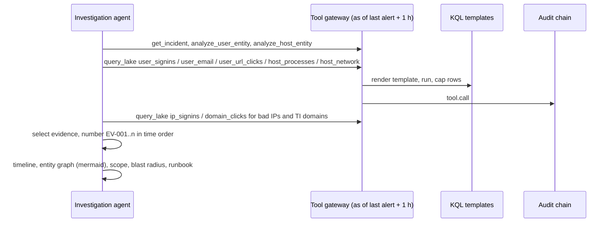

# Component: investigation agent

For every tier 2 and tier 3 incident the investigation agent plans tool calls through the gateway,
collects evidence, builds a timeline and an entity graph, and works out scope and blast radius. It sees
the tenant as of one hour after the incident's last alert and never reads ground truth.

Sections: [1. Purpose](#1-purpose) · [2. Architecture](#2-architecture) · [3. How it works](#3-how-it-works) · [4. Key files](#4-key-files) · [5. Code excerpts](#5-code-excerpts) · [6. Configuration](#6-configuration) · [7. Commands](#7-commands) · [8. Real output](#8-real-output) · [9. Tests and gates](#9-tests-and-gates) · [10. Guardrails](#10-guardrails) · [11. Security and governance](#11-security-and-governance) · [12. Observability](#12-observability) · [13. Failure modes](#13-failure-modes) · [14. Mapping to Azure services](#14-mapping-to-azure-services) · [15. Limitations](#15-limitations) · [16. Interview talking points](#16-interview-talking-points)

## 1. Purpose

* Do the first hour of an analyst's work in seconds: pivot on accounts, hosts, attacker addresses and
  threat-intel domains, and hand over a cited timeline.
* Separate signal from haystack: list evidence, count routine rows.
* Give the response agent a precise scope so containment targets only what was touched.

## 2. Architecture



## 3. How it works

1. Account steps: sign-ins, cloud activity, email and URL clicks over 48 hours. Host steps: processes and
   network connections.
2. A row becomes evidence when it is one of the incident's own events, touches a known-bad indicator or
   attacker address, or matches an ATT&CK behaviour pattern. Everything else is counted as routine.
3. The agent pivots on attacker IPs and threat-intel domains to find other affected accounts. Mail from
   the phishing-drill sender is treated as routine, so drill clickers never enter scope.
4. For a spray, scope is limited to accounts that actually signed in successfully from the spraying
   address, not every account that was tried.
5. Evidence is renumbered in time order. Scope lists accounts, hosts, external IPs and destinations; blast
   radius flags privileged accounts and crown jewels.
6. The matching runbook (by rule id or technique) is attached.

## 4. Key files

| File | Role |
|---|---|
| `src/aisoc/investigation.py` | Planning, evidence selection, timeline, graph, scope |
| `src/aisoc/tools.py` | The gateway it calls |
| `src/aisoc/knowledge.py` | Runbook matching |
| `runbooks/*.md` | One runbook per attack family |

## 5. Code excerpts

<!-- code: src/aisoc/investigation.py::Evidence -->
```python
@dataclass(frozen=True)
class Evidence:
    id: str
    time: datetime
    kind: str
    summary: str
    event_id: str
    why: str
```
<!-- /code -->

## 6. Configuration

`LOOKBACK` 48 hours and `SETTLE` 1 hour are constants in `investigation.py`. The templates it may use
are those allowed for `agent:investigation` in `config/identities.yaml`.

## 7. Commands

```bash
aisoc investigate --tenant orchidvalley --incident INC-OR-032
aisoc bench   # wall-clock timings; machine-dependent, so never rendered into docs
```

## 8. Real output

<!-- output: investigate --tenant orchidvalley --incident INC-OR-032 -->
```text
INC-OR-032 (orchidvalley) tier 3: 4 ATT&CK tactics
verdict true_positive p=0.995 confidence 0.995
score terms: prior 0.75 (Possible LSASS memory access, Suspicious PowerShell command line, shadow-copy-delete, ti-c2-connection); ti 0.78 x +2.2; two_tactics 1.00 x +1.0; three_tactics 1.00 x +1.0; high_severity 1.00 x +0.4
techniques: T1003.001 OS Credential Dumping: LSASS Memory, T1059.001 Command and Scripting Interpreter: PowerShell, T1071.001 Application Layer Protocol: Web Protocols, T1204.002 User Execution: Malicious File, T1490 Inhibit System Recovery
runbook: ransomware-precursor.md
tool calls 12, evidence 4, routine rows counted 17
timeline:
  EV-001 D18 01:00 winword.exe started powershell.exe on OVC-WS008: powershell.exe -nop -w hidden -enc SQBFAFgAIAAoAE4AZQB3AC0ATwBiAGoAZQBjAHQAIABOAGUAdAAuAFcAZQBiAEMAbABpAGUAbgB0ACkALgBEAG8AdwBuAGwA...
  EV-002 D18 01:05 OVC-WS008 (powershell.exe) connected to 203.0.113.140:443 [alert event]
  EV-003 D18 01:20 powershell.exe started rundll32.exe on OVC-WS008: rundll32.exe C:\Windows\System32\comsvcs.dll, MiniDump 624 C:\Users\Public\lsass.dmp full [alert event]
  EV-004 D18 01:45 powershell.exe started vssadmin.exe on OVC-WS008: vssadmin.exe delete shadows /all /quiet [alert event]
scope: {"accounts": ["emery.calloway@orchidvalley.example"], "hosts": ["OVC-WS008"], "external_ips": ["203.0.113.140"], "destinations": []}
blast radius: {"privileged_accounts": [], "crown_jewels": [], "external_destinations": [], "evidence_rows": 4, "routine_rows": 17}
containment plan (digest 115d2fd8318a215c):
  revoke_sessions emery.calloway@orchidvalley.example  approvals 1  permission User.RevokeSessions.All
  disable_user emery.calloway@orchidvalley.example  approvals 1  permission User.EnableDisableAccount.All
  isolate_host OVC-WS008  approvals 1  permission Machine.Isolate
  block_ip 203.0.113.140  approvals 1  permission Ti.ReadWrite.All
approved: True; executions: [('revoke_sessions', 'emery.calloway@orchidvalley.example', 'dry-run'), ('disable_user', 'emery.calloway@orchidvalley.example', 'dry-run'), ('isolate_host', 'OVC-WS008', 'dry-run'), ('block_ip', '203.0.113.140', 'dry-run')]
narrative (fallback=False, injection obeyed=False, ~589 prompt tokens):
  Connection to a threat-intel address; Possible LSASS memory access; Suspicious PowerShell command line; Volume shadow co: malicious activity confirmed by evidence
  Code verdict true_positive at confidence 0.99. Mapped techniques: T1003.001, T1059.001, T1071.001, T1204.002, T1490. Scope: accounts USER-1; external_ips 203.0.113.140; hosts HOST-1.
  evidence cited: EV-001, EV-002, EV-003, EV-004; actions: block_ip, disable_user, isolate_host, revoke_sessions
analyst: analyst.okafor -> true_positive
```
<!-- /output -->

Across the learning run the agent investigated 37 incidents with 336 tool calls (mean 9.1) and no denied
calls (see `aisoc metrics`). One local `aisoc bench` run measured a median of 4.1 ms per investigation;
that timing depends on the machine and is not a product claim.

## 9. Tests and gates

`tests/test_investigation.py`: product code never imports ground truth (AST check); ransomware scope and
graph; evidence numbered in time order; the phishing simulation never enters scope; spray scope is the
compromised account only; the runbook is attached; the investigation reads no rows after its as-of time.

## 10. Guardrails

* Read-only tools through the gateway; templates only; as-of time; 200-row cap.
* Evidence text (subjects, command lines) is carried as data. When it reaches the model it is screened,
  redacted and quoted (see [narrative-guardrails.md](narrative-guardrails.md)).

## 11. Security and governance

Every pivot is an audit record, so a reviewer can replay exactly what the agent looked at. The agent's
Azure identity is Microsoft Sentinel Reader on one workspace.

## 12. Observability

Per investigation: tool calls, evidence rows, routine rows, denied calls and duration. Aggregates appear
in `aisoc metrics`.

## 13. Failure modes

| Failure | Effect | Handling |
|---|---|---|
| Drill clickers pulled into scope | Wrong users disabled | Drill sender rows counted as routine; test |
| Spray scope too wide | Mass account disable | Only successful sign-ins from the spraying IP |
| Reads after the alert | Hindsight bias in metrics | As-of time enforced by the gateway; test |

## 14. Mapping to Azure services

| Here | In Azure |
|---|---|
| Pivots | Microsoft Sentinel investigation graph and hunting queries |
| Host data | Defender XDR device timeline (`DeviceProcessEvents`, `DeviceNetworkEvents`) |
| Account data | Entra ID sign-in logs and Defender for Cloud Apps activity |
| Timeline storage | Sentinel incident comments or a custom Log Analytics table, monitored with Azure Monitor |
| Agent runtime | Foundry Agent Service with MCP tools |

## 15. Limitations

* Evidence selection is rule based, not learned; unusual attacks need new patterns.
* The 48-hour lookback misses slow intrusions; real investigations widen the window on demand.
* Timings are from a laptop-class box on small synthetic data.

## 16. Interview talking points

* "The investigator sees the world as of one hour after the last alert, so MTTR and accuracy are not
  inflated by hindsight."
* "Evidence is cited by number, and routine rows are counted, so the analyst knows both the signal and
  the size of the haystack."
* "Scope discipline matters for containment: spray scope is the accounts that actually got in."
