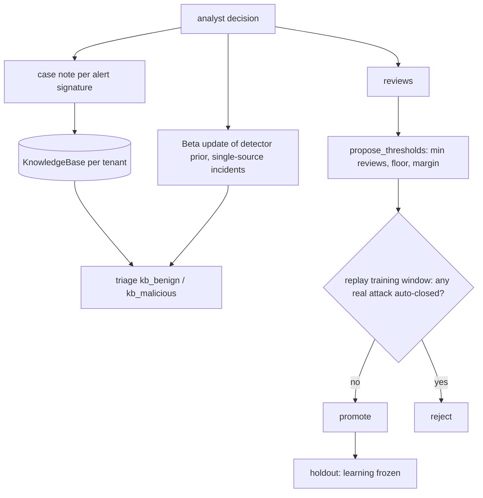

# Component: knowledge capture and the feedback loop

Analyst decisions become case notes in a per-tenant knowledge base and update per-detector priors. At the
end of the training window, per-detector auto-close thresholds are proposed from the reviews and promoted
only if replaying the training window with them would auto-close zero real attacks. Learning is then
frozen and measured on the holdout window.

Sections: [1. Purpose](#1-purpose) · [2. Architecture](#2-architecture) · [3. How it works](#3-how-it-works) · [4. Key files](#4-key-files) · [5. Code excerpts](#5-code-excerpts) · [6. Configuration](#6-configuration) · [7. Commands](#7-commands) · [8. Real output](#8-real-output) · [9. Tests and gates](#9-tests-and-gates) · [10. Guardrails](#10-guardrails) · [11. Security and governance](#11-security-and-governance) · [12. Observability](#12-observability) · [13. Failure modes](#13-failure-modes) · [14. Mapping to Azure services](#14-mapping-to-azure-services) · [15. Limitations](#15-limitations) · [16. Interview talking points](#16-interview-talking-points)

## 1. Purpose

* Make one analyst's call the team's starting point next time ("that encoded PowerShell is the inventory
  job").
* Earn tier 1 autonomy per detector and per tenant from evidence, not by setting a global threshold.
* Prove the learning helps on data it did not see, and that it never closes an attack.

## 2. Architecture



## 3. How it works

1. **Case notes.** Every reviewed case writes a note per alert signature. Only `analyst.*` identities may
   write; the AI never does, so it cannot teach itself a wrong answer. A note for another tenant is refused.
2. **Priors.** For single-detector incidents, the detector's prior becomes
   `(shipped_prior * 4 + malicious_reviews) / (4 + reviews)`: the shipped prior counts as four reviews.
3. **Thresholds.** A detector needs four reviews before its threshold moves. If the AI ever called a real
   attack benign on that detector, its threshold locks at 0.99. Otherwise the threshold sits 0.05 below
   the lowest correct benign confidence, never below 0.70.
4. **Promotion gate.** The candidate thresholds are replayed over the training window; any real attack
   that would reach tier 1 blocks promotion. The outcome is audited (`thresholds.tuned`).
5. **Freeze.** Learning stops at the holdout boundary, so holdout numbers are a fair test.

## 4. Key files

| File | Role |
|---|---|
| `src/aisoc/knowledge.py` | Runbooks, case notes, per-tenant knowledge base |
| `src/aisoc/feedback.py` | Reviews, prior updates, threshold proposals |
| `src/aisoc/pipeline.py` | Replay gate and the train-to-holdout switch |
| `runbooks/*.md` | Shared runbooks per attack family |

## 5. Code excerpts

<!-- code: src/aisoc/feedback.py::propose_thresholds -->
```python
def propose_thresholds(reviews: list[Review]) -> dict[str, float]:
    th = thresholds()
    by_src: dict[str, list[Review]] = defaultdict(list)
    for r in reviews:
        if len(r.sources) == 1:
            by_src[r.sources[0]].append(r)
    out = {}
    for src, rs in by_src.items():
        if len(rs) < th["min_reviews_to_tune"]:
            continue
        if any(r.analyst_verdict == "true_positive" and r.ai_verdict != "true_positive" for r in rs):
            out[src] = 0.99  # the AI called a real attack benign on this detector: effectively never auto-close
            continue
        benign_right = [r.ai_confidence for r in rs if r.ai_verdict != "true_positive" and r.analyst_verdict != "true_positive"]
        if len(benign_right) >= th["min_reviews_to_tune"]:
            out[src] = round(max(th["threshold_floor"], min(benign_right) - th["threshold_margin"]), 2)
    return out
```
<!-- /code -->

<!-- code: src/aisoc/pipeline.py::replay_gate -->
```python
def replay_gate(store: TenantStore, incidents: list[Incident], kb: KnowledgeBase, learned: Learned) -> list[str]:
    """Re-triage the training window with candidate thresholds; any real attack that would be auto-closed blocks promotion."""
    misses = []
    for inc in incidents:
        if window_of(inc) != "train":
            continue
        probe = copy.copy(inc)
        enrich_and_score(store, probe, kb, learned)
        if route(store, probe, learned).tier == 1 and verdict_for_events(store.tenant.id, inc.event_ids) == "true_positive":
            misses.append(inc.id)
    return misses
```
<!-- /code -->

## 6. Configuration

`min_reviews_to_tune` 4, `threshold_floor` 0.70, `threshold_margin` 0.05 in `config/thresholds.yaml`;
`PRIOR_STRENGTH` 4 in `feedback.py`. Learned priors and thresholds live in memory for the run and are
printed by `aisoc feedback`; `KnowledgeBase.save()` writes case notes to `out/knowledge/`. Nothing is
written back into config.

## 7. Commands

```bash
aisoc feedback
aisoc compare
```

## 8. Real output

<!-- output: feedback -->
```text
brightwater: 9 training-window reviews, 3 overrides, 10 case notes
  learned priors: {"encoded-powershell": 0.225, "mass-download": 0.2333, "phish-click": 0.4, "shadow-copy-delete": 0.4}
  gate: promoted 1 threshold change(s); replay auto-closed 0 real attacks
  auto-close thresholds now: {"encoded-powershell": 0.7}
orchidvalley: 9 training-window reviews, 3 overrides, 11 case notes
  learned priors: {"encoded-powershell": 0.225, "mass-download": 0.2333, "phish-click": 0.4, "shadow-copy-delete": 0.4}
  gate: promoted 1 threshold change(s); replay auto-closed 0 real attacks
  auto-close thresholds now: {"encoded-powershell": 0.7}
pinecrest: 10 training-window reviews, 3 overrides, 14 case notes
  learned priors: {"encoded-powershell": 0.225, "mass-download": 0.2333, "phish-click": 0.4, "shadow-copy-delete": 0.4}
  gate: promoted 1 threshold change(s); replay auto-closed 0 real attacks
  auto-close thresholds now: {"encoded-powershell": 0.7}
```
<!-- /output -->

<!-- output: compare -->
```text
holdout window (days 14-20), same incidents:
metric                     baseline (no learning)  after feedback loop
-------------------------  ----------------------  -------------------
incidents                  40                      40
accuracy_3class_pct        77.5                    100.0
accuracy_binary_pct        92.5                    100.0
malicious_precision_pct    62.5                    100.0
malicious_recall_pct       100.0                   100.0
tier1                      10                      28
tier2                      28                      10
tier3                      2                       2
auto_closed_pct            25.0                    70.0
auto_closed_attacks        0                       0
escalation_noise_pct       83.3                    58.3
human_reviews              30                      15
override_rate_pct          30.0                    0.0
simulated_analyst_minutes  650                     380
```
<!-- /output -->

The learned priors are the same in all three tenants because the synthetic look-alikes are the same; in
real tenants they would differ. Holdout accuracy reaches 100% because look-alikes repeat on a schedule;
real benign noise is messier, so treat the size of the gain as an upper bound, not a forecast.

## 9. Tests and gates

`tests/test_workflow_feedback.py`: the knowledge base only accepts analyst decisions; the Beta prior
update; thresholds need enough reviews and respect the floor; a missed attack locks the detector; the
promotion gate blocks thresholds that would close attacks; learning is frozen for the holdout window;
threshold promotion is audited. `tests/test_metrics_risk_isolation.py`: the feedback loop improves the
holdout. Release gate: the feedback loop does not reduce holdout binary accuracy, and no attack is
auto-closed in any window or mode.

## 10. Guardrails

No self-poisoning (AI verdicts never become notes), single-source credit for priors, a floor, a lock after
a miss, a replay gate and a freeze before evaluation.

## 11. Security and governance

Knowledge bases and learned thresholds are per tenant; a write to the wrong tenant raises. Promotions are
audited with the candidate values, so a reviewer can see what changed and why.

## 12. Observability

Override rate, binary override rate, review counts and the gate log, per window and mode (see
[metrics-gate.md](metrics-gate.md)).

## 13. Failure modes

| Failure | Effect | Handling |
|---|---|---|
| A wrong analyst decision | Bad note, bad prior | Notes are counted, not trusted alone; QA sampling; replay gate |
| A noisy rule joins an attack incident | Rule credited with attacks | Priors update on single-source incidents only |
| Threshold creeps down | Attacks auto-closed | Floor, lock after a miss, replay gate |

## 14. Mapping to Azure services

| Here | In Azure |
|---|---|
| Case notes | Microsoft Sentinel incident comments and classification, exported to a knowledge store |
| Knowledge base search | Azure AI Search index per tenant, used by a Foundry agent |
| Learned thresholds | Configuration in Azure App Configuration, changed through a pull request |
| Promotion audit | Azure Monitor log of the promotion run |
| Product alerts as signal | Defender XDR alert classification feedback |
| Identity of the reviewer | Entra ID |

## 15. Limitations

* The simulated analyst is always right, so the loop never learns from a bad decision here.
* The replay gate checks candidates against ground truth for the training window, standing in for the
  confirmed outcomes a real SOC would have for past incidents (including ones closed at tier 1).
* Thresholds are tuned once, at the window boundary; a real SOC would tune on a schedule with the same gate.
* Case notes are matched by signature, not by semantic similarity.

## 16. Interview talking points

* "Autonomy is earned per detector and per tenant: four reviews, a floor, and a replay that must close zero
  real attacks."
* "The AI cannot write to its own knowledge base. Only analyst decisions become notes."
* "On the holdout, override rate went from 30% to 0% and human reviews from 30 to 15, with recall at 100%.
  I say plainly that the synthetic look-alikes make this easier than real life."
