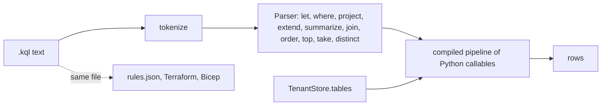

# Component: KQL engine

A small pure-Python interpreter for the subset of KQL this repository uses. The same `.kql` files feed
the Sentinel analytics rules in the IaC and run here over the synthetic tables, so detections are tested
offline with the query text that would be deployed.

Sections: [1. Purpose](#1-purpose) · [2. Architecture](#2-architecture) · [3. How it works](#3-how-it-works) · [4. Key files](#4-key-files) · [5. Code excerpts](#5-code-excerpts) · [6. Configuration](#6-configuration) · [7. Commands](#7-commands) · [8. Real output](#8-real-output) · [9. Tests and gates](#9-tests-and-gates) · [10. Guardrails](#10-guardrails) · [11. Security and governance](#11-security-and-governance) · [12. Observability](#12-observability) · [13. Failure modes](#13-failure-modes) · [14. Mapping to Azure services](#14-mapping-to-azure-services) · [15. Limitations](#15-limitations) · [16. Interview talking points](#16-interview-talking-points)

## 1. Purpose

* Run detections and investigation queries in CI without a Log Analytics workspace.
* Keep one copy of each query: the rule file is the deployed artefact and the test input.
* Fail loudly on anything outside the supported subset instead of guessing.

## 2. Architecture



## 3. How it works

1. `tokenize` splits the query into identifiers, strings, numbers, timespans and operators.
2. `Parser` turns the pipeline into nested Python callables. Each stage takes rows and returns rows.
3. `summarize ... by bin(TimeGenerated, 1h)` groups rows; aggregates include `count`, `dcount`,
   `make_set`, `countif`, `min`, `max`, `avg` and `take_any`.
4. `run(text, tables, now)` binds `ago()` and `now()` to the investigation time, not the wall clock, so
   results are deterministic.
5. Unknown tables, operators or functions raise `KqlError`. The CLI prints the error and exits 2.

## 4. Key files

| File | Role |
|---|---|
| `src/aisoc/kql.py` | Tokenizer, parser, aggregates, `run` |
| `detections/*.kql` | Analytics rule queries |
| `config/kql-templates.yaml` | Allow-listed investigation templates (see the tool gateway) |
| `tests/test_kql.py` | Operator and function coverage, error cases |

## 5. Code excerpts

<!-- code: detections/password-spray.kql -->
```kusto
// Password spray: one source address fails sign-in for many distinct accounts within an hour.
SigninLogs
| where ResultType != "0"
| summarize FailedAccounts = dcount(UserPrincipalName), Attempts = count(), EventIds = make_set(EventId) by IPAddress, Window = bin(TimeGenerated, 1h)
| where FailedAccounts >= 5
```
<!-- /code -->

<!-- code: src/aisoc/kql.py::run -->
```python
def run(text: str, tables: dict[str, Iterable[Row]], now: datetime) -> list[Row]:
    """Run one KQL query over in-memory tables. `now` anchors ago() so results are reproducible."""
    return compile_query(text)({k: list(v) for k, v in tables.items()}, {"now": now})
```
<!-- /code -->

## 6. Configuration

None. The supported subset is listed in the module docstring and enforced by the parser.

## 7. Commands

```bash
aisoc kql --tenant pinecrest --file detections/password-spray.kql --limit 5
aisoc kql --tenant brightwater --query 'SigninLogs | where ResultType != "0" | count'
```

## 8. Real output

<!-- output: kql --tenant pinecrest --file detections/password-spray.kql --limit 5 -->
```text
4 row(s)
  {"IPAddress": "198.51.100.70", "FailedAccounts": 8, "Attempts": 8}
  {"IPAddress": "198.51.100.70", "FailedAccounts": 8, "Attempts": 8}
  {"IPAddress": "198.51.100.70", "FailedAccounts": 8, "Attempts": 8}
  {"IPAddress": "203.0.113.77", "FailedAccounts": 10, "Attempts": 10}
```
<!-- /output -->

The first three rows are the authorised scanner at `198.51.100.70`, which fails sign-in for eight
accounts every few days. The last row is the real spray. Telling these apart is the triage agent's job.

## 9. Tests and gates

`tests/test_kql.py` covers 20 filter forms (`==`, `=~`, `in~`, `!in~`, `has`, `!has`, `contains`,
`startswith`, `endswith`, `has_any`, `ago`, `not`, `isempty`, `take`, `limit`, `distinct`), `summarize`
with `bin` and aggregates, `join` in both key syntaxes, `extend` with `parse_url`, `let` with `order` and
`top`, string functions, `count`, and five unsupported forms that must raise `KqlError`
(`mv-expand`, unknown functions, `evaluate`, an incomplete comparison, `invoke`). Every detection in
`tests/test_detections.py` also runs through this engine.

## 10. Guardrails

* No `eval` and no dynamic code: the parser builds closures from a fixed grammar.
* Agents never send raw KQL. They fill allow-listed templates whose parameters are checked by regex
  (see [tool-gateway-mcp.md](tool-gateway-mcp.md)). Raw KQL is reserved for human hunting identities.

## 11. Security and governance

The engine only sees the tables of the store it is given, so a query cannot reach another tenant. In
Azure the same boundary is the workspace scope of the caller's role assignment.

## 12. Observability

Every query an agent runs is a `tool.call` record in the tenant's audit chain, with the template name,
parameters and row count; refused queries are `tool.denied` records.

## 13. Failure modes

| Failure | Effect | Handling |
|---|---|---|
| Query uses an unsupported operator | `KqlError` | Fails the test or the CLI with exit 2; extend the parser or rewrite the query |
| Semantics differ from Kusto in an edge case | A rule behaves differently in Sentinel | Planned cross-check in the Kusto emulator; rules ship disabled |
| Huge result set | Memory and prompt bloat | The tool gateway caps rows at 200 |

## 14. Mapping to Azure services

| Here | In Azure |
|---|---|
| `kql.run` over synthetic tables | Log Analytics query API on the Microsoft Sentinel workspace |
| `.kql` rule files | `azurerm_sentinel_alert_rule_scheduled` / `Microsoft.SecurityInsights/alertRules` |
| Defender XDR tables in queries | Advanced hunting tables streamed into Sentinel |
| Caller identity | Entra ID managed identity with Microsoft Sentinel Reader |
| Query audit | Azure Monitor diagnostic setting (`audit` category group) on the workspace |
| Foundry | Not used by this component |

## 15. Limitations

* A subset only: no `mv-expand`, `make-series`, `materialize`, regex functions or time-series operators.
* Not yet cross-checked against the Kusto emulator; that is the next step before enabling rules.
* Columns follow the simplified schema, so deployed rules need the column mapping in
  [../infra/sentinel-workspace.md](../infra/sentinel-workspace.md).

## 16. Interview talking points

* "The query in the test is the query in the Terraform plan: both read the same file through rules.json."
* "I chose a tiny interpreter over mocking query results, so a broken `where` clause fails CI."
* "Rules are created disabled because the schema is simplified. Saying that plainly matters more than a
  green deploy."
