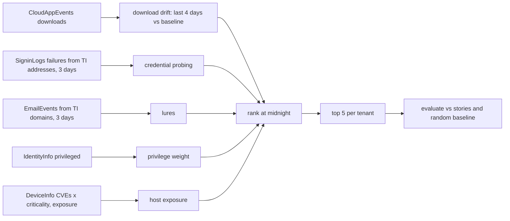

# Component: predictive risk

Each midnight the model ranks a tenant's accounts and hosts by how likely they are to be involved in an
attack soon, from signals seen so far: download drift, credential probing from threat-intel addresses,
lures from threat-intel domains, privilege, and host exposure. The evaluation asks whether each attack
story's target was in the tenant's top five the midnight before.

Sections: [1. Purpose](#1-purpose) · [2. Architecture](#2-architecture) · [3. How it works](#3-how-it-works) · [4. Key files](#4-key-files) · [5. Code excerpts](#5-code-excerpts) · [6. Configuration](#6-configuration) · [7. Commands](#7-commands) · [8. Real output](#8-real-output) · [9. Tests and gates](#9-tests-and-gates) · [10. Guardrails](#10-guardrails) · [11. Security and governance](#11-security-and-governance) · [12. Observability](#12-observability) · [13. Failure modes](#13-failure-modes) · [14. Mapping to Azure services](#14-mapping-to-azure-services) · [15. Limitations](#15-limitations) · [16. Interview talking points](#16-interview-talking-points)

## 1. Purpose

* Turn passive detection into a short daily watch list for the SOC and the customer.
* Show the honest way to evaluate such a model: hit rate and precision against a random baseline.

## 2. Architecture



## 3. How it works

1. `rank(store, as_of)` scores every account and host with only data before `as_of`.
2. Account signals: download drift, failed sign-ins from a threat-intel address, email from a threat-intel
   domain, plus a small weight for privileged accounts. Host signals: open critical vulnerabilities times
   asset criticality, plus internet exposure. Each score keeps its reasons.
3. `evaluate()` checks every story's target against the top five at the midnight before it, and computes
   precision over every daily top five with a three-day horizon. It also computes what random picks would
   achieve.

## 4. Key files

| File | Role |
|---|---|
| `src/aisoc/risk.py` | `rank`, `evaluate` |
| `src/aisoc/ueba.py` | Baselines used for drift |
| `src/aisoc/intel.py` | Indicators used for probing and lures |

## 5. Code excerpts

<!-- code: src/aisoc/risk.py::evaluate -->
```python
def evaluate(horizon_days: int = 3) -> dict:
    per_story = []
    slots = hits = 0
    base_num = base_den = 0
    for t in sorted(tenants()):
        store = load(t)
        st = labels.stories(t)
        for s in st:
            midnight = T0 + timedelta(days=s["day"])
            top = rank(store, midnight)[:TOP_K]
            targets = set(s["entities"]["accounts"]) | set(s["entities"]["hosts"])
            found = [r for r in top if r.entity in targets]
            per_story.append({"tenant": t, "story": s["id"], "hit": bool(found), "reasons": list(found[0].reasons) if found else []})
        everyone = set(store.users()) | set(store.assets())
        for d in range(1, DAYS):
            soon = {e for s in st if 0 <= s["day"] - d < horizon_days for e in s["entities"]["accounts"] + s["entities"]["hosts"]}
            base_num += len(soon & everyone)
            base_den += len(everyone)
            top = rank(store, T0 + timedelta(days=d))[:TOP_K]
            for r in top:
                slots += 1
                hits += any(
                    r.entity in (set(s["entities"]["accounts"]) | set(s["entities"]["hosts"])) and 0 <= s["day"] - d < horizon_days for s in st
                )
    n_entities = sum(len(load(t).users()) + len(load(t).assets()) for t in tenants())
    per_tenant = n_entities / len(tenants())
    return {
        "stories": len(per_story),
        "stories_flagged_day_before": sum(p["hit"] for p in per_story),
        "precision_at_5_pct": round(100 * hits / slots, 1) if slots else 0.0,
        "random_story_hit_pct": round(100 * TOP_K / per_tenant, 1),
        "random_precision_pct": round(100 * base_num / base_den, 1) if base_den else 0.0,
        "per_story": per_story,
    }
```
<!-- /code -->

## 6. Configuration

`TOP_K` 5 in `risk.py`; the evaluation horizon is three days.

## 7. Commands

```bash
aisoc risk
```

## 8. Real output

<!-- output: risk -->
```text
  brightwater-spray-d9           missed   
  brightwater-phish-d16          flagged  received a lure linking to a threat-intel domain
  brightwater-insider-d19        flagged  downloads rising [15, 18, 30, 33] vs baseline 1.6/day
  orchidvalley-phish-d6          flagged  received a lure linking to a threat-intel domain
  orchidvalley-ransomware-d18    flagged  4 open critical CVEs, criticality 2
  pinecrest-ransomware-d5        flagged  4 open critical CVEs, criticality 2
  pinecrest-insider-d11          flagged  downloads rising [14, 22, 24, 34] vs baseline 2.1/day
  pinecrest-spray-d17            missed   
  pinecrest-travel-d20           flagged  credential probing: failed sign-ins from threat-intel address 203.0.113.200
stories: 9
stories_flagged_day_before: 7
precision_at_5_pct: 6.0
random_story_hit_pct: 7.9
random_precision_pct: 0.9
```
<!-- /output -->

Seven of nine story targets were in the top five the night before, against about 7.9% for random picks;
precision over all daily lists was 6.0% against 0.9% for random. The two password sprays are expected
misses: a spray has no precursor on the target accounts.

## 9. Tests and gates

`tests/test_metrics_risk_isolation.py`: risk flags the planted precursors and misses the spray stories.

## 10. Guardrails

The watch list is advisory. It raises nothing to the customer and triggers no containment; it is an input
for hunting and for prioritising patching.

## 11. Security and governance

Rankings are per tenant and use only that tenant's data plus the shared feed. Reasons are kept with each
score so an analyst can challenge a ranking.

## 12. Observability

`aisoc risk` prints per-story hits with reasons and the summary rates.

## 13. Failure modes

| Failure | Effect | Handling |
|---|---|---|
| Signals planted by the generator | Inflated hit rate | Stated in the module docstring and here |
| Low precision | Watch list ignored | Report precision against random, not just hit rate |
| No precursor (spray) | Miss | Reported as an expected miss |

## 14. Mapping to Azure services

| Here | In Azure |
|---|---|
| Host exposure | Microsoft Defender Vulnerability Management (Defender XDR) and Defender for Cloud attack paths |
| Download drift | Microsoft Sentinel UEBA and Purview Insider Risk Management |
| Probing and lures | Entra ID Protection, Defender for Office 365, Sentinel TI matches |
| Scheduled ranking | Azure Functions or a Foundry agent on a timer, results in a workbook monitored with Azure Monitor |

## 15. Limitations

* The precursors were planted by the generator, so 7 of 9 shows the model reads the signals it was built
  for. It is not evidence that it predicts real attacks.
* Precision of 6.0% means most of the watch list is not about to be attacked; on real data it would need
  calibration against months of history.

## 16. Interview talking points

* "I report precision against a random baseline: 6.0% versus 0.9%, which is the honest frame for a
  watch list."
* "The sprays are expected misses and are printed as misses."
* "The docstring says the precursors were planted. That sentence is the difference between a demo and a
  claim."
