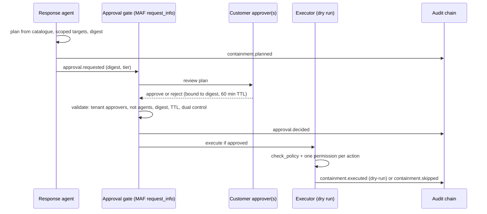

# Component: containment, approvals and audit

The response agent proposes containment from a fixed action catalogue. Nothing runs until named people
from the customer's approver list approve the exact plan; privileged accounts and crown jewels need two
approvers. Execution is a dry run by default, the executor holds one permission per action, and every
step lands in a hash-chained audit log per tenant.

Sections: [1. Purpose](#1-purpose) · [2. Architecture](#2-architecture) · [3. How it works](#3-how-it-works) · [4. Key files](#4-key-files) · [5. Code excerpts](#5-code-excerpts) · [6. Configuration](#6-configuration) · [7. Commands](#7-commands) · [8. Real output](#8-real-output) · [9. Tests and gates](#9-tests-and-gates) · [10. Guardrails](#10-guardrails) · [11. Security and governance](#11-security-and-governance) · [12. Observability](#12-observability) · [13. Failure modes](#13-failure-modes) · [14. Mapping to Azure services](#14-mapping-to-azure-services) · [15. Limitations](#15-limitations) · [16. Interview talking points](#16-interview-talking-points)

## 1. Purpose

* Human approval for every disruptive action, bound to the exact plan that was reviewed.
* Least privilege for the identity that would act, and no containment permission in the IaC at all.
* Tamper-evident records an auditor or the customer can verify.

## 2. Architecture



## 3. How it works

1. `plan()` maps scope to catalogue actions: revoke sessions and disable the compromised account, isolate
   the host, block the attacker address. Benign incidents get no plan.
2. `check_policy` refuses actions outside the catalogue, targets outside the incident's tenant, and any
   attempt to disable a break-glass account.
3. Each action records its Graph or Defender request, the single permission it needs and how to reverse
   it. The plan digest is a hash over the actions.
4. `validate_approvals` accepts only tenant approvers, never agents, for the current digest, inside the
   60-minute TTL. Two distinct approvers are needed for a privileged account or crown jewel. Any rejection
   blocks the plan.
5. `execute` records the request as `dry-run` unless `AISOC_EXECUTE=live`, which reaches `LiveExecutor`;
   that class raises `NotImplementedError` on purpose.
6. `AuditLog` chains each record to the previous hash. `verify()` checks sequence, links, hashes and
   tenant, so an edit, deletion, reordering or foreign record is detected.

## 4. Key files

| File | Role |
|---|---|
| `src/aisoc/response.py` | Catalogue, policy, planning, approvals, executor |
| `src/aisoc/audit.py` | Hash-chained audit log per tenant |
| `config/actions.yaml` | Actions, requests, permissions, reversal, risk |
| `config/tenants.yaml` | Approvers and break-glass accounts per tenant |

## 5. Code excerpts

<!-- code: src/aisoc/response.py::validate_approvals -->
```python
def validate_approvals(store: TenantStore, p: ContainmentPlan, approvals: list[Approval], requested_at: datetime) -> tuple[bool, list[str]]:
    """True when every action has enough valid approvals. Problems are returned, never raised."""
    problems = []
    valid = []
    for a in approvals:
        if a.approver.startswith("agent:"):
            problems.append(f"{a.approver}: agents cannot approve containment")
        elif a.approver not in store.tenant.approvers:
            problems.append(f"{a.approver}: not an approver for {store.tenant.id}")
        elif a.plan_digest != p.digest:
            problems.append(f"{a.approver}: approval is for plan {a.plan_digest}, current plan is {p.digest}")
        elif a.at - requested_at > APPROVAL_TTL:
            problems.append(f"{a.approver}: approval expired")
        elif not a.approved:
            problems.append(f"{a.approver}: rejected ({a.reason})")
        else:
            valid.append(a.approver)
    distinct = len(set(valid))
    need = max((x.approvals_required for x in p.actions), default=0)
    if p.actions and distinct < need:
        problems.append(f"{distinct} valid approval(s); this plan needs {need}")
    return (bool(p.actions) and distinct >= need and not any("rejected" in x for x in problems)), problems
```
<!-- /code -->

<!-- code: src/aisoc/response.py::execute -->
```python
def execute(
    store: TenantStore, p: ContainmentPlan, approved: bool, audit: AuditLog, at: datetime, identity: str = "svc:containment-executor"
) -> list[ExecutionRecord]:
    mode = os.environ.get("AISOC_EXECUTE", "dry-run")
    out = []
    if not approved:
        audit.append(identity, "containment.skipped", {"incident": p.incident_id, "digest": p.digest, "reason": "not approved"}, at)
        return out
    for a in p.actions:
        check_policy(store, a.action, a.target)
        if a.permission not in EXECUTOR_PERMISSIONS.get(a.action, set()):
            raise PolicyViolation(f"executor lacks {a.permission} for {a.action}")
        if mode == "live":
            rec = LiveExecutor().run(a)
        else:
            rec = ExecutionRecord(a.action, a.target, "dry-run", "recorded", a.request)
        audit.append(identity, "containment.executed", {"incident": p.incident_id, "digest": p.digest, **asdict(rec)}, at)
        out.append(rec)
    return out
```
<!-- /code -->

## 6. Configuration

`config/actions.yaml` lists `disable_user`, `revoke_sessions`, `isolate_host` and `block_ip` with the API,
request, permission (`User.EnableDisableAccount.All`, `User.RevokeSessions.All`, `Machine.Isolate`,
`Ti.ReadWrite.All`), reversal and risk. `APPROVAL_TTL` is 60 minutes. `AISOC_EXECUTE` defaults to
`dry-run`.

## 7. Commands

```bash
aisoc approvals
aisoc audit --tenant pinecrest
aisoc audit --tenant pinecrest --tamper
```

## 8. Real output

<!-- output: approvals -->
```text
plan 115d2fd8318a215c for INC-OR-032: [('revoke_sessions', 'emery.calloway@orchidvalley.example'), ('disable_user', 'emery.calloway@orchidvalley.example'), ('isolate_host', 'OVC-WS008'), ('block_ip', '203.0.113.140')]
  named approver, current digest: approved=True
  agent approves its own plan: approved=False ['agent:response: agents cannot approve containment', '0 valid approval(s); this plan needs 1']
  approver from another tenant: approved=False ['soc.lead@brightwater.example: not an approver for orchidvalley', '0 valid approval(s); this plan needs 1']
  approval for an older plan digest: approved=False ['ciso@orchidvalley.example: approval is for plan 0000000000000000, current plan is 115d2fd8318a215c', '0 valid approval(s); this plan needs 1']
  approval after it expired: approved=False ['ciso@orchidvalley.example: approval expired', '0 valid approval(s); this plan needs 1']
  crown-jewel plan with one approver: approved=False ['1 valid approval(s); this plan needs 2']
  crown-jewel plan with two approvers: approved=True
  disable break-glass account: refused (breakglass01@orchidvalley.example is a break-glass account and is never disabled)
```
<!-- /output -->

<!-- output: audit --tenant pinecrest --tamper -->
```text
pinecrest: 281 records verified (valid=True)
  approval.decided 4, approval.requested 13, case.auto_closed 24, case.qa_reviewed 2, case.reviewed 13, case.routed 37, containment.executed 12, containment.planned 13, containment.skipped 9, thresholds.tuned 1, tool.call 116, triage.scored 37
after editing record 82: (False, 'record 82: hash mismatch')
```
<!-- /output -->

In the learning run all nine attack stories were contained in dry run with 27 recorded actions and zero
live actions. In the baseline run, 15 plans were never approved: the simulated approvers approve only real
attacks, so plans for look-alikes the untuned model called malicious went nowhere.

## 9. Tests and gates

`tests/test_response_audit.py`: benign incidents get no plan; only catalogue actions are planned; approval
rules; dual control needs two distinct approvers; a rejection blocks the plan; a changed plan invalidates
approval; policy refusals; execution is a dry run by default; an unapproved plan executes nothing; live
mode is not implemented; the executor holds exactly one permission per action; the infrastructure never
grants containment permissions; runs record human approval before every execution; the audit chain
detects edits, deletions and reordering and rejects foreign-tenant records. Release gate: audit chains
verify and no live containment.

## 10. Guardrails

Agents cannot approve. Approvals bind to a digest and expire. Dual control for high-impact targets.
Break-glass accounts are untouchable. Targets must belong to the tenant. Dry run by default, and the live
path is not implemented.

## 11. Security and governance

The executor identity is separate from the agents' identities and is not created by this repository's IaC;
the Terraform and Bicep grant only Microsoft Sentinel Responder (playbook) and Reader (agent). The audit
chain gives the customer a verifiable record of who approved what, for which plan, and when.

## 12. Observability

Audit events per tenant: `containment.planned`, `approval.requested`, `approval.decided`,
`containment.executed`, `containment.skipped`, plus triage, review and tool events.

## 13. Failure modes

| Failure | Effect | Handling |
|---|---|---|
| Plan changes after approval | Unreviewed action | Digest mismatch invalidates the approval |
| Stale approval | Action on old context | 60-minute TTL |
| Approver from another tenant | Cross-customer authority | Refused |
| Disable break-glass | Lock-out | Refused by policy |
| Audit tampering | Lost accountability | Hash chain verification fails |

## 14. Mapping to Azure services

| Here | In Azure |
|---|---|
| `disable_user`, `revoke_sessions` | Microsoft Graph user APIs under an Entra ID workload identity |
| `isolate_host`, `block_ip` | Defender XDR (Defender for Endpoint) machine actions and indicators |
| Approval gate | Microsoft Sentinel playbook with a Teams or email approval step |
| Audit chain | Immutable Azure Storage or a Log Analytics table, watched by Azure Monitor alerts |
| Agent runtime | Foundry Agent Service; the executor runs outside it |

## 15. Limitations

* No real containment exists here; the live executor is a deliberate stub.
* No dual-approval plan occurs in the synthetic run (no story touches a crown jewel or privileged
  account); dual control is covered by tests and `aisoc approvals`.
* Reversal requests are recorded but not exercised.

## 16. Interview talking points

* "An approval is for a digest. If the agent changes the plan after approval, the approval no longer
  counts."
* "The IaC cannot contain anything: it grants Sentinel Responder and Reader only, and a test fails if a
  Graph or Defender permission appears."
* "Every step is in a per-tenant hash chain; the CLI shows an edit being caught."
