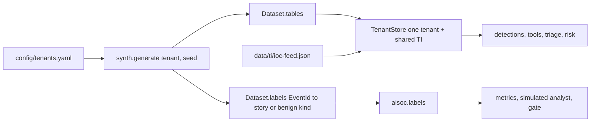

# Component: synthetic tenants and telemetry

Three fictional tenants of a fictional MSSP, each with 21 days of deterministic telemetry shaped like
Microsoft Sentinel and Defender XDR tables, ordinary noise, benign look-alikes that real detections trip
over, and scripted attack stories. Ground truth is kept apart from the telemetry so no agent can read it.

Sections: [1. Purpose](#1-purpose) · [2. Architecture](#2-architecture) · [3. How it works](#3-how-it-works) · [4. Key files](#4-key-files) · [5. Code excerpts](#5-code-excerpts) · [6. Configuration](#6-configuration) · [7. Commands](#7-commands) · [8. Real output](#8-real-output) · [9. Tests and gates](#9-tests-and-gates) · [10. Guardrails](#10-guardrails) · [11. Security and governance](#11-security-and-governance) · [12. Observability](#12-observability) · [13. Failure modes](#13-failure-modes) · [14. Mapping to Azure services](#14-mapping-to-azure-services) · [15. Limitations](#15-limitations) · [16. Interview talking points](#16-interview-talking-points)

## 1. Purpose

* Give every other component realistic, repeatable input without a subscription or real customer data.
* Make the hard part of SOC work visible: most alerts come from look-alikes (an authorised scanner,
  admin scripts, backup jobs, phishing drills, VPN egress, a data engineer who downloads a lot), not attacks.
* Keep a clean train / holdout split (days 0-13 and 14-20) so learning can be measured honestly.

## 2. Architecture



## 3. How it works

1. `synth.generate(tenant, seed)` builds users, devices, sign-ins, process and network events, email,
   URL clicks, cloud app events and product alerts (`SecurityAlert`) for 21 days.
2. Benign look-alikes recur on a schedule, and each carries a label such as `scanner` or `vpn_travel`
   with the verdict an expert analyst would give (benign positive or false positive).
3. Attack stories (phishing takeover, password spray, ransomware precursor, insider theft, token replay
   behind a travel alert) are injected on fixed days. Each has its ATT&CK techniques and entity list.
4. Every row carries a synthetic `EventId`. Labels map `EventId` to a story or benign kind and live only
   in `Dataset.labels`, which only `aisoc.labels` reads.
5. `TenantStore` wraps one tenant's tables plus the shared threat-intel table. It has no method that
   returns another tenant's rows.
6. `fingerprint()` hashes the generated tables, so a doc or a test can prove the data did not change.

## 4. Key files

| File | Role |
|---|---|
| `src/aisoc/synth.py` | Generator, stories, look-alikes, fingerprint |
| `src/aisoc/store.py` | `TenantStore`, `load()` (cached) and `fresh()` (uncached, for canary tests) |
| `src/aisoc/tenants.py` | Tenant model and the MSSP record |
| `src/aisoc/labels.py` | Ground truth, read only by evaluation code |
| `config/tenants.yaml` | Tenants, domains, crown jewels, approvers, break-glass accounts |

## 5. Code excerpts

<!-- code: src/aisoc/synth.py::STORY_TECHNIQUES -->
```python
STORY_TECHNIQUES = {
    "phish": ["T1566.002", "T1078.004", "T1114.003"],
    "spray": ["T1110.003", "T1078.004"],
    "ransomware": ["T1204.002", "T1059.001", "T1071.001", "T1003.001", "T1490"],
    "insider": ["T1530", "T1567.002"],
    "travel": ["T1078", "T1078.004", "T1530"],
}
```
<!-- /code -->

<!-- code: src/aisoc/synth.py::BENIGN_KINDS -->
```python
BENIGN_KINDS = {  # label -> verdict an expert analyst would give
    "scanner": "benign_positive",
    "admin_script": "benign_positive",
    "backup": "benign_positive",
    "phish_sim": "benign_positive",
    "vpn_travel": "false_positive",
    "data_engineer": "false_positive",
}
```
<!-- /code -->

## 6. Configuration

`config/tenants.yaml` sets each tenant's name, industry, `.example` domain, workspace name, crown-jewel
hosts, containment approvers and break-glass accounts. The seed and the 21-day timeline are constants in
`synth.py`; changing either changes the fingerprints, and the doc drift check then fails until the docs
are re-rendered.

## 7. Commands

```bash
aisoc tenants
aisoc data --tenant pinecrest
```

## 8. Real output

<!-- output: tenants -->
```text
MSSP: Halyard Security Services (fictional); analysts: analyst.rivera tier 2, analyst.okafor tier 3
tenant        name                    industry            domain                workspace             users  hosts  crown jewels
------------  ----------------------  ------------------  --------------------  --------------------  -----  -----  --------------------
brightwater   Brightwater Logistics   logistics           brightwater.example   law-soc-brightwater   30     24     BWL-DC01, BWL-ERP01
orchidvalley  Orchid Valley Clinics   healthcare          orchidvalley.example  law-soc-orchidvalley  26     22     OVC-DC01, OVC-EHR01
pinecrest     Pinecrest Credit Union  financial services  pinecrest.example     law-soc-pinecrest     28     22     PCU-DC01, PCU-CORE01
```
<!-- /output -->

<!-- output: data --tenant pinecrest -->
```text
pinecrest: fingerprint 9001ba8e5d32d191
  IdentityInfo 29, DeviceInfo 34, SigninLogs 1234, CloudAppEvents 2372, EmailEvents 646, DeviceProcessEvents 867, DeviceNetworkEvents 421, UrlClickEvents 4, SecurityAlert 9, ThreatIntelligenceIndicator 9
  story pinecrest-ransomware-d5      train   starts D05 22:30  events   5  T1204.002, T1059.001, T1071.001, T1003.001, T1490
  story pinecrest-insider-d11        train   starts D11 21:00  events 212  T1530, T1567.002
  story pinecrest-spray-d17          holdout starts D17 03:00  events  23  T1110.003, T1078.004
  story pinecrest-travel-d20         holdout starts D20 08:00  events  35  T1078, T1078.004, T1530
```
<!-- /output -->

## 9. Tests and gates

* `tests/test_synth.py`: same seed gives the same fingerprint, a different seed changes the data, nine
  stories split across the train and holdout windows, every tenant has each look-alike, the planted
  injection and PII strings exist, identities are fictional, no real GUIDs, and no table carries a
  ground-truth column.
* `tests/test_investigation.py`: an AST check that triage, investigation, response and tool code never
  import `aisoc.labels`, `aisoc.analyst` or `aisoc.metrics`.

## 10. Guardrails

* Fictional data only: `.example` domains, documentation IP ranges, mock workspace IDs that start with
  `00000000-`. A hygiene test fails on anything that looks like a real GUID or a secret.
* Some rows deliberately carry prompt-injection text and PII-shaped strings so the guardrails have
  something real to catch.

## 11. Security and governance

The tenant is the isolation boundary for data, knowledge, learned thresholds, pseudonym maps and the
audit chain. Ground truth is evaluation-only, which mirrors how a real SOC keeps its gold-labelled test
set away from the system it grades.

## 12. Observability

`aisoc data` prints table counts, stories and the fingerprint for each tenant. CI re-renders this output
and fails if it drifts.

## 13. Failure modes

| Failure | Effect | Handling |
|---|---|---|
| Generator change shifts timestamps | Every metric moves | Fingerprints in the docs fail the drift check |
| A label leaks into a table | Agents could cheat | Test asserts no label column in any table |
| Look-alikes too regular | Learning looks better than it would on real data | Stated in limitations and in the metrics doc |

## 14. Mapping to Azure services

| Here | In Azure |
|---|---|
| `SigninLogs`, `EmailEvents`, `Device*`, `CloudAppEvents`, `UrlClickEvents` | Microsoft Sentinel tables fed by Entra ID and Defender XDR connectors |
| `SecurityAlert` rows | Defender XDR product alerts (Defender for Endpoint, Defender for Office 365, Entra ID Protection) |
| `IdentityInfo`, `DeviceInfo` | UEBA and Defender device inventory tables |
| `TenantStore` | One Log Analytics workspace per customer, reached through Azure Lighthouse |
| Fingerprint and drift check | Azure Monitor data collection health checks in a real workspace |
| Narrative model | Foundry model deployment (see the narrative component) |

## 15. Limitations

* Columns are a simplified subset of the real schemas plus `EventId`; real tables are wider and messier.
* Look-alikes repeat on a schedule, so the feedback loop learns them quickly. Real benign noise drifts.
* Twenty-one days and about 30 users per tenant is small; a real tenant has far more volume and variety.

## 16. Interview talking points

* "Ground truth never travels with the telemetry. A test parses the product code and fails if any agent
  module imports the labels."
* "Most of the data is benign look-alikes, because that is where a SOC spends its time."
* "The fingerprint makes every number in the docs reproducible: same seed, same data, same metrics."
