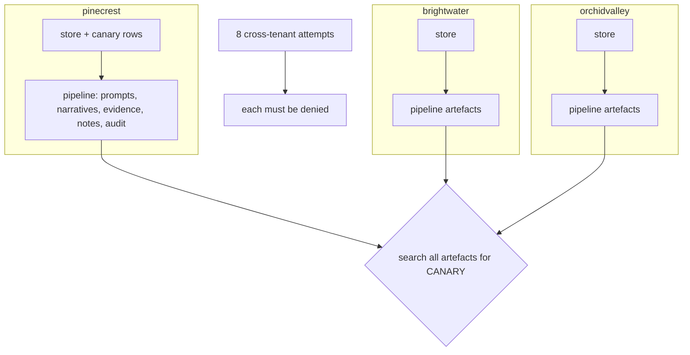

# Component: multi-tenant isolation

The MSSP serves three customers from one SOC. Data, knowledge, learned thresholds, pseudonym maps and the
audit chain are all keyed by tenant. Two checks prove the boundary holds: a canary planted in one tenant
must never appear in another tenant's artefacts, and every way one tenant's agent could reach another
tenant must be refused.

Sections: [1. Purpose](#1-purpose) · [2. Architecture](#2-architecture) · [3. How it works](#3-how-it-works) · [4. Key files](#4-key-files) · [5. Code excerpts](#5-code-excerpts) · [6. Configuration](#6-configuration) · [7. Commands](#7-commands) · [8. Real output](#8-real-output) · [9. Tests and gates](#9-tests-and-gates) · [10. Guardrails](#10-guardrails) · [11. Security and governance](#11-security-and-governance) · [12. Observability](#12-observability) · [13. Failure modes](#13-failure-modes) · [14. Mapping to Azure services](#14-mapping-to-azure-services) · [15. Limitations](#15-limitations) · [16. Interview talking points](#16-interview-talking-points)

## 1. Purpose

* Make "no cross-customer leakage" a test result, not a sentence in a slide.
* Cover the paths that matter: queries, identities, audit chains, knowledge bases and containment targets.

## 2. Architecture



## 3. How it works

1. `canary_check` plants a unique marker in pinecrest's insider-story file names using an uncached store,
   runs the full learning pipeline for all tenants, and counts the marker in every artefact per tenant.
2. `cross_tenant_attempts` tries eight paths: another tenant's workspace, another tenant's user through
   one's own workspace, an unknown identity, a customer viewer on another tenant, writing to another
   tenant's audit chain, storing a note in another tenant's knowledge base, and disabling a user or
   isolating a host that belongs to another tenant.
3. The gate passes only if the canary appears in pinecrest and nowhere else, and every attempt is denied.

## 4. Key files

| File | Role |
|---|---|
| `src/aisoc/isolation.py` | Canary plant and search, cross-tenant attempts |
| `src/aisoc/store.py` | One store per tenant; `fresh()` for the canary run |
| `src/aisoc/tools.py`, `audit.py`, `knowledge.py`, `response.py` | The checks being exercised |

## 5. Code excerpts

<!-- code: src/aisoc/isolation.py::canary_check -->
```python
def canary_check() -> dict:
    store = fresh(CANARY_TENANT)
    planted = plant(store)
    run = asyncio.run(run_async("learning", stores={CANARY_TENANT: store}))
    seen = {t: artefacts(run, t).count(CANARY) for t in run.tenants}
    return {"planted_rows": planted, "seen": seen}
```
<!-- /code -->

## 6. Configuration

The marker and the canary tenant are constants in `isolation.py`. Tenant entitlements are in
`config/identities.yaml`.

## 7. Commands

```bash
aisoc isolation
```

## 8. Real output

<!-- output: isolation -->
```text
canary CANARY-PCU-QX7 planted in 119 pinecrest rows
  occurrences in brightwater artefacts (prompts, narratives, evidence, case notes, audit): 0
  occurrences in orchidvalley artefacts (prompts, narratives, evidence, case notes, audit): 0
  occurrences in pinecrest artefacts (prompts, narratives, evidence, case notes, audit): 139
cross-tenant attempts:
  query another tenant's workspace: denied: workspace law-soc-orchidvalley is outside this tenant (law-soc-brightwater)
  query another tenant's user through own workspace: denied: 0 rows (the gateway's store holds only brightwater data)
  unknown identity: denied: unknown identity customer.pinecrest.viewer
  brightwater customer viewer on pinecrest: denied: customer.brightwater.viewer is not entitled to tenant pinecrest
  write brightwater activity to pinecrest's audit chain: denied: audit chain and store belong to different tenants
  store a pinecrest case note in brightwater's knowledge base: denied: case note for pinecrest written to the brightwater knowledge base
  disable_user ciso@orchidvalley.example from a brightwater incident: denied: ciso@orchidvalley.example does not belong to tenant brightwater
  isolate_host PCU-DC01 from a brightwater incident: denied: PCU-DC01 does not belong to tenant brightwater
```
<!-- /output -->

## 9. Tests and gates

`tests/test_metrics_risk_isolation.py`: the canary never leaves its tenant; every cross-tenant attempt is
denied. `tests/test_llm_guardrails.py`: pseudonyms are per tenant. `tests/test_response_audit.py`: audit
chains reject foreign-tenant records. Release gate: no cross-tenant leakage and every attempt denied.

## 10. Guardrails

The gateway is bound to one store; the store has no API for other tenants; audit chains and knowledge
bases check the tenant on every write; containment targets must belong to the incident's tenant.

## 11. Security and governance

In Azure the boundary is one Log Analytics workspace per customer in the customer's own tenant, reached
through Azure Lighthouse delegations with per-customer groups. Agent identities get Microsoft Sentinel
Reader on one workspace each. See [../mssp-operating-model.md](../mssp-operating-model.md).

## 12. Observability

Canary counts per tenant and the list of attempts with their refusal messages, rendered here and run in CI.

## 13. Failure modes

| Failure | Effect | Handling |
|---|---|---|
| Shared cache leaks rows | Cross-tenant evidence | Canary run on an uncached store; search every artefact |
| Shared knowledge base | One customer's notes shape another's verdicts | Per-tenant KB; write check |
| Shared pseudonym map | Identity correlation across tenants | Per-tenant pseudonymiser |
| Analyst with blanket access | Over-privilege | Per-tenant entitlement in identities |

## 14. Mapping to Azure services

| Here | In Azure |
|---|---|
| One store per tenant | One Microsoft Sentinel workspace per customer tenant |
| Identities and entitlements | Entra ID groups via Azure Lighthouse; managed identities per workspace |
| Product data | Defender XDR in each customer tenant, multi-tenant view for the MSSP |
| Per-tenant model context | Separate Foundry agent threads per tenant, no shared memory |
| Leakage monitoring | Azure Monitor alerts on cross-workspace queries |

## 15. Limitations

* The canary is one marker in one tenant; a real programme would plant markers in every tenant and in
  more field types.
* Isolation of model provider infrastructure is outside this repository's scope.

## 16. Interview talking points

* "Isolation is a gate check: the canary shows up 139 times in its own tenant and zero times anywhere else."
* "Eight attempted crossings, eight refusals, each with the reason printed."
* "Pseudonyms are per tenant too, so even the model's context cannot link two customers' users."
