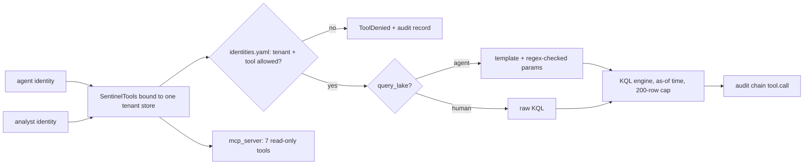

# Component: tool gateway and MCP server

The only door from an agent to tenant data. Tool names and shapes follow the Microsoft Sentinel MCP
server's data-exploration tools, plus three of this repository's own, and the same functions are served
over MCP. This repository's agents sit behind that interface; they do not replace Security Copilot or
Microsoft's hosted server.

Sections: [1. Purpose](#1-purpose) · [2. Architecture](#2-architecture) · [3. How it works](#3-how-it-works) · [4. Key files](#4-key-files) · [5. Code excerpts](#5-code-excerpts) · [6. Configuration](#6-configuration) · [7. Commands](#7-commands) · [8. Real output](#8-real-output) · [9. Tests and gates](#9-tests-and-gates) · [10. Guardrails](#10-guardrails) · [11. Security and governance](#11-security-and-governance) · [12. Observability](#12-observability) · [13. Failure modes](#13-failure-modes) · [14. Mapping to Azure services](#14-mapping-to-azure-services) · [15. Limitations](#15-limitations) · [16. Interview talking points](#16-interview-talking-points)

## 1. Purpose

* One choke point for entitlement checks, query safety, row caps and auditing.
* A tool surface an agent can use whether it points at Microsoft's hosted Sentinel MCP server or at this
  local one.
* Read-only by construction: no containment tool exists on this surface.

## 2. Architecture



## 3. How it works

1. `SentinelTools(store, identity, audit, as_of)` binds a gateway to one tenant, one caller and one
   point in time. Rows after `as_of` are invisible, so an investigation cannot read the future.
2. Each call checks the caller against `config/identities.yaml` (tenants and tools).
3. `query_lake` takes a template name and parameters for agents. Each parameter must match its regex, so a
   value cannot close the string and append a pipeline stage. Raw KQL is only for human hunters.
4. Results are capped at 200 rows. Every call, allowed or denied, is appended to the tenant's audit chain.
5. `mcp_server.build_server` registers seven tools with read-only annotations. `get_incident` is not
   exposed over MCP; it reads the pipeline's incident list in-process.

## 4. Key files

| File | Role |
|---|---|
| `src/aisoc/tools.py` | Gateway, template rendering, entitlement checks |
| `src/aisoc/mcp_server.py` | MCP server and the demo client session |
| `config/kql-templates.yaml` | Nine templates and parameter patterns |
| `config/identities.yaml` | Agent and human identities, tenants, tools, raw KQL flag |

## 5. Code excerpts

<!-- code: src/aisoc/tools.py::render_template -->
```python
def render_template(name: str, params: dict[str, str]) -> str:
    doc = templates()
    if name not in doc["templates"]:
        raise ToolDenied(f"unknown template {name!r}")
    text = doc["templates"][name]["kql"]
    needed = set(re.findall(r"\{(\w+)\}", text))
    if set(params) - needed:
        raise ToolDenied(f"unexpected parameters {sorted(set(params) - needed)}")
    for p in needed:
        v = params.get(p)
        if v is None:
            raise ToolDenied(f"missing parameter {p}")
        if not re.fullmatch(doc["params"][p], v):
            raise ToolDenied(f"parameter {p}={v!r} rejected by its pattern")
        text = text.replace("{" + p + "}", v)
    return text
```
<!-- /code -->

<!-- code: src/aisoc/mcp_server.py::TOOL_NAMES -->
```python
TOOL_NAMES = [
    "list_sentinel_workspaces",
    "search_tables",
    "query_lake",
    "analyze_user_entity",
    "analyze_url_entity",
    "analyze_host_entity",
    "lookup_indicator",
]
```
<!-- /code -->

## 6. Configuration

Templates: `user_signins`, `user_cloud_activity`, `user_email`, `user_url_clicks`, `host_processes`,
`host_network`, `ip_signins`, `ip_connections`, `domain_clicks`. Identities: `agent:triage`,
`agent:investigation`, `agent:response`, `analyst.rivera`, `analyst.okafor` and
`customer.brightwater.viewer` (a customer who may list its workspace and read its incidents only).

## 7. Commands

```bash
aisoc mcp-demo                 # in-process MCP client session against the brightwater server
aisoc mcp --tenant pinecrest   # serve over stdio for an MCP client
```

## 8. Real output

<!-- output: mcp-demo -->
```text
tools: analyze_host_entity, analyze_url_entity, analyze_user_entity, list_sentinel_workspaces, lookup_indicator, query_lake, search_tables
all read-only: True
workspaces: ['law-soc-brightwater']
203.0.113.77: [('ind-0005', ['password-spray-source'], 32.1)]
ip_signins 203.0.113.77: attempts 11, failures 10, accounts 10
injected parameter: is_error=True
BWL-DC01: role domain-controller, criticality 5, crown jewel True
audit: 5 records verified; denied calls 1
```
<!-- /output -->

The injected parameter (`203.0.113.77" | take 1000`) is refused by its pattern, comes back to the MCP
client as an error, and is recorded as a `tool.denied` record in the audit chain.

## 9. Tests and gates

* `tests/test_tools.py`: parameters are pattern-checked; unknown templates and extra parameters are
  refused; every template compiles and runs; agents cannot run raw KQL but analysts can; the row cap;
  the per-identity tool allow-list; every call is audited, including denials; the gateway cannot see the
  future; entity tools return context.
* `tests/test_mcp_cli.py`: the MCP demo runs; the server exposes no containment tool.
* Release gate: every cross-tenant attempt denied.

## 10. Guardrails

Template-only KQL for agents, regex parameters, row cap, as-of time, read-only MCP annotations, and no
write tool on the surface at all. Containment lives in a separate component with its own approvals.

## 11. Security and governance

The gateway is the policy enforcement point for least privilege. In Azure the agent's managed identity
holds Microsoft Sentinel Reader on its own workspace only, so even a bypass of this code cannot write or
cross tenants.

## 12. Observability

Allowed calls are `tool.call` audit records (identity, tool, parameters, row count); refusals are
`tool.denied` records with the reason. The in-memory call log also keeps the duration of each call.
`aisoc audit --tenant T` summarises them.

## 13. Failure modes

| Failure | Effect | Handling |
|---|---|---|
| Parameter injection | Query rewriting | Regex per parameter; denial audited |
| Over-broad query | Prompt bloat, cost | Templates are narrow; 200-row cap |
| Caller names another workspace | Cross-tenant read | Denied; gateway bound to one store |
| Unknown identity | Unattributed access | Denied and audited |

## 14. Mapping to Azure services

| Here | In Azure |
|---|---|
| Tool names and shapes | Microsoft Sentinel MCP server (data exploration tools) |
| `query_lake` | Sentinel data lake / Log Analytics query |
| Entity tools | Sentinel entity pages and UEBA, Defender XDR device and user context |
| Identities | Entra ID managed identities and groups; Azure Lighthouse for MSSP analysts |
| Tool audit | Azure Monitor diagnostic settings plus the workspace `LAQueryLogs` table |
| Agent runtime | Foundry Agent Service calling MCP tools |

## 15. Limitations

* The hosted Sentinel MCP server has its own authentication and scopes; this local server models the
  tool shapes, not Microsoft's exact contract.
* Templates cover account, host, IP and domain pivots only.

## 16. Interview talking points

* "Agents never write KQL. They pick a template and fill parameters that must match a pattern, so prompt
  injection cannot become query injection."
* "The MCP server is read-only by construction; a test fails if a containment tool appears on it."
* "My agents sit behind the same interface as Microsoft's server, so the design works with Security
  Copilot rather than against it."
