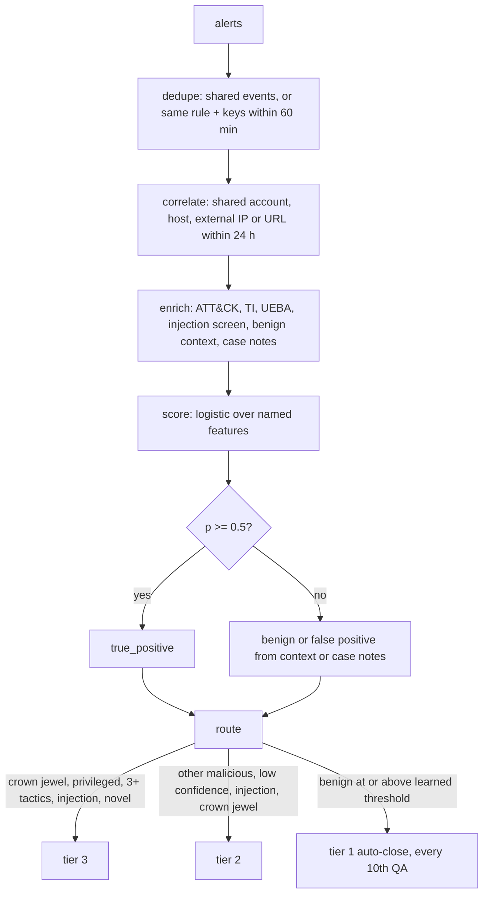

# Component: triage and tier routing

The triage agent turns an alert stream into incidents, enriches them, scores them with a transparent
model and gives each a verdict (true positive, benign positive, false positive) with a confidence. The
router then sends each incident to tier 1 (AI closes it), tier 2 (AI investigates, analyst decides) or
tier 3 (human-led, AI assists).

Sections: [1. Purpose](#1-purpose) · [2. Architecture](#2-architecture) · [3. How it works](#3-how-it-works) · [4. Key files](#4-key-files) · [5. Code excerpts](#5-code-excerpts) · [6. Configuration](#6-configuration) · [7. Commands](#7-commands) · [8. Real output](#8-real-output) · [9. Tests and gates](#9-tests-and-gates) · [10. Guardrails](#10-guardrails) · [11. Security and governance](#11-security-and-governance) · [12. Observability](#12-observability) · [13. Failure modes](#13-failure-modes) · [14. Mapping to Azure services](#14-mapping-to-azure-services) · [15. Limitations](#15-limitations) · [16. Interview talking points](#16-interview-talking-points)

## 1. Purpose

* Cut alert volume by merging duplicates and correlating related alerts into one incident.
* Put context next to every alert: threat intel, behaviour baselines, ATT&CK techniques, asset value,
  known benign explanations and what analysts decided before.
* Let the AI close only what it is confident about, and never anything that touches a crown jewel, a
  privileged account or carries a prompt-injection attempt.

## 2. Architecture



## 3. How it works

1. **Dedupe.** A Defender product alert and an analytics rule firing on the same event become one group,
   as do repeats of the same rule on the same entity within 60 minutes.
2. **Correlate.** Groups that share an account, host, external address or URL within 24 hours of the
   incident's first alert join one incident. Corporate egress and VPN addresses never correlate
   unrelated users.
3. **Enrich.** Techniques from rule tags plus content inference; TI hits with decayed confidence; a UEBA
   anomaly score per account; a prompt-injection screen over subjects, command lines, descriptions and
   file names; benign context (the authorised scanner, the phishing drill sender, a known VPN); and the
   tenant's case-note counts for the same alert signature.
4. **Score.** Start from the source prior (learned per tenant), add weighted features in log-odds space
   and convert to a probability. Every term is kept as an explanation string.
5. **Verdict.** At or above 0.5 the verdict is true positive. Otherwise benign context or case notes pick
   benign positive or false positive. Confidence is the larger of p and 1 - p.
6. **Route.** See the routing excerpt below. Benign context counts only if it explains every alert in the
   incident, so a VPN artefact cannot hide a real token replay grouped with it.

## 4. Key files

| File | Role |
|---|---|
| `src/aisoc/triage.py` | Dedupe, correlation, enrichment, scoring, verdict |
| `src/aisoc/routing.py` | Tier rules |
| `config/thresholds.yaml` | Auto-close confidence, malicious threshold, windows, QA sampling |
| `config/tenants.yaml` | Crown jewels per tenant |

## 5. Code excerpts

<!-- code: src/aisoc/triage.py::WEIGHTS -->
```python
WEIGHTS = {
    "ti": 2.2,
    "ueba": 3.0,
    "two_tactics": 1.0,
    "three_tactics": 1.0,
    "injection": 1.5,
    "high_severity": 0.4,
    "context_benign": -4.0,
    "kb_benign": -3.0,
    "kb_malicious": 3.0,
}
```
<!-- /code -->

<!-- code: src/aisoc/routing.py::route -->
```python
def route(store: TenantStore, inc: Incident, learned: Learned) -> Route:
    t = store.tenant
    users = store.users()
    crown = [h for h in inc.entities("host") if h in t.crown_jewels]
    privileged = [u for u in inc.entities("account") if users.get(u, {}).get("IsPrivileged")]
    threshold = min(learned.threshold(s) for s in inc.sources)
    if inc.verdict == "true_positive":
        why = []
        if crown:
            why.append(f"crown-jewel host {crown[0]}")
        if privileged:
            why.append("privileged account")
        if len(inc.tactics) >= 3:
            why.append(f"{len(inc.tactics)} ATT&CK tactics")
        if inc.injection:
            why.append("prompt-injection attempt in alert fields")
        if not inc.techniques:
            why.append("no mapped technique (novel)")
        if why:
            return Route(3, tuple(why))
        return Route(2, ("malicious verdict",))
    if inc.injection:
        return Route(2, ("prompt-injection attempt in alert fields",))
    if crown or privileged:
        return Route(2, ("crown-jewel host" if crown else "privileged account",))
    if inc.confidence >= threshold:
        return Route(1, (f"{inc.verdict} at confidence {inc.confidence:.2f} >= {threshold:.2f}",))
    return Route(2, (f"confidence {inc.confidence:.2f} below auto-close {threshold:.2f}",))
```
<!-- /code -->

## 6. Configuration

`auto_close_confidence` 0.90 (the starting tier 1 threshold), `malicious_probability` 0.50,
`qa_sample_every` 10, `correlation_window_hours` 24, `dedupe_window_minutes` 60. Learned per-tenant
priors and thresholds come from the feedback loop and never overwrite this file.

## 7. Commands

```bash
aisoc triage --tenant orchidvalley
aisoc triage --tenant orchidvalley --mode baseline
```

## 8. Real output

<!-- output: triage --tenant orchidvalley -->
```text
mode learning: 36 incidents for orchidvalley
incident    start      window   sources                                       alerts  p     AI verdict       tier  gold
----------  ---------  -------  --------------------------------------------  ------  ----  ---------------  ----  ---------------
INC-OR-001  D00 18:00  train    mass-download                                 1       0.71  true_positive    2     false_positive
INC-OR-002  D01 13:52  train    Atypical travel                               1       0.03  false_positive   1     false_positive
INC-OR-003  D01 18:00  train    mass-download                                 1       0.07  false_positive   1     false_positive
INC-OR-004  D02 15:10  train    encoded-powershell                            1       0.45  false_positive   2     benign_positive
INC-OR-005  D02 18:00  train    mass-download                                 1       0.02  false_positive   1     false_positive
INC-OR-006  D03 02:15  train    password-spray                                1       0.01  benign_positive  1     benign_positive
INC-OR-007  D03 18:00  train    mass-download                                 1       0.02  false_positive   1     false_positive
INC-OR-008  D04 03:35  train    shadow-copy-delete                            1       0.60  true_positive    2     benign_positive
INC-OR-009  D04 18:00  train    mass-download                                 1       0.03  false_positive   1     false_positive
INC-OR-010  D05 13:52  train    Atypical travel                               1       0.03  false_positive   1     false_positive
INC-OR-011  D06 10:20  train    Email messages containing malicious URL remo  3       0.99  true_positive    2     true_positive
INC-OR-012  D06 15:10  train    encoded-powershell                            1       0.03  benign_positive  2     benign_positive
INC-OR-013  D07 18:00  train    mass-download                                 1       0.02  false_positive   1     false_positive
INC-OR-014  D08 14:25  train    phish-click                                   2       0.02  benign_positive  2     benign_positive
INC-OR-015  D08 18:00  train    mass-download                                 1       0.02  false_positive   1     false_positive
INC-OR-016  D09 15:10  train    encoded-powershell                            1       0.02  benign_positive  2     benign_positive
INC-OR-017  D09 18:00  train    mass-download                                 1       0.02  false_positive   1     false_positive
INC-OR-018  D10 02:15  train    password-spray                                1       0.01  benign_positive  1     benign_positive
INC-OR-019  D10 18:00  train    mass-download                                 1       0.01  false_positive   1     false_positive
INC-OR-020  D11 03:35  train    shadow-copy-delete                            1       0.05  benign_positive  1     benign_positive
INC-OR-021  D11 18:00  train    mass-download                                 1       0.01  false_positive   1     false_positive
INC-OR-022  D12 13:52  train    Atypical travel                               1       0.03  false_positive   1     false_positive
INC-OR-023  D13 15:10  train    encoded-powershell                            1       0.02  benign_positive  2     benign_positive
INC-OR-024  D14 18:00  holdout  mass-download                                 1       0.01  false_positive   1     false_positive
INC-OR-025  D15 14:25  holdout  phish-click                                   2       0.00  benign_positive  2     benign_positive
INC-OR-026  D15 18:00  holdout  mass-download                                 1       0.01  false_positive   1     false_positive
INC-OR-027  D16 13:52  holdout  Atypical travel                               1       0.03  false_positive   1     false_positive
INC-OR-028  D16 15:10  holdout  encoded-powershell                            1       0.01  benign_positive  2     benign_positive
INC-OR-029  D16 18:00  holdout  mass-download                                 1       0.01  false_positive   1     false_positive
INC-OR-030  D17 02:15  holdout  password-spray                                1       0.01  benign_positive  1     benign_positive
INC-OR-031  D17 18:00  holdout  mass-download                                 1       0.01  false_positive   1     false_positive
INC-OR-032  D18 01:03  holdout  Possible LSASS memory access,Suspicious Powe  7       0.99  true_positive    3     true_positive
INC-OR-033  D18 03:35  holdout  shadow-copy-delete                            1       0.05  benign_positive  1     benign_positive
INC-OR-034  D18 18:00  holdout  mass-download                                 1       0.01  false_positive   1     false_positive
INC-OR-035  D19 13:52  holdout  Atypical travel                               1       0.03  false_positive   1     false_positive
INC-OR-036  D20 15:10  holdout  encoded-powershell                            1       0.01  benign_positive  2     benign_positive
```
<!-- /output -->

The `gold` column is ground truth, printed for evaluation only; the triage code never sees it. Early in
the training window the model escalates look-alikes (INC-OR-001, INC-OR-008); after analyst reviews the
same look-alikes are closed at tier 1 or kept at tier 2 with the right verdict.

## 9. Tests and gates

`tests/test_triage_routing.py`: product and rule alerts on the same event merge; grouping reduces volume;
corporate egress never correlates unrelated users; spray and success correlate into one incident; the
score is explained term by term; VPN context must explain every alert; the scanner spray is benign by
context; case notes move the verdict; an injection attempt routes a malicious case to tier 3; a
privileged account is never auto-closed; a crown-jewel malicious case goes to tier 3. The release gate
fails if any real attack is auto-closed in any window or mode.

## 10. Guardrails

* The language model plays no part in the verdict; it only narrates it afterwards.
* A true positive can never be routed to tier 1, whatever the threshold.
* Injection text raises suspicion (weight +1.5) and forces at least tier 2, rather than being obeyed.

## 11. Security and governance

Thresholds and priors are per tenant, so one customer's analysts cannot loosen another customer's
auto-close policy. Every scoring and routing decision is an audit record (`triage.scored`,
`case.routed`).

## 12. Observability

Per incident: features, explanation, p, verdict, tier and reasons. Aggregated: tier mix, auto-close rate,
escalation noise and override rate (see [metrics-gate.md](metrics-gate.md)).

## 13. Failure modes

| Failure | Effect | Handling |
|---|---|---|
| Benign context hides an attack in a mixed incident | Missed TP | Context must explain every alert |
| Over-correlation via shared infrastructure | Unrelated users in one incident | Corporate egress and VPN excluded from correlation keys |
| Learned threshold too loose | Attacks auto-closed | Replay gate blocks promotion; floor 0.70; true positives never tier 1 |

## 14. Mapping to Azure services

| Here | In Azure |
|---|---|
| Alert grouping | Microsoft Sentinel alert grouping and Defender XDR incident correlation |
| Verdict labels | Sentinel incident classification (true positive, benign positive, false positive) |
| Tier 1 closure | Sentinel automation rule or playbook closing the incident with a comment |
| Privileged account flag | Entra ID role membership from `IdentityInfo` |
| Decision log | Azure Monitor / Log Analytics custom table for triage decisions |
| Foundry | Hosts the agent runtime in production; not used for scoring |

## 15. Limitations

* The scoring weights are hand-set and reviewed, not trained; the feedback loop moves priors and
  thresholds, not weights.
* Benign context is a short list of known explanations; a real SOC maintains many more.

## 16. Interview talking points

* "The score is a logistic model with named terms, so the analyst sees why: prior 0.75, TI 0.78 times
  2.2, three tactics, high severity."
* "Tier 1 is earned per detector and per tenant from analyst reviews, and a malicious verdict can never
  be auto-closed."
* "I found a real bug this way: a VPN false positive merged with a token replay made the whole incident
  look benign. Context now has to explain every alert."
