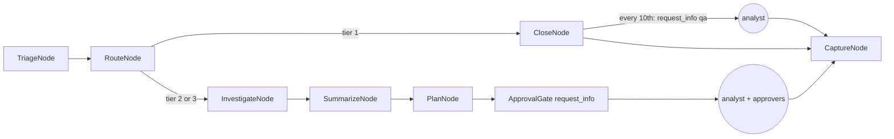

# Component: incident workflow and human checkpoints

Each incident runs through a Microsoft Agent Framework workflow: triage, route, then either close
(with every tenth closure sampled for QA) or investigate, summarise, plan and wait at the approval gate.
Human checkpoints use MAF's `request_info` and response handlers, so the workflow pauses until a person
answers.

Sections: [1. Purpose](#1-purpose) · [2. Architecture](#2-architecture) · [3. How it works](#3-how-it-works) · [4. Key files](#4-key-files) · [5. Code excerpts](#5-code-excerpts) · [6. Configuration](#6-configuration) · [7. Commands](#7-commands) · [8. Real output](#8-real-output) · [9. Tests and gates](#9-tests-and-gates) · [10. Guardrails](#10-guardrails) · [11. Security and governance](#11-security-and-governance) · [12. Observability](#12-observability) · [13. Failure modes](#13-failure-modes) · [14. Mapping to Azure services](#14-mapping-to-azure-services) · [15. Limitations](#15-limitations) · [16. Interview talking points](#16-interview-talking-points)

## 1. Purpose

* One explicit graph for every incident, with the human steps built in rather than bolted on.
* A resumable pause: the workflow stops at QA or approval and continues with the analyst's answer.
* Capture every human decision for the feedback loop.

## 2. Architecture



## 3. How it works

1. `build(deps)` wires executors with `WorkflowBuilder(start_executor=..., max_iterations=20)` and
   conditional edges on the routed tier.
2. `run_case` calls `workflow.run(case)`. If the run yields request events (QA or approval), it collects
   the simulated analyst's `AnalystDecision` and resumes with `workflow.run(responses={id: answer})`.
3. The approval request doubles as the tier 2 / tier 3 review: the analyst gives a verdict, and approvers
   approve or reject the plan.
4. `CaptureNode` hands the case to the feedback loop and writes the audit trail.
5. The simulated analysts (`aisoc.analyst`) answer from ground truth; tier 3 goes to `analyst.okafor`,
   other reviews to `analyst.rivera`. They are the evaluation harness, not the product.

## 4. Key files

| File | Role |
|---|---|
| `src/aisoc/workflow.py` | Case, requests, nodes, graph, `run_case` |
| `src/aisoc/analyst.py` | Simulated analysts and approvers (evaluation only) |
| `src/aisoc/pipeline.py` | Runs every incident for every tenant, tunes thresholds at the holdout switch |

## 5. Code excerpts

<!-- code: src/aisoc/workflow.py::build -->
```python
def build(deps: Deps):
    triage, rte, close = TriageNode(deps), RouteNode(deps), CloseNode(deps)
    inv, summ, plan, gate, cap = InvestigateNode(deps), SummarizeNode(deps), PlanNode(deps), ApprovalGate(deps), CaptureNode(deps)
    return (
        WorkflowBuilder(start_executor=triage, name="aisoc-incident", max_iterations=20)
        .add_edge(triage, rte)
        .add_edge(rte, close, condition=lambda c: c.route.tier == 1)
        .add_edge(rte, inv, condition=lambda c: c.route.tier != 1)
        .add_edge(close, cap)
        .add_edge(inv, summ)
        .add_edge(summ, plan)
        .add_edge(plan, gate)
        .add_edge(gate, cap)
        .build()
    )
```
<!-- /code -->

<!-- code: src/aisoc/workflow.py::ApprovalGate -->
```python
class ApprovalGate(Node):
    node = "approval_gate"

    @handler
    async def run(self, case: Case, ctx: WorkflowContext[Case, Case]) -> None:
        req = _request(case, "approval")
        self.deps.audit.append(
            "agent:response", "approval.requested", {"incident": req.incident_id, "digest": req.plan_digest, "tier": req.tier}, req.requested_at
        )
        await ctx.request_info(req, AnalystDecision)

    @response_handler
    async def decided(self, req: ReviewRequest, decision: AnalystDecision, ctx: WorkflowContext[Case, Case]) -> None:
        d = self.deps
        case = d.cases[req.incident_id]
        case.decision = decision
        ok, problems = response.validate_approvals(d.store, case.plan, decision.approvals, req.requested_at)
        case.approved, case.approval_problems = ok, problems
        for a in decision.approvals:
            d.audit.append(a.approver, "approval.decided", {"incident": req.incident_id, "digest": a.plan_digest, "approved": a.approved}, a.at)
        d.audit.append(
            decision.analyst,
            "case.reviewed",
            {"incident": req.incident_id, "verdict": decision.verdict, "ai_verdict": req.verdict, "override": decision.verdict != req.verdict},
            decision.decided_at,
        )
        case.executions = response.execute(d.store, case.plan, ok, d.audit, decision.decided_at)
        await ctx.send_message(case)
```
<!-- /code -->

## 6. Configuration

`qa_sample_every` and `analyst_minutes` in `config/thresholds.yaml`; `max_iterations` in `build`.

## 7. Commands

```bash
aisoc stories
aisoc metrics --mode baseline
```

## 8. Real output

<!-- output: stories -->
```text
story                        window   starts     detected  MTTD min  incident    tier  AI verdict     contained  MTTR min (sim)  techniques
---------------------------  -------  ---------  --------  --------  ----------  ----  -------------  ---------  --------------  ----------
brightwater-spray-d9         train    D09 02:00  yes       20.0      INC-BR-015  2     true_positive  dry-run    100.0           2/2
brightwater-phish-d16        holdout  D16 09:00  yes       20.0      INC-BR-027  3     true_positive  dry-run    265.0           2/3
brightwater-insider-d19      holdout  D19 20:00  yes       60.0      INC-BR-036  2     true_positive  dry-run    115.0           2/2
orchidvalley-phish-d6        train    D06 10:00  yes       20.0      INC-OR-011  2     true_positive  dry-run    240.0           2/3
orchidvalley-ransomware-d18  holdout  D18 00:30  yes       33.0      INC-OR-032  3     true_positive  dry-run    152.0           5/5
pinecrest-ransomware-d5      train    D05 22:30  yes       33.0      INC-PI-011  3     true_positive  dry-run    152.0           5/5
pinecrest-insider-d11        train    D11 21:00  yes       60.0      INC-PI-022  2     true_positive  dry-run    115.0           2/2
pinecrest-spray-d17          holdout  D17 03:00  yes       20.0      INC-PI-032  2     true_positive  dry-run    100.0           2/2
pinecrest-travel-d20         holdout  D20 08:00  yes       60.0      INC-PI-036  2     true_positive  dry-run    80.0            1/3
```
<!-- /output -->

MTTR here is simulated: an incident is processed at its last alert plus one hour of settling, machine time
is measured, and analyst time comes from `analyst_minutes` in the config.

## 9. Tests and gates

`tests/test_workflow_feedback.py`: the workflow pauses for a human before any execution; a rejected plan
is not executed; every tenth auto-closure is sampled for QA; the audit trail follows the graph; plus the
feedback-loop tests in [knowledge-capture.md](knowledge-capture.md).

## 10. Guardrails

No path in the graph reaches execution without passing the approval gate. The gate validates approvals
in code; the analyst's answer cannot skip validation.

## 11. Security and governance

The graph is the operating model in code: tier 1 automation with sampling, tier 2 AI plus analyst, tier 3
human-led. Each transition is an audit record.

## 12. Observability

Per case: node timings, tier, review or QA, approvals, executions. Per run: the metrics in
[metrics-gate.md](metrics-gate.md).

## 13. Failure modes

| Failure | Effect | Handling |
|---|---|---|
| No analyst answer | Case waits | Pause is explicit; nothing executes |
| Loop in the graph | Runaway | `max_iterations=20` |
| Analyst overrides the AI | Disagreement | Recorded as an override; drives the knowledge base |

## 14. Mapping to Azure services

| Here | In Azure |
|---|---|
| MAF workflow | Foundry Agent Service hosting the workflow, or Azure Functions / Container Apps |
| `request_info` pauses | Microsoft Sentinel incident tasks, Teams approval cards |
| Trigger | Sentinel automation rule calling the playbook (see [../infra/playbook.md](../infra/playbook.md)) |
| Analyst identity | Entra ID users through Azure Lighthouse |
| Run telemetry | Application Insights / Azure Monitor (MAF emits OpenTelemetry) |
| Product alerts | Defender XDR incidents synced to Sentinel |

## 15. Limitations

* Analysts are simulated from ground truth, so tier 2 and tier 3 verdicts are always right; real
  analysts make mistakes and the override metric would show disagreement both ways.
* Workflow state is in memory; a production run needs a checkpoint store.

## 16. Interview talking points

* "The human checkpoint is a first-class workflow node: MAF pauses with `request_info` and resumes with the
  analyst's answer."
* "Tier 1 isn't unsupervised: every tenth closure goes to QA."
* "MTTR is simulated and labelled as such: real machine time plus configured analyst minutes."
