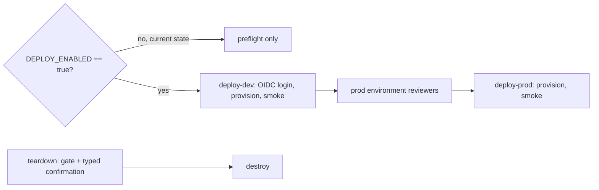

# Deployment

**Nothing in this repository has been deployed.** The deploy workflow runs on every push, reports that the
gate is off and skips every real job. This page is the one-time setup a team would do to turn it on, and
what would happen next.



## One-time setup

1. **Entra ID app registration or user-assigned identity for GitHub** with federated credentials for
   `repo:<owner>/<repo>:environment:dev` and `...:environment:prod`. No client secret.
2. **Role assignments for that identity**, per target subscription: Contributor on the subscription (it
   creates the resource group), plus Role Based Access Control Administrator constrained to assigning only
   Microsoft Sentinel Responder and Microsoft Sentinel Reader, because the stack creates two role
   assignments.
3. **Terraform state** (Terraform only): a storage account with a `tfstate` container and Storage Blob Data
   Contributor for the deploy identity. The backend uses Entra ID auth.
4. **Repository variables:** `AZURE_CLIENT_ID`, `AZURE_TENANT_ID`, `AZURE_SUBSCRIPTION_ID`,
   `TFSTATE_RESOURCE_GROUP`, `TFSTATE_STORAGE_ACCOUNT`, optional `TFSTATE_CONTAINER`, `DEPLOY_TOOL`,
   `AZURE_LOCATION`, and finally `DEPLOY_ENABLED=true`.
5. **GitHub Environments** `dev` and `prod`, with required reviewers on `prod`.

## What a deployment creates

See [infra/README.md](infra/README.md). In short: resource group, Log Analytics with Sentinel, two
user-assigned identities with Sentinel Responder and Reader on the workspace, the triage playbook, audit and
runtime diagnostic settings, and in prod the analytics rules (disabled), the automation rule and private
networking.

## Smoke test

`deploy.sh smoke` checks that Sentinel is onboarded on the workspace, that the playbook exists and that the
workspace has exactly the expected Sentinel Reader and Responder assignments.

## After deployment (manual, per customer)

1. Enable the data connectors (Entra ID, Defender XDR, Office 365) in the customer's Sentinel.
2. Map the rule columns as described in [infra/sentinel-workspace.md](infra/sentinel-workspace.md), test
   against real data, then set `analytics_rules_enabled = true` through a reviewed change.
3. Stand up the agent endpoint (Foundry Agent Service or Container Apps), set `agent_endpoint`, and keep
   `AISOC_EXECUTE` unset so containment stays a dry run.
4. Delegate the workspace to the MSSP with Azure Lighthouse.

## Commands

```bash
gh variable list                         # DEPLOY_ENABLED is not set
gh workflow run deploy.yml -f deploy_tool=bicep
gh workflow run teardown.yml -f environment=dev -f confirm=dev
```
