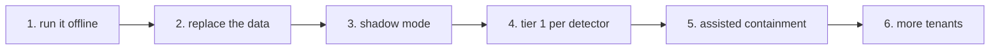

# Implementation guide: adopt this

For a security team or MSSP that wants to use these patterns. It explains what to keep, what to replace and
the order to roll it out in. Everything here runs offline first.



## 1. Run it as it is

```bash
python -m venv .venv && source .venv/bin/activate
pip install -e ".[dev]"
pytest -q
aisoc gate
aisoc compare
aisoc investigate --tenant orchidvalley --incident INC-OR-032
```

## 2. What to keep and what to replace

| Keep as is | Replace for your environment |
|---|---|
| Workflow shape and human checkpoints (`workflow.py`) | `TenantStore` with a Log Analytics query client per workspace |
| Approval rules, digest binding, TTL, dual control (`response.py`) | `LiveExecutor` with Graph and Defender calls under a separate identity |
| Audit chain (`audit.py`) | Storage for the chain (immutable blob or a Log Analytics table) |
| Tool gateway checks (`tools.py`) | Templates for your schema; or point agents at the hosted Sentinel MCP server |
| Validator and fallback (`llm.py`) | `MockSocChatClient` with `FoundryChatClient` (`AISOC_LLM=foundry`) |
| Feedback loop and replay gate (`feedback.py`, `pipeline.py`) | Ground truth for the replay with your confirmed incident outcomes |
| Release gate idea (`aisoc gate`) | Gate checks for your own non-negotiables |
| | Regex screens with Prompt Shields and Azure AI Language PII |
| | `config/tenants.yaml`, `identities.yaml`, `actions.yaml` |

## 3. Roll out in phases

1. **Shadow.** The agents triage and investigate every incident, but nothing is closed or contained. Compare
   AI verdicts with analyst classifications for several weeks. The `baseline` mode here shows the kind of
   report to expect.
2. **Tier 1 by detector.** Let the feedback loop propose thresholds per detector and per tenant, with the
   replay gate on your confirmed outcomes. Turn on auto-close one detector at a time; keep QA sampling.
3. **Assisted containment.** Keep the approval gate; implement the live executor for the lowest-risk action
   first (`revoke_sessions`), then others. Dual control stays for privileged accounts and crown jewels.
4. **More tenants.** Onboard each customer with its own workspace, approvers and break-glass list; run the
   isolation checks for every tenant in CI.

## 4. What to measure

Use [metrics.md](metrics.md) as the template: MTTD, MTTR (measured, once real), escalation noise, override
rate, auto-closed attacks (must stay zero), coverage. Track them per tenant and per detector.

## 5. Security checklist before go-live

* Agent identities: Sentinel Reader on one workspace each; no Graph or Defender permissions.
* Executor identity: one permission per action, in the customer tenant, used only after approval.
* Prompt Shields and PII detection in front of the model; validator after it.
* Audit chain stored immutably and verified daily.
* Threat model reviewed: [threat-model.md](threat-model.md).

## 6. Known gaps to close

See [best-practices.md](best-practices.md) for the full built-versus-planned list.
