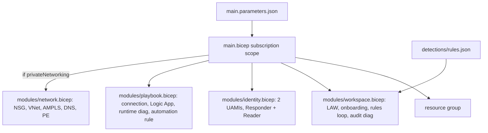

# Infra: Bicep stack

The Bicep stack declares the same per-customer footprint as Terraform, at subscription scope, split into
four modules: workspace (with rules), identity, playbook and network. It builds with zero warnings, and CI
treats any warning as a failure.

Sections: [1. Purpose](#1-purpose) · [2. Architecture](#2-architecture) · [3. How it works](#3-how-it-works) · [4. Key files](#4-key-files) · [5. Code excerpts](#5-code-excerpts) · [6. Configuration](#6-configuration) · [7. Commands](#7-commands) · [8. Real output](#8-real-output) · [9. Tests and gates](#9-tests-and-gates) · [10. Guardrails](#10-guardrails) · [11. Security and governance](#11-security-and-governance) · [12. Observability](#12-observability) · [13. Failure modes](#13-failure-modes) · [14. Mapping to Azure services](#14-mapping-to-azure-services) · [15. Limitations](#15-limitations) · [16. Interview talking points](#16-interview-talking-points)

## 1. Purpose

* Give Bicep-first teams an equivalent, idiomatic stack.
* Prove parity with Terraform: same rules file, same roles, same defaults.

## 2. Architecture



## 3. How it works

1. `main.bicep` creates the resource group and calls the modules with a shared suffix and tags.
2. `workspace.bicep` loads the rules with `loadJsonContent` and loops with `if (deployAnalyticsRules)`.
3. `identity.bicep` uses the public built-in role definition IDs for Microsoft Sentinel Responder and
   Microsoft Sentinel Reader, with deterministic `guid()` assignment names.
4. `playbook.bicep` declares the managed-identity connection (two lines carry `#disable-next-line` for
   linter rules that do not know the `kind` and `parameterValueType` properties) and an empty actions block
   when no agent endpoint is set.
5. `network.bicep` is deployed only when `privateNetworking` is true.

## 4. Key files

| File | Role |
|---|---|
| `infra/bicep/main.bicep` | Entry point (subscription scope) |
| `infra/bicep/main.parameters.json` | dev parameters |
| `infra/bicep/modules/*.bicep` | Workspace, identity, playbook, network |

## 5. Code excerpts

<!-- code: infra/bicep/modules/identity.bicep::resource agentReader -->
```bicep
resource agentReader 'Microsoft.Authorization/roleAssignments@2022-04-01' = {
  name: guid(law.id, agentId.id, sentinelReader)
  scope: law
  properties: {
    principalId: agentId.properties.principalId
    principalType: 'ServicePrincipal'
    roleDefinitionId: sentinelReader
  }
}
```
<!-- /code -->

## 6. Configuration

Parameters mirror the Terraform variables in camelCase: `environment`, `location`, `tenantSlug`,
`retentionInDays`, `dailyQuotaGb`, `deployAnalyticsRules`, `analyticsRulesEnabled`, `agentEndpoint`,
`agentAudience`, `enableAutomationRule`, `privateNetworking`, `vnetAddressSpace`.

## 7. Commands

```bash
bicep build infra/bicep/main.bicep --stdout > /dev/null
aisoc iac --part bicep
```

## 8. Real output

<!-- output: iac --part bicep -->
```text
main.bicep                 resource rg                 Microsoft.Resources/resourceGroups
main.bicep                 module   workspace          modules/workspace.bicep
main.bicep                 module   identity           modules/identity.bicep
main.bicep                 module   playbook           modules/playbook.bicep
main.bicep                 module   network            modules/network.bicep  [if privateNetworking]
modules/identity.bicep     resource law                Microsoft.OperationalInsights/workspaces  [existing]
modules/identity.bicep     resource playbookId         Microsoft.ManagedIdentity/userAssignedIdentities
modules/identity.bicep     resource agentId            Microsoft.ManagedIdentity/userAssignedIdentities
modules/identity.bicep     resource playbookResponder  Microsoft.Authorization/roleAssignments
modules/identity.bicep     resource agentReader        Microsoft.Authorization/roleAssignments
modules/network.bicep      resource nsg                Microsoft.Network/networkSecurityGroups
modules/network.bicep      resource vnet               Microsoft.Network/virtualNetworks
modules/network.bicep      resource ampls              Microsoft.Insights/privateLinkScopes
modules/network.bicep      resource scoped             Microsoft.Insights/privateLinkScopes/scopedResources
modules/network.bicep      resource dns                Microsoft.Network/privateDnsZones  [loop]
modules/network.bicep      resource links              Microsoft.Network/privateDnsZones/virtualNetworkLinks  [loop]
modules/network.bicep      resource pe                 Microsoft.Network/privateEndpoints
modules/network.bicep      resource zoneGroup          Microsoft.Network/privateEndpoints/privateDnsZoneGroups
modules/playbook.bicep     resource law                Microsoft.OperationalInsights/workspaces  [existing]
modules/playbook.bicep     resource connection         Microsoft.Web/connections
modules/playbook.bicep     resource playbook           Microsoft.Logic/workflows
modules/playbook.bicep     resource runtimeDiag        Microsoft.Insights/diagnosticSettings
modules/playbook.bicep     resource automationRule     Microsoft.SecurityInsights/automationRules  [if enableAutomationRule]
modules/workspace.bicep    resource law                Microsoft.OperationalInsights/workspaces
modules/workspace.bicep    resource onboarding         Microsoft.SecurityInsights/onboardingStates
modules/workspace.bicep    resource alertRules         Microsoft.SecurityInsights/alertRules  [loop; if deployAnalyticsRules]
modules/workspace.bicep    resource auditDiag          Microsoft.Insights/diagnosticSettings
```
<!-- /output -->

## 9. Tests and gates

The CI `bicep` job builds with a pinned Bicep CLI and fails on any warning. `tests/test_iac.py` checks
parity with Terraform: same rules file, the two built-in role IDs only, workspace scope, local auth off,
PrivateOnly AMPLS, diagnostic settings, opt-in flags.

## 10. Guardrails

The only GUIDs in the repository outside `00000000-` mocks are the two public built-in role IDs, and the
hygiene test allow-lists exactly those two.

## 11. Security and governance

Same as Terraform: managed identities, workspace-scoped roles, no secrets, no containment permissions.

## 12. Observability

Same diagnostic settings as Terraform: workspace audit and playbook runtime.

## 13. Failure modes

| Failure | Effect | Handling |
|---|---|---|
| Linter warning | CI fails | Fix, or a justified `#disable-next-line` (two exist, both checked to be needed) |
| Drift from Terraform | Two different deployments | Parity tests in `tests/test_iac.py` |
| Wrong role ID | Over- or under-privilege | IDs pinned and allow-listed; checked against Microsoft Learn |

## 14. Mapping to Azure services

| Module | Azure service |
|---|---|
| workspace | Microsoft Sentinel / Log Analytics |
| identity | Entra ID managed identities and Azure RBAC |
| playbook | Azure Logic Apps, Sentinel automation rules |
| network | Azure Monitor Private Link Scope, Private DNS |
| Not declared | Defender XDR connectors, Foundry project |

## 15. Limitations

* Never deployed; validated by `bicep build` only (no what-if against a subscription).
* No Bicep parameter file for prod; prod uses the deploy workflow inputs or overrides.

## 16. Interview talking points

* "Zero warnings is enforced, and the two suppressions are proven necessary."
* "Bicep and Terraform read the same rules.json, and Python tests check the two stacks agree on roles,
  scope and defaults."
