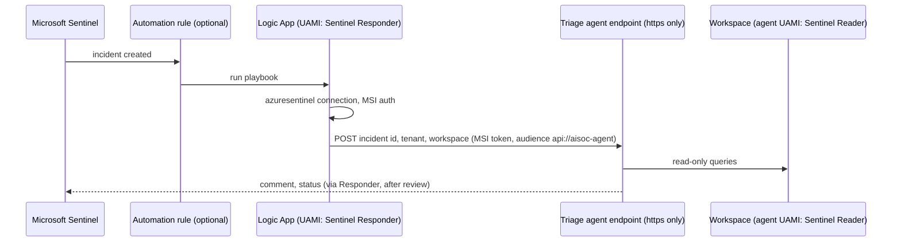

# Infra: triage playbook, identities and automation rule

A Logic App (consumption) triggered by a new Microsoft Sentinel incident. It authenticates to Sentinel
with a user-assigned managed identity and, when an agent endpoint is configured, forwards the incident to
the triage agent with a managed-identity token. It contains no containment action. An optional automation
rule runs it for every new incident.

Sections: [1. Purpose](#1-purpose) · [2. Architecture](#2-architecture) · [3. How it works](#3-how-it-works) · [4. Key files](#4-key-files) · [5. Code excerpts](#5-code-excerpts) · [6. Configuration](#6-configuration) · [7. Commands](#7-commands) · [8. Real output](#8-real-output) · [9. Tests and gates](#9-tests-and-gates) · [10. Guardrails](#10-guardrails) · [11. Security and governance](#11-security-and-governance) · [12. Observability](#12-observability) · [13. Failure modes](#13-failure-modes) · [14. Mapping to Azure services](#14-mapping-to-azure-services) · [15. Limitations](#15-limitations) · [16. Interview talking points](#16-interview-talking-points)

## 1. Purpose

* Connect Sentinel to the agents without secrets: managed identity for the connector and for the call out.
* Keep the playbook a messenger. Containment stays with the human-approved executor, which this IaC does not
  create.

## 2. Architecture



## 3. How it works

1. Two user-assigned identities. The playbook identity gets Microsoft Sentinel Responder on the workspace;
   the agent identity gets Microsoft Sentinel Reader on the workspace. Nothing else.
2. A `Microsoft.Web/connections` resource for the Sentinel managed API with `parameterValueType:
   Alternative`, which is how a connection uses managed identity instead of a stored credential.
3. The Logic App's `$connections` parameter points at that connection with `ManagedServiceIdentity`
   authentication. The trigger is the Sentinel incident-creation webhook.
4. If `agent_endpoint` is set (it must start with `https://`), an HTTP action posts the incident ARM id,
   tenant and workspace to the agent with a managed-identity token for `agent_audience`.
5. With `enable_automation_rule = true`, a Sentinel automation rule runs the playbook on every new incident.
6. A diagnostic setting sends `WorkflowRuntime` logs to the workspace.

## 4. Key files

| File | Role |
|---|---|
| `infra/terraform/main.tf` | Identities, role assignments, connection, Logic App, trigger, action, automation rule |
| `infra/bicep/modules/identity.bicep` | Identities and role assignments (built-in role IDs) |
| `infra/bicep/modules/playbook.bicep` | Connection, Logic App, diagnostic setting, automation rule |

## 5. Code excerpts

<!-- code: infra/terraform/main.tf::resource "azurerm_role_assignment" "agent_reader" -->
```hcl
resource "azurerm_role_assignment" "agent_reader" {
  scope                = azurerm_log_analytics_workspace.this.id
  role_definition_name = "Microsoft Sentinel Reader"
  principal_id         = azurerm_user_assigned_identity.agent.principal_id
  principal_type       = "ServicePrincipal"
}
```
<!-- /code -->

<!-- code: infra/bicep/modules/identity.bicep::resource playbookResponder -->
```bicep
resource playbookResponder 'Microsoft.Authorization/roleAssignments@2022-04-01' = {
  name: guid(law.id, playbookId.id, sentinelResponder)
  scope: law
  properties: {
    principalId: playbookId.properties.principalId
    principalType: 'ServicePrincipal'
    roleDefinitionId: sentinelResponder
  }
}
```
<!-- /code -->

## 6. Configuration

| Terraform | Bicep | Default |
|---|---|---|
| `agent_endpoint` | `agentEndpoint` | empty (no forward action) |
| `agent_audience` | `agentAudience` | `api://aisoc-agent` |
| `enable_automation_rule` | `enableAutomationRule` | false (prod tfvars: true) |

## 7. Commands

```bash
aisoc iac --part terraform
aisoc investigate --tenant pinecrest --incident INC-PI-032   # what the agent does with a forwarded incident, offline
```

## 8. Real output

<!-- output: investigate --tenant pinecrest --incident INC-PI-032 -->
```text
INC-PI-032 (pinecrest) tier 2: malicious verdict
verdict true_positive p=0.997 confidence 0.997
score terms: prior 0.75 (password-spray, success-after-spray); ti 0.40 x +2.2; ueba 0.80 x +3.0; two_tactics 1.00 x +1.0; high_severity 1.00 x +0.4
techniques: T1078.004 Valid Accounts: Cloud Accounts, T1110.003 Brute Force: Password Spraying
runbook: password-spray.md
tool calls 9, evidence 14, routine rows counted 13
timeline:
  EV-001 D17 03:27 sign-in failure 50126 for marlow.holloway@pinecrest.example from 203.0.113.77 (BR) [alert event]
  EV-002 D17 03:35 sign-in success for marlow.holloway@pinecrest.example from 203.0.113.77 (BR) [alert event]
  EV-003 D17 03:45 FileDownloaded by marlow.holloway@pinecrest.example: /sites/finance/doc000.docx [attacker address 203.0.113.77]
  EV-004 D17 03:46 FileDownloaded by marlow.holloway@pinecrest.example: /sites/finance/doc001.docx [attacker address 203.0.113.77]
  EV-005 D17 03:47 FileDownloaded by marlow.holloway@pinecrest.example: /sites/finance/doc002.docx [attacker address 203.0.113.77]
  EV-006 D17 03:48 FileDownloaded by marlow.holloway@pinecrest.example: /sites/finance/doc003.docx [attacker address 203.0.113.77]
  EV-007 D17 03:49 FileDownloaded by marlow.holloway@pinecrest.example: /sites/finance/doc004.docx [attacker address 203.0.113.77]
  EV-008 D17 03:50 FileDownloaded by marlow.holloway@pinecrest.example: /sites/finance/doc005.docx [attacker address 203.0.113.77]
  EV-009 D17 03:51 FileDownloaded by marlow.holloway@pinecrest.example: /sites/finance/doc006.docx [attacker address 203.0.113.77]
  EV-010 D17 03:52 FileDownloaded by marlow.holloway@pinecrest.example: /sites/finance/doc007.docx [attacker address 203.0.113.77]
  EV-011 D17 03:53 FileDownloaded by marlow.holloway@pinecrest.example: /sites/finance/doc008.docx [attacker address 203.0.113.77]
  EV-012 D17 03:54 FileDownloaded by marlow.holloway@pinecrest.example: /sites/finance/doc009.docx [attacker address 203.0.113.77]
scope: {"accounts": ["marlow.holloway@pinecrest.example"], "hosts": [], "external_ips": ["203.0.113.77"], "destinations": []}
blast radius: {"privileged_accounts": [], "crown_jewels": [], "external_destinations": [], "evidence_rows": 14, "routine_rows": 13}
containment plan (digest e5d22083ce158722):
  revoke_sessions marlow.holloway@pinecrest.example  approvals 1  permission User.RevokeSessions.All
  disable_user marlow.holloway@pinecrest.example  approvals 1  permission User.EnableDisableAccount.All
  block_ip 203.0.113.77  approvals 1  permission Ti.ReadWrite.All
approved: True; executions: [('revoke_sessions', 'marlow.holloway@pinecrest.example', 'dry-run'), ('disable_user', 'marlow.holloway@pinecrest.example', 'dry-run'), ('block_ip', '203.0.113.77', 'dry-run')]
narrative (fallback=False, injection obeyed=False, ~745 prompt tokens):
  Password spray against many accounts; Successful sign-in from a spraying address: malicious activity confirmed by evidence
  Code verdict true_positive at confidence 1.00. Mapped techniques: T1078.004, T1110.003. Scope: accounts USER-1; external_ips 203.0.113.77.
  evidence cited: EV-001, EV-002, EV-003, EV-004, EV-005; actions: block_ip, disable_user, revoke_sessions
analyst: analyst.rivera -> true_positive
```
<!-- /output -->

## 9. Tests and gates

* `tests/test_iac.py`: only Sentinel Responder and Reader roles, both scoped to the workspace; the infra
  never grants or performs containment (no Graph or Defender permission names, no disable or isolate verbs
  in the playbook); managed identity only; the agent endpoint must be https.
* `infra/terraform/tests/plan.tftest.hcl`: `private_networking_and_agent_endpoint` (forward action and
  automation rule present) and `rejects_plain_http_endpoint`.
* `tests/test_response_audit.py`: the infrastructure never grants containment permissions.

## 10. Guardrails

No secrets anywhere; https only for the call out; no write path beyond Sentinel Responder (comments,
status, assignment); no containment action in the definition.

## 11. Security and governance

Role assignments are at workspace scope, not resource group or subscription. The agent's identity can read
one customer's workspace and nothing else.

## 12. Observability

`WorkflowRuntime` diagnostics show every run, trigger and action outcome in the workspace.

## 13. Failure modes

| Failure | Effect | Handling |
|---|---|---|
| Agent endpoint down | Incident not triaged by the agent | Logic App retry policy; incident still in the Sentinel queue |
| Plain http endpoint | Token sent in clear | Terraform validation rejects it; test |
| Connection without MSI | Stored credential | `parameterValueType: Alternative` with MSI only |

## 14. Mapping to Azure services

| Element | Azure service |
|---|---|
| Playbook | Azure Logic Apps (consumption) with the Microsoft Sentinel connector |
| Trigger | Microsoft Sentinel incident creation and automation rules |
| Identities | Entra ID user-assigned managed identities |
| Agent endpoint | Foundry Agent Service or a Container Apps API in front of the MAF workflow |
| Run history | Azure Monitor diagnostic settings |
| Downstream containment (not here) | Defender XDR and Microsoft Graph via the approved executor |

## 15. Limitations

* Never deployed; the Sentinel managed API connection shape is from documentation and `bicep build`, not a
  live run.
* No retry, timeout or dead-letter settings are tuned.
* The agent endpoint itself is not part of this repository's IaC.

## 16. Interview talking points

* "The playbook is a messenger with a managed identity. It cannot contain anything, and a test checks that."
* "The agent gets Sentinel Reader on one workspace; the playbook gets Responder. That is the whole grant."
* "The connection uses the managed-identity form, so there is no credential to rotate or leak."
