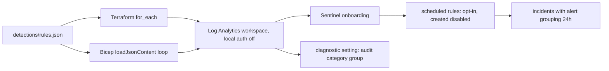

# Infra: Sentinel workspace and analytics rules

One Log Analytics workspace per customer tenant with Microsoft Sentinel onboarded, local (shared key)
authentication off, an audit diagnostic setting, and the twelve analytics rules from
`detections/rules.json`. The rules are opt-in and are created disabled, because their queries target this
repository's simplified schema.

Sections: [1. Purpose](#1-purpose) · [2. Architecture](#2-architecture) · [3. How it works](#3-how-it-works) · [4. Key files](#4-key-files) · [5. Code excerpts](#5-code-excerpts) · [6. Configuration](#6-configuration) · [7. Commands](#7-commands) · [8. Real output](#8-real-output) · [9. Tests and gates](#9-tests-and-gates) · [10. Guardrails](#10-guardrails) · [11. Security and governance](#11-security-and-governance) · [12. Observability](#12-observability) · [13. Failure modes](#13-failure-modes) · [14. Mapping to Azure services](#14-mapping-to-azure-services) · [15. Limitations](#15-limitations) · [16. Interview talking points](#16-interview-talking-points)

## 1. Purpose

* The data plane the agents query and the rules run on, declared in both Terraform and Bicep.
* Detection as code with one source of truth: the rule files the offline tests run.

## 2. Architecture



## 3. How it works

1. Resource group `rg-aisoc-<tenant>-<env>-<region>-001`, workspace `law-aisoc-...` on `PerGB2018`,
   90-day retention and a daily ingestion cap (1 GB in dev).
2. `local_authentication_enabled = false` (Bicep: `disableLocalAuth: true`), so only Entra ID can query or
   ingest. With private networking on, public ingestion and query are disabled.
3. Sentinel onboarding on the workspace.
4. With `deploy_analytics_rules = true`, one scheduled rule per entry: query, frequency, period, tactics,
   parent techniques, entity mappings, incident creation with 24-hour alert grouping. `enabled` follows
   `analytics_rules_enabled`, which defaults to false in every environment.
5. A diagnostic setting sends the workspace's `audit` category group (query audit) to itself.

## 4. Key files

| File | Role |
|---|---|
| `infra/terraform/main.tf` | Workspace, onboarding, rules, diagnostic setting |
| `infra/terraform/locals.tf` | Rule loading, entity type map, naming |
| `infra/bicep/modules/workspace.bicep` | The same in Bicep |
| `detections/rules.json` | Generated rule export |

## 5. Code excerpts

<!-- code: infra/terraform/main.tf::resource "azurerm_log_analytics_workspace" -->
```hcl
resource "azurerm_log_analytics_workspace" "this" {
  name                         = "law-aisoc-${local.suffix}"
  location                     = azurerm_resource_group.this.location
  resource_group_name          = azurerm_resource_group.this.name
  sku                          = "PerGB2018"
  retention_in_days            = var.retention_in_days
  daily_quota_gb               = var.daily_quota_gb
  internet_ingestion_enabled   = !var.private_networking
  internet_query_enabled       = !var.private_networking
  local_authentication_enabled = false
  tags                         = local.tags
}
```
<!-- /code -->

<!-- code: infra/bicep/modules/workspace.bicep::resource alertRules -->
```bicep
resource alertRules 'Microsoft.SecurityInsights/alertRules@2024-03-01' = [
  for r in rules: if (deployAnalyticsRules) {
    name: 'aisoc-${r.id}'
    scope: law
    kind: 'Scheduled'
    dependsOn: [onboarding]
    properties: {
      displayName: r.name
      enabled: analyticsRulesEnabled
      query: r.query
      queryFrequency: r.frequency
      queryPeriod: r.period
      severity: r.severity
      triggerOperator: 'GreaterThan'
      triggerThreshold: 0
      suppressionDuration: 'PT1H'
      suppressionEnabled: false
      tactics: r.tactics
      techniques: r.parent_techniques
      entityMappings: [
        for e in items(r.entities): {
          entityType: entityTypes[e.value].type
          fieldMappings: [{ identifier: entityTypes[e.value].identifier, columnName: e.key }]
        }
      ]
      incidentConfiguration: {
        createIncident: true
        groupingConfiguration: {
          enabled: true
          lookbackDuration: 'PT24H'
          matchingMethod: 'AnyAlert'
          reopenClosedIncident: false
        }
      }
      eventGroupingSettings: { aggregationKind: 'AlertPerResult' }
    }
  }
```
<!-- /code -->

## 6. Configuration

| Terraform | Bicep | Default |
|---|---|---|
| `retention_in_days` | `retentionInDays` | 90 |
| `daily_quota_gb` | `dailyQuotaGb` | 1 (prod tfvars: 5) |
| `deploy_analytics_rules` | `deployAnalyticsRules` | false (prod tfvars: true) |
| `analytics_rules_enabled` | `analyticsRulesEnabled` | false everywhere |
| `private_networking` | `privateNetworking` | false (prod tfvars: true) |

**Column mapping before enabling rules.** The queries use a simplified schema plus a synthetic `EventId`.
Before setting `analytics_rules_enabled`, map them to the real tables: `EventId` to the table's own
identifier (or drop the `make_set(EventId)` columns), `Location` in `SigninLogs` to
`LocationDetails.countryOrRegion`, `AccountUpn` in `CloudAppEvents` to `AccountObjectId` or
`AccountDisplayName` joined with `IdentityInfo`, and `Destination` to the real field of the source table.
Then run each rule against a week of real data in a test workspace and tune thresholds.

## 7. Commands

```bash
aisoc rules-json --check
aisoc iac --part rules
terraform -chdir=infra/terraform test
bicep build infra/bicep/main.bicep --stdout > /dev/null
```

## 8. Real output

<!-- output: iac --part rules -->
```text
password-spray           Medium  PT5M/PT1H  T1110.003  entities: ip
success-after-spray      High    PT5M/PT1H  T1078.004, T1110.003  entities: account, ip
encoded-powershell       Medium  PT5M/PT1H  T1059.001  entities: host, account
office-spawns-script     High    PT5M/PT1H  T1204.002, T1059.001  entities: host, account
lsass-dump               High    PT5M/PT1H  T1003.001  entities: host, account
shadow-copy-delete       High    PT5M/PT1H  T1490  entities: host, account
ti-c2-connection         High    PT5M/PT1H  T1071.001  entities: host, ip
ti-url-click             High    PT5M/PT1H  T1566.002  entities: account, url
phish-click              Medium  PT5M/PT1H  T1566.002  entities: account, url
inbox-forward-external   High    PT5M/PT1H  T1114.003  entities: account, ip
mass-download            Medium  PT1H/P1D   T1530  entities: account
exfil-personal-cloud     High    PT5M/PT1H  T1567.002  entities: account
```
<!-- /output -->

## 9. Tests and gates

* `tests/test_iac.py`: `rules.json` matches the `.kql` files; both stacks load it; rules are opt-in and
  created disabled; local auth is off in both stacks; diagnostic settings in both stacks; prod is private
  with rules still disabled.
* `infra/terraform/tests/plan.tftest.hcl`: `dev_defaults` (no rules) and `analytics_rules` (one rule per
  `rules.json` entry, all disabled, techniques and tactics carried over) with mocked providers.
* CI `infra` workflow: fmt, validate, test, tflint and checkov (no skips). CI `ci` workflow: `bicep build`
  with warnings treated as failures.

## 10. Guardrails

Rules ship disabled; turning them on is a reviewed change to tfvars. No shared keys. Daily cap limits
runaway ingestion cost.

## 11. Security and governance

The workspace is the customer's isolation boundary. Query audit is on from the first deployment, so every
agent and analyst query is attributable.

## 12. Observability

`LAQueryLogs` (from the audit category group) and the Sentinel health tables. Rule failures appear in
`SentinelHealth`.

## 13. Failure modes

| Failure | Effect | Handling |
|---|---|---|
| Rules enabled before column mapping | Rules error or never fire | Opt-in, created disabled, documented mapping |
| Daily cap reached | Ingestion stops for the day | Alert on the cap in Azure Monitor; raise per environment |
| Shared key used by a collector | Rejected | Collectors must use Entra ID (DCR-based ingestion) |

## 14. Mapping to Azure services

| Element | Azure service |
|---|---|
| Workspace, onboarding, rules | Microsoft Sentinel on Log Analytics |
| Product alerts | Defender XDR connector (configured in the portal, not in this IaC) |
| Authentication | Entra ID only |
| Diagnostics | Azure Monitor diagnostic settings |
| Agent model | Foundry project (separate; not declared here) |

## 15. Limitations

* Never deployed. Validated with `terraform validate`, `terraform test` (mocked providers), tflint,
  checkov and `bicep build` only.
* Data connectors (Entra ID, Defender XDR, Office 365) are not declared; they are usually enabled per
  customer in the portal or by content hub solutions.
* Queries need the column mapping above before they are useful on real tables.

## 16. Interview talking points

* "The deployed rule text is the tested rule text: Terraform and Bicep both read rules.json, and CI fails if
  it drifts from the .kql files."
* "Rules are opt-in and created disabled, because I know the schema is simplified. That is written in the
  variable description, the docs and a test."
* "Local auth is off, so every query against the workspace is an Entra ID identity in the audit log."
