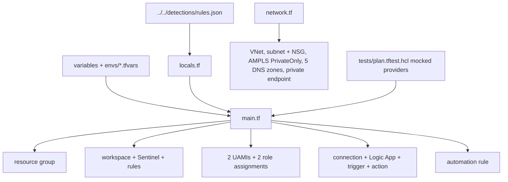

# Infra: Terraform stack

The Terraform stack declares the per-customer SOC workspace: resource group, Log Analytics with Sentinel,
analytics rules from `rules.json`, two least-privilege identities, the triage playbook, an optional
automation rule, diagnostic settings and optional private networking through Azure Monitor Private Link
Scope.

Sections: [1. Purpose](#1-purpose) · [2. Architecture](#2-architecture) · [3. How it works](#3-how-it-works) · [4. Key files](#4-key-files) · [5. Code excerpts](#5-code-excerpts) · [6. Configuration](#6-configuration) · [7. Commands](#7-commands) · [8. Real output](#8-real-output) · [9. Tests and gates](#9-tests-and-gates) · [10. Guardrails](#10-guardrails) · [11. Security and governance](#11-security-and-governance) · [12. Observability](#12-observability) · [13. Failure modes](#13-failure-modes) · [14. Mapping to Azure services](#14-mapping-to-azure-services) · [15. Limitations](#15-limitations) · [16. Interview talking points](#16-interview-talking-points)

## 1. Purpose

* A reviewable, testable definition of what one customer's SOC footprint looks like.
* Safe defaults: rules off, automation off, public access only when private networking is off.

## 2. Architecture



## 3. How it works

1. Providers: `azurerm ~> 4.50` and `azapi ~> 2.5` (for the managed-identity API connection), Terraform
   1.16. The lock file is committed.
2. Remote state in Azure Storage with Entra ID auth (`backend.tf`, `envs/<env>.backend.hcl`).
3. `locals.tf` builds the naming suffix and tags and loads `rules.json`.
4. `network.tf` is all `count`/`for_each` on `private_networking`: VNet, private-endpoint subnet with an NSG,
   AMPLS in `PrivateOnly` mode, the scoped workspace, five private DNS zones with links and the private
   endpoint.
5. `terraform test` runs four plans against mocked providers.

## 4. Key files

| File | Role |
|---|---|
| `infra/terraform/versions.tf`, `providers.tf`, `backend.tf` | Versions, providers, state |
| `infra/terraform/variables.tf`, `locals.tf`, `outputs.tf` | Inputs, derived values, outputs |
| `infra/terraform/main.tf` | Workspace, rules, identities, playbook, diagnostics |
| `infra/terraform/network.tf` | Private networking |
| `infra/terraform/envs/` | dev and prod tfvars and backend config |
| `infra/terraform/tests/plan.tftest.hcl` | Mocked plan tests |

## 5. Code excerpts

<!-- code: infra/terraform/network.tf::resource "azurerm_monitor_private_link_scope" -->
```hcl
resource "azurerm_monitor_private_link_scope" "this" {
  count                 = var.private_networking ? 1 : 0
  name                  = "ampls-aisoc-${local.suffix}"
  resource_group_name   = azurerm_resource_group.this.name
  ingestion_access_mode = "PrivateOnly"
  query_access_mode     = "PrivateOnly"
  tags                  = local.tags
}
```
<!-- /code -->

## 6. Configuration

dev: no rules, no automation rule, public endpoints, 1 GB cap. prod: rules created (disabled), automation
rule on, private networking on, 5 GB cap. Every variable has a description and a validation where it
matters (`environment`, `location`, `tenant_slug`, `agent_endpoint`).

## 7. Commands

```bash
terraform -chdir=infra/terraform init -backend=false
terraform -chdir=infra/terraform validate
terraform -chdir=infra/terraform test
tflint --chdir=infra/terraform
checkov -d infra/terraform --config-file .checkov.yaml
aisoc iac --part terraform
```

## 8. Real output

<!-- output: iac --part terraform -->
```text
main.tf      azurerm_resource_group.this
main.tf      azurerm_log_analytics_workspace.this
main.tf      azurerm_sentinel_log_analytics_workspace_onboarding.this
main.tf      azurerm_sentinel_alert_rule_scheduled.rule  [for_each: var.deploy_analytics_rules ? local.rules : {}]
main.tf      azurerm_user_assigned_identity.playbook
main.tf      azurerm_user_assigned_identity.agent
main.tf      azurerm_role_assignment.playbook_responder
main.tf      azurerm_role_assignment.agent_reader
main.tf      azapi_resource.sentinel_connection
main.tf      azurerm_logic_app_workflow.playbook
main.tf      azurerm_logic_app_trigger_custom.incident_created
main.tf      azurerm_logic_app_action_custom.forward_to_agent  [count: var.agent_endpoint == "" ? 0 : 1]
main.tf      azurerm_sentinel_automation_rule.triage  [count: var.enable_automation_rule ? 1 : 0]
main.tf      azurerm_monitor_diagnostic_setting.workspace_audit
main.tf      azurerm_monitor_diagnostic_setting.playbook
network.tf   azurerm_virtual_network.this  [count: var.private_networking ? 1 : 0]
network.tf   azurerm_subnet.private_endpoints  [count: var.private_networking ? 1 : 0]
network.tf   azurerm_monitor_private_link_scope.this  [count: var.private_networking ? 1 : 0]
network.tf   azurerm_monitor_private_link_scoped_service.workspace  [count: var.private_networking ? 1 : 0]
network.tf   azurerm_private_dns_zone.this  [for_each: var.private_networking ? local.private_dns_zones : toset([])]
network.tf   azurerm_private_dns_zone_virtual_network_link.this  [for_each: azurerm_private_dns_zone.this]
network.tf   azurerm_private_endpoint.ampls  [count: var.private_networking ? 1 : 0]
network.tf   azurerm_network_security_group.private_endpoints  [count: var.private_networking ? 1 : 0]
network.tf   azurerm_subnet_network_security_group_association.private_endpoints  [count: var.private_networking ? 1 : 0]
```
<!-- /output -->

## 9. Tests and gates

`plan.tftest.hcl`: `dev_defaults`, `analytics_rules`, `private_networking_and_agent_endpoint`,
`rejects_plain_http_endpoint`. `tests/test_iac.py` checks the same properties offline in Python. The
`infra` workflow runs fmt, validate, test, tflint and checkov on every pull request and push.

## 10. Guardrails

Checkov runs with no skips. Defaults are off for anything that acts (automation) or exposes (public
access when private networking is chosen). No secrets in variables.

## 11. Security and governance

OIDC for CI, Entra ID auth for state, managed identities in the stack, workspace-scoped roles. Tags carry
workload, environment, tenant and data classification for cost and policy.

## 12. Observability

Outputs expose the workspace, playbook and agent identity client id for the deploy smoke test. Diagnostic
settings cover the workspace and the playbook.

## 13. Failure modes

| Failure | Effect | Handling |
|---|---|---|
| Provider upgrade changes a resource | Plan drift | Lock file committed; Dependabot proposes upgrades as pull requests |
| Unknown values in test assertions | Test errors | `override_resource` with `override_during = plan` in the mocks |
| Region not in the short-name map | Plan fails | Validation on `location` |

## 14. Mapping to Azure services

| Resource | Azure service |
|---|---|
| Workspace, onboarding, rules, automation rule | Microsoft Sentinel / Log Analytics |
| Identities, role assignments | Entra ID managed identities and Azure RBAC |
| Playbook | Azure Logic Apps |
| AMPLS, private endpoint, DNS | Azure Monitor Private Link Scope, Private Link, Private DNS |
| Product data (not declared) | Defender XDR connector |
| Agent model (not declared) | Foundry |

## 15. Limitations

* Never applied to a subscription. Plans run only against mocked providers in CI.
* Data connectors, Lighthouse delegations and the Foundry project are out of scope.

## 16. Interview talking points

* "Four `terraform test` runs with mocked providers prove the conditional resources and the https
  validation without a subscription."
* "Checkov has zero skips. Where it flagged the private-endpoint subnet, I added the NSG instead of a skip."
* "The same rule export feeds Terraform and Bicep, so the two stacks cannot disagree about detections."
