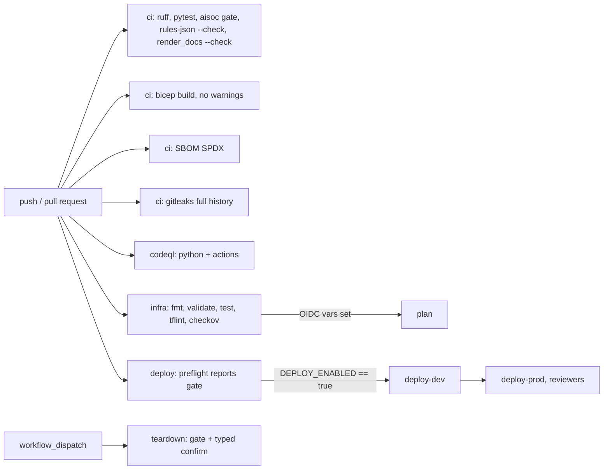

# Infra: GitHub Actions workflows

Five workflows: `ci` (lint, tests, the SOC release gate, doc and rules drift, Bicep build, SBOM, secret
scan), `codeql` (Python and Actions), `infra` (Terraform checks and an optional plan), `deploy` (dev then
prod, OIDC, gated off) and `teardown` (gated, with typed confirmation). Every workflow has read-only
top-level permissions and SHA-pinned actions.

Sections: [1. Purpose](#1-purpose) · [2. Architecture](#2-architecture) · [3. How it works](#3-how-it-works) · [4. Key files](#4-key-files) · [5. Code excerpts](#5-code-excerpts) · [6. Configuration](#6-configuration) · [7. Commands](#7-commands) · [8. Real output](#8-real-output) · [9. Tests and gates](#9-tests-and-gates) · [10. Guardrails](#10-guardrails) · [11. Security and governance](#11-security-and-governance) · [12. Observability](#12-observability) · [13. Failure modes](#13-failure-modes) · [14. Mapping to Azure services](#14-mapping-to-azure-services) · [15. Limitations](#15-limitations) · [16. Interview talking points](#16-interview-talking-points)

## 1. Purpose

* Make every claim in the docs re-checked on every push.
* Show a production-shaped deployment path without ever deploying.

## 2. Architecture



## 3. How it works

1. Top-level `permissions: contents: read` everywhere; jobs that need more ask for it (`id-token: write`
   for OIDC, `security-events: write` for CodeQL).
2. Every `uses:` is pinned to a full commit SHA with the version in a comment; Dependabot proposes updates
   for pip, GitHub Actions and Terraform.
3. `deploy` always runs `preflight`, which writes the gate state to the job summary. Real jobs require the
   repository variable `DEPLOY_ENABLED == 'true'`, which is not set. Prod needs dev and waits for
   environment reviewers.
4. `teardown` requires the gate and that the typed confirmation equals the environment name.
5. `.github/scripts/deploy.sh` holds the provision, smoke and destroy steps for either IaC tool.

## 4. Key files

| File | Role |
|---|---|
| `.github/workflows/ci.yml` | Offline CI |
| `.github/workflows/codeql.yml` | Code scanning |
| `.github/workflows/infra.yml` | Terraform checks and plan |
| `.github/workflows/deploy.yml` | Gated deployment |
| `.github/workflows/teardown.yml` | Gated teardown |
| `.github/scripts/deploy.sh` | Provision, smoke, destroy |
| `.github/dependabot.yml` | Dependency updates |

## 5. Code excerpts

<!-- code: .github/workflows/teardown.yml -->
```yaml
# Manual teardown of one environment. Gated by DEPLOY_ENABLED == 'true' like deploy.yml, runs in
# the matching GitHub Environment (so prod teardown also needs reviewer approval), and requires
# typing the environment name to confirm.
name: teardown
on:
  workflow_dispatch:
    inputs:
      environment:
        description: "Environment to destroy"
        type: choice
        options: [dev, prod]
        default: dev
      deploy_tool:
        description: "Tool that created it"
        type: choice
        options: [terraform, bicep]
        default: terraform
      confirm:
        description: "Type the environment name again to confirm"
        type: string
        required: true
permissions:
  contents: read
jobs:
  teardown:
    if: vars.DEPLOY_ENABLED == 'true' && inputs.confirm == inputs.environment
    runs-on: ubuntu-latest
    environment: ${{ inputs.environment }}
    permissions:
      contents: read
      id-token: write
    env:
      TARGET_ENV: ${{ inputs.environment }}
      DEPLOY_TOOL: ${{ inputs.deploy_tool }}
      LOCATION: ${{ vars.AZURE_LOCATION || 'eastus2' }}
      ARM_USE_OIDC: "true"
      ARM_CLIENT_ID: ${{ vars.AZURE_CLIENT_ID }}
      ARM_TENANT_ID: ${{ vars.AZURE_TENANT_ID }}
      ARM_SUBSCRIPTION_ID: ${{ vars.AZURE_SUBSCRIPTION_ID }}
      TFSTATE_RESOURCE_GROUP: ${{ vars.TFSTATE_RESOURCE_GROUP }}
      TFSTATE_STORAGE_ACCOUNT: ${{ vars.TFSTATE_STORAGE_ACCOUNT }}
    steps:
      - uses: actions/checkout@11d5960a326750d5838078e36cf38b85af677262 # v4.4.0
      - uses: hashicorp/setup-terraform@b9cd54a3c349d3f38e8881555d616ced269862dd # v3.1.2
        with: { terraform_version: "1.16.4", terraform_wrapper: false }
      - uses: azure/login@7184910d9eb2b1c5e48f7073824a90609bb9b6d6 # v2.3.1
        with:
          client-id: ${{ vars.AZURE_CLIENT_ID }}
          tenant-id: ${{ vars.AZURE_TENANT_ID }}
          subscription-id: ${{ vars.AZURE_SUBSCRIPTION_ID }}
      - name: Destroy
        run: .github/scripts/deploy.sh destroy
```
<!-- /code -->

## 6. Configuration

Repository variables (none set): `DEPLOY_ENABLED`, `DEPLOY_TOOL`, `AZURE_LOCATION`, `AZURE_CLIENT_ID`,
`AZURE_TENANT_ID`, `AZURE_SUBSCRIPTION_ID`, `TFSTATE_*`. GitHub Environments `dev` and `prod` with required
reviewers on `prod`. No secrets: Azure login is OIDC with a federated credential.

## 7. Commands

```bash
gh workflow run deploy.yml -f deploy_tool=terraform   # skips every job except preflight while the gate is off
aisoc iac --part workflows
```

## 8. Real output

<!-- output: iac --part workflows -->
```text
ci.yml: triggers [push, pull_request], top-level permissions {"contents": "read"}
  test
  bicep
  sbom
  secrets
codeql.yml: triggers [push, pull_request, schedule], top-level permissions {"contents": "read"}
  analyze (permissions contents: read, security-events: write)
deploy.yml: triggers [push, workflow_dispatch], top-level permissions {"contents": "read"}
  preflight
  deploy-dev (if vars.DEPLOY_ENABLED == 'true'; environment dev; permissions contents: read, id-token: write)
  deploy-prod (if vars.DEPLOY_ENABLED == 'true' && (github.event_name == 'push' || inputs.promote_to_prod); environment prod; permissions contents: read, id-token: write)
infra.yml: triggers [pull_request, push, workflow_dispatch], top-level permissions {"contents": "read"}
  terraform
  tflint
  checkov
  plan (if github.event_name == 'pull_request' || github.event_name == 'workflow_dispatch'; permissions contents: read, id-token: write)
teardown.yml: triggers [workflow_dispatch], top-level permissions {"contents": "read"}
  teardown (if vars.DEPLOY_ENABLED == 'true' && inputs.confirm == inputs.environment; environment ${{ inputs.environment }}; permissions contents: read, id-token: write)
```
<!-- /output -->

## 9. Tests and gates

`tests/test_iac.py`: every workflow has read-only top-level permissions and SHA-pinned actions and no
client secret; CI runs pytest, the gate, both drift checks, gitleaks, SBOM and Bicep build; deploy is gated
and uses OIDC with dev and prod environments; teardown needs the gate and confirmation; CodeQL scans Python
and Actions; Dependabot covers pip, GitHub Actions and Terraform; the deploy script has every subcommand.

## 10. Guardrails

Deployment is off by default and needs a repository variable, environment reviewers and OIDC. Teardown
needs a typed confirmation. No long-lived cloud credential exists.

## 11. Security and governance

Supply chain: SHA pins, Dependabot (weekly, grouped), CodeQL, gitleaks over full history, an SPDX SBOM per run, CODEOWNERS.
Repository settings: secret scanning with push protection, Dependabot alerts and security updates, private
vulnerability reporting, and a `main` ruleset that blocks force-push and deletion and requires the CI checks
on pull requests (the admin can still push directly, so those checks run after a direct push).
See [../../SECURITY.md](../../SECURITY.md).

## 12. Observability

The gate output is uploaded as an artefact on every CI run. The deploy preflight writes the gate state to
the job summary.

## 13. Failure modes

| Failure | Effect | Handling |
|---|---|---|
| Action tag moved by an attacker | Malicious code in CI | SHA pins |
| Accidental deploy | Cost, exposure | Gate variable unset; environments; OIDC subject restrictions |
| Stale doc number | Misleading docs | `render_docs.py --check` fails CI |

## 14. Mapping to Azure services

| Element | Azure service |
|---|---|
| OIDC login | Entra ID workload identity federation |
| Deployed stack | Microsoft Sentinel, Log Analytics, Logic Apps, Azure Monitor Private Link |
| Smoke test | Log Analytics query as the agent identity |
| Product data | Defender XDR connector (manual, outside CI) |
| Model | Foundry (not deployed by these workflows) |

## 15. Limitations

* `deploy` and `teardown` have never run past the gate.
* Dependabot pull requests are opened automatically and are not merged without review.

## 16. Interview talking points

* "Every action is pinned to a SHA and every workflow starts read-only."
* "The deploy workflow runs on every push, reports that the gate is off, and does nothing else. That is the
  honest state."
