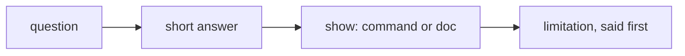

# Interview guide

For Jagadish, and for anyone reviewing this repository in an interview. Short answers first, then where to
point on screen. Every number quoted here is rendered from a run in [metrics.md](metrics.md).

## Two-minute walkthrough

1. `aisoc tenants`: a fictional MSSP and three customers, synthetic Sentinel and Defender XDR data.
2. `aisoc compare`: on 40 holdout incidents, the feedback loop takes accuracy from 77.5% to 100% and halves
   human reviews (30 to 15), with zero attacks auto-closed.
3. `aisoc investigate --tenant orchidvalley --incident INC-OR-032`: a ransomware precursor, investigated
   through read-only tools, a cited timeline, a four-action plan waiting for the customer's approval.
4. `aisoc injection`: a phishing subject tells the AI to close the case; quoting stops it, and with quoting
   off the validator catches it.
5. `aisoc gate`: eleven checks that fail the build.

## Likely questions

| Question | Short answer | Show |
|---|---|---|
| Does the model decide verdicts? | No. A logistic score with named terms decides; the model writes the summary and a validator checks it | [components/triage-routing.md](components/triage-routing.md), [components/narrative-guardrails.md](components/narrative-guardrails.md) |
| How do you stop prompt injection? | Quote untrusted fields, validate output, treat the attempt as evidence, and give the model no authority | `aisoc injection` |
| How does it learn without poisoning itself? | Only analyst decisions become notes; thresholds need four reviews, a floor and a replay that closes zero attacks | `aisoc feedback` |
| What stops an agent from isolating the wrong host? | It cannot: no containment tool, no permission in the IaC, approval bound to the plan digest, targets must belong to the tenant | `aisoc approvals` |
| How do you keep customers apart? | Per-tenant stores, notes, pseudonyms and audit chains, a canary and eight crossing attempts in the gate | `aisoc isolation` |
| How does this relate to Security Copilot and the Sentinel MCP server? | Same tool interface; these agents sit behind it and complement Copilot | [architecture.md](architecture.md) |
| Is it deployed? | No. The IaC is validated and tested with mocks; deployment is gated off | [deployment.md](deployment.md) |
| What is weakest? | Synthetic look-alikes that repeat, simulated analysts and MTTR, regex guardrails, rules on a simplified schema | [best-practices.md](best-practices.md) |

## Numbers worth remembering

* 9 of 9 stories detected; MTTD median 33 minutes (max 60), including ingestion delay and rule schedule.
* Holdout: 3-class accuracy 77.5% to 100%, auto-closed 25% to 70%, override rate 30% to 0%.
* Zero attacks auto-closed in any window or mode.
* ATT&CK priority coverage 11 of 21, with the gaps listed.
* Risk watch list: 7 of 9 story targets flagged the night before; precision 6.0% against 0.9% random, on
  planted precursors.
* Canary: 139 sightings in its own tenant, 0 elsewhere; 8 of 8 crossings refused.

## Things to say before being asked

* MTTR is simulated with configured analyst minutes.
* The analysts in the evaluation are simulated from ground truth.
* The Foundry path and the IaC have never touched Azure.
