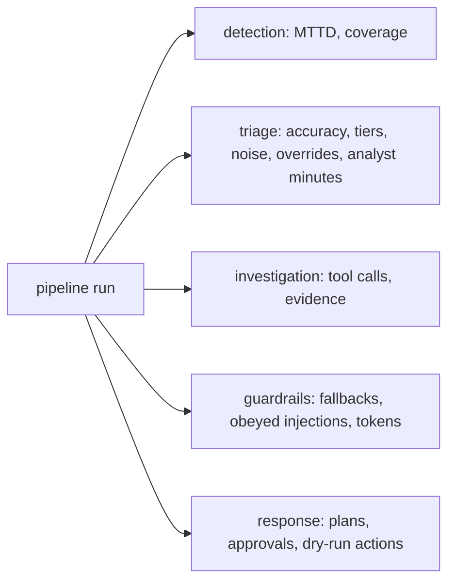

# Metrics

Every number here comes from a run of the code on the synthetic data and is re-rendered and compared in
CI. Definitions live in `src/aisoc/metrics.py`; the component view is in
[components/metrics-gate.md](components/metrics-gate.md). Read the caveats before quoting any number.



## Baseline versus feedback loop, same holdout incidents

<!-- output: compare -->
```text
holdout window (days 14-20), same incidents:
metric                     baseline (no learning)  after feedback loop
-------------------------  ----------------------  -------------------
incidents                  40                      40
accuracy_3class_pct        77.5                    100.0
accuracy_binary_pct        92.5                    100.0
malicious_precision_pct    62.5                    100.0
malicious_recall_pct       100.0                   100.0
tier1                      10                      28
tier2                      28                      10
tier3                      2                       2
auto_closed_pct            25.0                    70.0
auto_closed_attacks        0                       0
escalation_noise_pct       83.3                    58.3
human_reviews              30                      15
override_rate_pct          30.0                    0.0
simulated_analyst_minutes  650                     380
```
<!-- /output -->

## Per attack story

<!-- output: stories -->
```text
story                        window   starts     detected  MTTD min  incident    tier  AI verdict     contained  MTTR min (sim)  techniques
---------------------------  -------  ---------  --------  --------  ----------  ----  -------------  ---------  --------------  ----------
brightwater-spray-d9         train    D09 02:00  yes       20.0      INC-BR-015  2     true_positive  dry-run    100.0           2/2
brightwater-phish-d16        holdout  D16 09:00  yes       20.0      INC-BR-027  3     true_positive  dry-run    265.0           2/3
brightwater-insider-d19      holdout  D19 20:00  yes       60.0      INC-BR-036  2     true_positive  dry-run    115.0           2/2
orchidvalley-phish-d6        train    D06 10:00  yes       20.0      INC-OR-011  2     true_positive  dry-run    240.0           2/3
orchidvalley-ransomware-d18  holdout  D18 00:30  yes       33.0      INC-OR-032  3     true_positive  dry-run    152.0           5/5
pinecrest-ransomware-d5      train    D05 22:30  yes       33.0      INC-PI-011  3     true_positive  dry-run    152.0           5/5
pinecrest-insider-d11        train    D11 21:00  yes       60.0      INC-PI-022  2     true_positive  dry-run    115.0           2/2
pinecrest-spray-d17          holdout  D17 03:00  yes       20.0      INC-PI-032  2     true_positive  dry-run    100.0           2/2
pinecrest-travel-d20         holdout  D20 08:00  yes       60.0      INC-PI-036  2     true_positive  dry-run    80.0            1/3
```
<!-- /output -->

## Full run report

<!-- output: metrics -->
```text
mode: learning
detection and response (all 21 days):
  stories: 9
  stories_detected: 9
  mttd_median_min: 33.0
  mttd_max_min: 60.0
  mttr_simulated_median_min: 115.0
  stories_contained: 9
  attack_priority_coverage: 11/21
  story_techniques_alerted: 11/12
triage quality, train window:
  alerts: 84
  incidents: 70
  malicious_incidents: 4
  accuracy_3class_pct: 87.1
  accuracy_binary_pct: 91.4
  malicious_precision_pct: 40.0
  malicious_recall_pct: 100.0
  tier1: 45
  tier2: 24
  tier3: 1
  auto_closed_pct: 64.3
  auto_closed_attacks: 0
  escalation_noise_pct: 84.0
  human_reviews: 28
  qa_reviews: 3
  override_rate_pct: 32.1
  binary_override_rate_pct: 21.4
  simulated_analyst_minutes: 615
triage quality, holdout window:
  alerts: 55
  incidents: 40
  malicious_incidents: 5
  accuracy_3class_pct: 100.0
  accuracy_binary_pct: 100.0
  malicious_precision_pct: 100.0
  malicious_recall_pct: 100.0
  tier1: 28
  tier2: 10
  tier3: 2
  auto_closed_pct: 70.0
  auto_closed_attacks: 0
  escalation_noise_pct: 58.3
  human_reviews: 15
  qa_reviews: 3
  override_rate_pct: 0.0
  binary_override_rate_pct: 0.0
  simulated_analyst_minutes: 380
investigation (deterministic counts; timings: aisoc bench):
  investigated: 37
  tool_calls_total: 336
  tool_calls_mean: 9.1
  evidence_rows_mean: 14.2
  denied_calls: 0
guardrails:
  narratives: 37
  fallbacks: 0
  injection_obeyed: 0
  injection_incidents: 1
  prompt_tokens: 17236
  output_tokens: 3863
response:
  plans_with_actions: 15
  actions_planned: 42
  plans_approved: 9
  plans_not_approved: 6
  actions_executed_dry_run: 27
  actions_executed_live: 0
  dual_approval_plans: 0
  policy_denials: 0
```
<!-- /output -->

## Caveats

* **Synthetic and small.** Three tenants, 21 days, 110 incidents, nine attack stories. One incident moves
  a holdout percentage by 2.5 points.
* **MTTR is simulated.** Machine time is measured; analyst review and approval time is configured
  (`analyst_minutes`). Treat it as a model of the process, not a measurement.
* **Holdout learning is easy here.** Look-alikes repeat on a schedule, so the loop learns them fully;
  real benign noise drifts and the gain would be smaller.
* **Analysts are simulated from ground truth,** so reviewed verdicts are always right.
* **Risk precursors were planted** by the generator; see [components/predictive-risk.md](components/predictive-risk.md).
* **Timings** come from `aisoc bench` and depend on the machine; they are never rendered into the docs.
  One local run: full learning run about 1 second for 110 incidents, investigation median about 4 ms.
