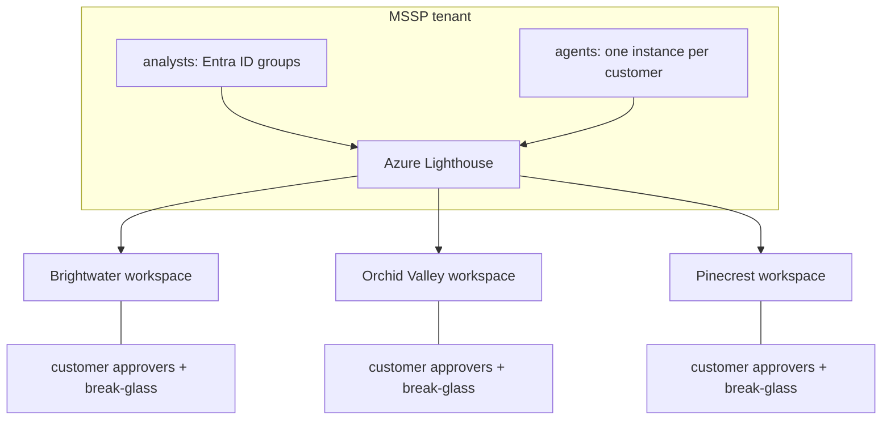

# MSSP operating model

The fictional Halyard Security Services runs one SOC for three fictional customers: Brightwater Logistics,
Orchid Valley Clinics and Pinecrest Credit Union. This page describes how the code maps to a multi-tenant
operation on Azure and what keeps customers apart.



## What is shared and what is not

| Shared across customers | Per customer |
|---|---|
| Detection rules, runbooks, threat-intel feed, code, KQL templates | Telemetry, workspace, incidents, case notes, learned priors and thresholds, pseudonym map, audit chain, approvers, crown jewels, break-glass accounts |

## Tenants

<!-- output: tenants -->
```text
MSSP: Halyard Security Services (fictional); analysts: analyst.rivera tier 2, analyst.okafor tier 3
tenant        name                    industry            domain                workspace             users  hosts  crown jewels
------------  ----------------------  ------------------  --------------------  --------------------  -----  -----  --------------------
brightwater   Brightwater Logistics   logistics           brightwater.example   law-soc-brightwater   30     24     BWL-DC01, BWL-ERP01
orchidvalley  Orchid Valley Clinics   healthcare          orchidvalley.example  law-soc-orchidvalley  26     22     OVC-DC01, OVC-EHR01
pinecrest     Pinecrest Credit Union  financial services  pinecrest.example     law-soc-pinecrest     28     22     PCU-DC01, PCU-CORE01
```
<!-- /output -->

## Mapping to Azure

| Concern | Azure mechanism |
|---|---|
| Analyst access to customer workspaces | Azure Lighthouse delegation to MSSP Entra ID groups, with Microsoft Sentinel Responder or Reader per group |
| Agent access | A managed identity per customer workspace with Microsoft Sentinel Reader (declared in the IaC) |
| Customer view | Customer-side Entra ID users with read access to their own incidents (`customer.brightwater.viewer` in config) |
| Containment authority | The customer's own approvers; the executor identity lives in the customer tenant and is not created by this repository |
| Cross-workspace hunting | Sentinel multi-workspace queries for analysts only; agents are bound to one workspace |
| Per-customer reporting | Per-tenant metrics from `aisoc metrics`, extended to SLA reports (planned) |

## Isolation evidence

<!-- output: isolation -->
```text
canary CANARY-PCU-QX7 planted in 119 pinecrest rows
  occurrences in brightwater artefacts (prompts, narratives, evidence, case notes, audit): 0
  occurrences in orchidvalley artefacts (prompts, narratives, evidence, case notes, audit): 0
  occurrences in pinecrest artefacts (prompts, narratives, evidence, case notes, audit): 139
cross-tenant attempts:
  query another tenant's workspace: denied: workspace law-soc-orchidvalley is outside this tenant (law-soc-brightwater)
  query another tenant's user through own workspace: denied: 0 rows (the gateway's store holds only brightwater data)
  unknown identity: denied: unknown identity customer.pinecrest.viewer
  brightwater customer viewer on pinecrest: denied: customer.brightwater.viewer is not entitled to tenant pinecrest
  write brightwater activity to pinecrest's audit chain: denied: audit chain and store belong to different tenants
  store a pinecrest case note in brightwater's knowledge base: denied: case note for pinecrest written to the brightwater knowledge base
  disable_user ciso@orchidvalley.example from a brightwater incident: denied: ciso@orchidvalley.example does not belong to tenant brightwater
  isolate_host PCU-DC01 from a brightwater incident: denied: PCU-DC01 does not belong to tenant brightwater
```
<!-- /output -->

## Onboarding a new customer (offline)

1. Add the tenant to `config/tenants.yaml` (domain, workspace, crown jewels, approvers, break-glass).
2. Add its analysts' entitlements to `config/identities.yaml`.
3. Run `aisoc data --tenant <id>`, `aisoc gate` and the tests. The isolation checks cover every tenant
   automatically.
4. For Azure, deploy the stack with `tenant_slug=<id>` in the customer's subscription and delegate it with
   Lighthouse (not automated here).
