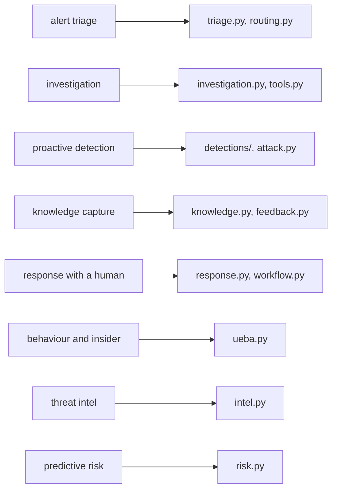

# Scenario mapping: AI SOC use cases to code

This repository was built after reading an AI-powered SOC guide published by Conifers Technologies
([conifers.ai/blog/ai-powered-soc](https://www.conifers.ai/blog/ai-powered-soc/)). The guide is not
included, redistributed or quoted here. The scenario names below are my own short labels for the kinds of
work such guides describe, and every description, design choice and line of code is this repository's own.
A local check (`scripts/overlap_check.py`) is run against a private local copy of the guide's text before
publishing and must report zero shared eight-word sequences.

## The eight scenarios

| # | Scenario (my label) | What this repository does | Where | Evidence | Status |
|---|---|---|---|---|---|
| S1 | Alert triage and prioritisation | Merges duplicate alerts, groups related ones into incidents, scores them with TI, behaviour and asset context, gives a three-way verdict, routes to tier 1, 2 or 3 | `triage.py`, `routing.py` | `aisoc triage`, `aisoc compare` | Built |
| S2 | Investigation with context | Pivots through read-only tools on accounts, hosts, attacker IPs and TI domains; cited timeline; entity graph; scope and blast radius | `investigation.py`, `tools.py` | `aisoc investigate` | Built |
| S3 | Proactive detection | Twelve KQL rules as code, alert timing that matches scheduled rules, ATT&CK coverage with gaps listed | `detections/`, `detections.py`, `attack.py` | `aisoc detect`, `aisoc attack` | Built; automated hunting planned |
| S4 | Knowledge capture and sharing | Analyst decisions become per-tenant case notes that shift future verdicts; runbooks attached to cases | `knowledge.py`, `feedback.py`, `runbooks/` | `aisoc feedback` | Built; semantic search over notes planned |
| S5 | Response and containment with a human in the loop | Plans from a fixed catalogue, approval bound to the plan digest, dual control for high-impact targets, dry-run executor, audit chain | `response.py`, `workflow.py`, `audit.py` | `aisoc approvals`, `aisoc audit` | Built (dry run); live executor not implemented |
| S6 | Behaviour analytics and insider risk | Per-user baselines with department peers, download z-score, new country, external uploads, rising trend | `ueba.py` | insider stories in `aisoc stories` | Built |
| S7 | Threat-intel integration | Shared MSSP feed shaped like STIX indicators, validity window, confidence decay, per-tenant sightings | `intel.py`, `data/ti/` | `aisoc mcp-demo` lookup | Built; TAXII ingestion and report parsing planned |
| S8 | Predictive and proactive risk | Nightly watch list from drift, credential probing, lures, privilege and host exposure, evaluated against random picks | `risk.py` | `aisoc risk` | Built on planted precursors |

## Design principles behind the scenarios

The five principles below are expanded, one section each, in
[cognitive-soc-five-parts.md](cognitive-soc-five-parts.md): a plain-language explanation, the code and
real output, an honest Strong / Partial verdict, what production would add, and interview talking points.

| Principle (my wording) | How it shows up |
|---|---|
| Specialised agents that hand work to each other | Triage, investigation, narrative and response steps as nodes in one MAF workflow |
| Grounding in the customer's own environment | Crown jewels, approvers, break-glass accounts per tenant; per-tenant baselines and case notes |
| Learning from outcomes | Beta-updated priors and replay-gated thresholds from analyst reviews |
| Context beyond the alert | Asset criticality, privilege, ATT&CK tactics count, TI confidence, behaviour anomaly in one score |
| People decide the consequential steps | QA sampling at tier 1, analyst verdicts at tier 2 and 3, customer approval for every containment |

## Operating model

| Topic | Implementation | Status |
|---|---|---|
| Tier 1 / 2 / 3 split | `routing.py`: AI closes, AI plus analyst, human-led with AI support | Built |
| Analyst feedback | `feedback.py`: notes, priors, thresholds, override rate | Built |
| Phased rollout | Shadow mode (AI verdicts logged next to analyst verdicts with no autonomy) is the first step in [implementation-guide.md](implementation-guide.md); the baseline mode approximates it | Documented; shadow-mode switch planned |
| Metrics: MTTD, MTTR, FP burden, investigation effort, accuracy, override rate, coverage | `metrics.py`, `aisoc metrics` | Built (MTTR simulated) |
| Business metrics (cost per incident) | Token estimates only | Planned |
| MSSP multi-tenancy | Per-tenant everything, canary and crossing tests, Lighthouse mapping in [mssp-operating-model.md](mssp-operating-model.md) | Built (offline) |
